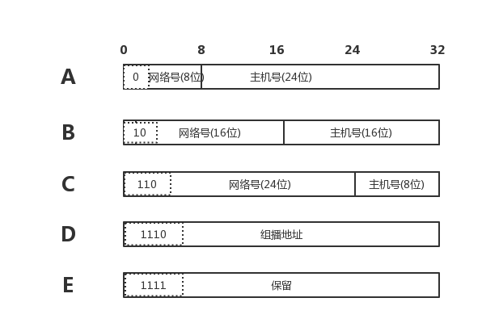
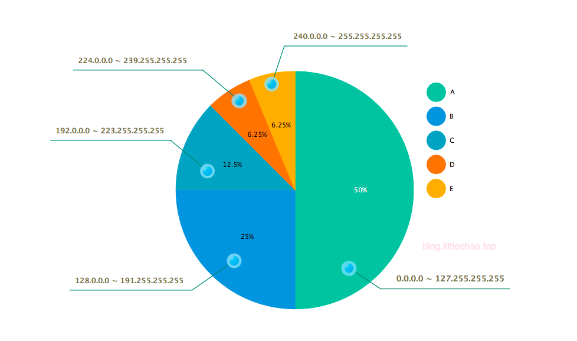
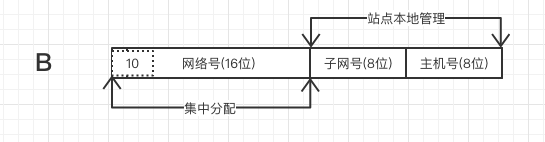
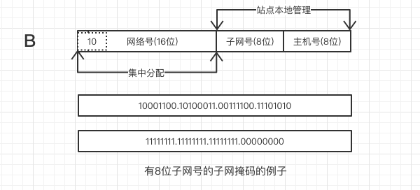
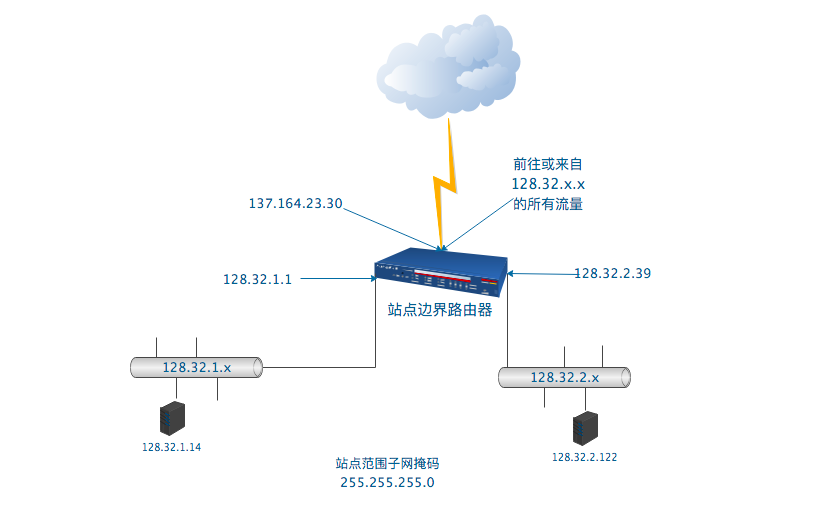
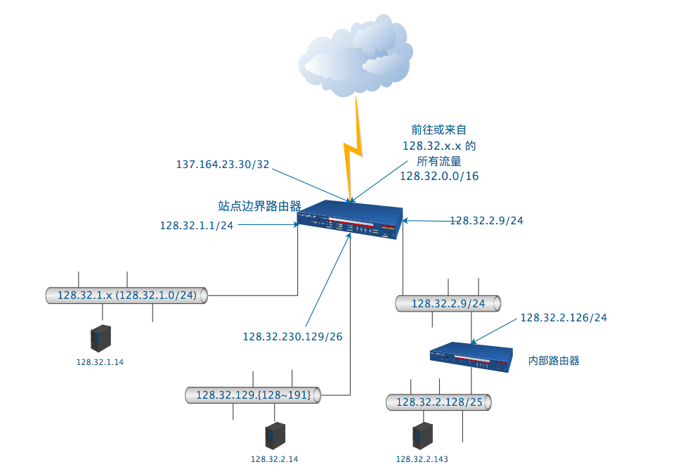
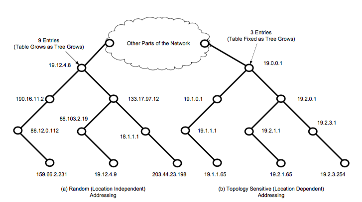
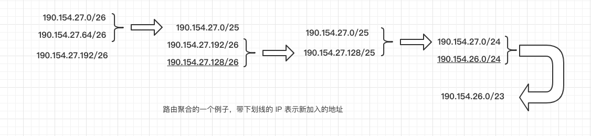
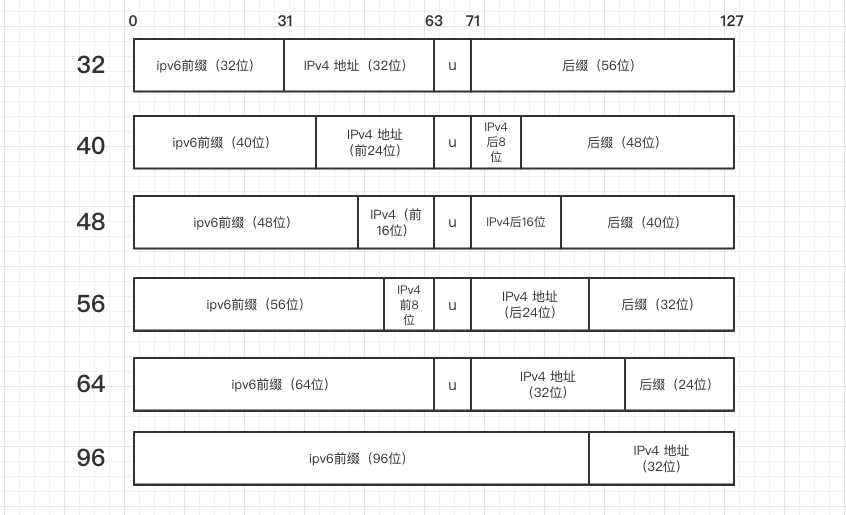

## IP 地址结构

> Internet 中使用的网络层地址，又叫 IP 地址。每一个连接到 Internet 的设备至少有一个 IP 地址。IP 地址标志了流量的来源和去向。

### IP 地址的表示

#### IPv4

IPv4 地址本质上是 32 位二进制整数，通常用**点分十进制**表示:

|点分十进制|二进制|
|:--|:--|
| 0.0.0.0 | 00000000 00000000 00000000 00000000 |
| 1.2.3.4 | 00000001 00000010 00000011 00000100 |

#### IPv6

ipv6 地址长度为 128 位，被分为 8 个块表示，每个块包含 4 个十六进制数，块之间用 `:` 分隔。另外有一些规则:

* 一个块中的前到 0 可以省略
* 全块的 0 可以用 `::` 代替。如：0:0:0:0:0:0:0:1 可以写成 ::1。另外 `::` 只能使用一次，并且只能在 0 最多的地方用，如果有两个一样多连续 0 的地方，前者可以使用 `::`
* 在 ipv6 中嵌入 ipv4 地址可以使用混合符号形式。::ffff:10.0.0.1 可以表示 ipv4 地址 10.0.0.1。其中 ipv4地址紧邻 ffff，这被称为 ipv4 映射的 ipv6 地址
* ipv6 地址低 32 位通常采用点分十进制，这被称为 *兼容 ipv4 的 ipv6 地址*

当 ipv6 地址和端口号一起使用时，`:` 可能造成歧义，所以用 `[]` 括起来：`http://[::3333:22]:443/`

### 基本的 IP 地址结构

#### IP 地址的分类

IP 地址中，被用于识别连接 Internet 或某些专用的内联网的计算机网络接口的地址，叫做单播地址，还有涉及多个接口或者有特殊用途的地址，包括广播、组播、多播地址。

##### 分类寻址

单播 IP 地址都有一个网络部分和一个主机部分，分别被用来识别网络和网络中的主机。IP 地址呗分为如下五大类：

更形象一点如图：

但是要注意的是，每个网络里的主机号，全 0 和全 1 的不能被分配给某个主机。全 1 的作为这个子网的广播地址使用。

##### 子网寻址

A 类地址的主机数量为 2^24 - 2，B 类地址的主机数量为 2^16 - 2，C 类地址为 2^8 - 2。实际上很难分配到一个大小合适的网络，于是在分类基础上加了子网的概念。

如图，把一个 B 类地址的主机号 ‘借’ 出 8 位作为子网号的例子，这样把一个网络划分出来若干子网，以此来得到一个合适大小的网络。

##### 子网掩码

为了能够从 IP 地址中知道主机号中哪些是子网号，哪些是主机号，使用了一个 32 位二进制的子网掩码。它的每一位和 IP 地址一一对应，子网掩码某一位为 1 代表对应 IP 地址那一位不是主机号。

写的时候为了简单，把 IP 地址和子网掩码 1 的位数写在一起，如：`128.3.4.5/23`。

要注意，只有划分子网内部路由器和主机知道子网结构，在需要子网寻址之前，互联网其他部分仍把它作为站点相关的地址来看。来看一个例子：

##### 可变长度子网掩码

Variable Length Subnet Mask, VLSM。在同一站点的不同部分，可以将不同长度的子网掩码应用于相同网络号。增加了配置的复杂性但是也提高了子网结构的灵活性。如图，三个不同掩码被用于 128.32.0.0/16 ，每个子网可以有不同数量的主机：

### CIDR 和聚合

划分子网缓解了增长带来的痛苦，但是随着互联网规模增长，路由表的条目数越来越多，路由性能受到影响。

#### 前缀

为了缓解 v4 地址的压力，分类寻址采用了类似于 VLSM 的方案，**无类别域间路由（Classless Inter-Domain Router, CIDR）**。使用 CIDR，任何没有预定义的地址都可以作为同一个类的一部分，就是说，B 类地址和 C 类地址可以在同一个类。

注意，和普通子网掩码不同的是，CIDR 的掩码不仅限于一个站点，而是全球路由可见的。核心 Internet 路由器必须能够解释和处理 CIDR 掩码。 IP 地址加上一个 0~32 的数字，称为前缀，代表一个子网。

|前缀|地址范围|
|:--|:--|
| 0.0.0.0/0 | 0.0.0.0 ~ 255.255.255.255 |
| 128.0.0.0/1 | 128.0.0.0 ~ 255.255.255.255 |
| 128.0.0.0/24 | 128.0.0.0 ~ 128.0.0.255 |

#### 聚合

前缀并没有解决路由表性能问题，但是可以把多条路由聚合成一条，以此减轻路由器压力。把网络拓扑排成一棵树，按照分层结构的思想来分配地址，可以在保证最短路由的情况下减少路由器路由条目。

下图是一个随意排布的、路由与位置无关的结构（a, 左图）和拓扑敏感的、位置与路由相关的结构（b, 右图），每个圆点代表路由器：

两者最大的区别在于，a 中顶层路由节点为了能够路由到下面 8 个节点，需要储存 9 条（加上 other Parts 那一条）路由信息；而 b 中顶层节点只需要存储 3 条（同上）。

关键在于，b 把多条路由信息聚合成一条。聚合是把多个相邻的 IP 前缀合并成一个短前缀。

注意，只有连续的、数值相邻的地址才能被聚合，如果中间有一条地址不在此列，那么不能聚合。

### 特殊用途地址

#### IPv4 和 IPv6 转换

IPv4 和 IPv6 转换时，采用特殊地址，称为**嵌入 IPv4 的 IPv6 地址**，如下，IPv6 前缀必须是以下之一：

其中，63~71 对应的 U 必须为 0。

