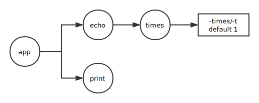

# Cobra

Cobra 是用于创建 CLI 应用程序的库，同时提供了用于生成应用程序和命令文件的程序。

非常多有名的开源项目都在使用它：

* [Kubernetes](http://kubernetes.io/)
* [Hugo](http://gohugo.io)
* [rkt](https://github.com/coreos/rkt)
* [etcd](https://github.com/coreos/etcd)
* [Moby (former Docker)](https://github.com/moby/moby)
* [Docker (distribution)](https://github.com/docker/distribution)
* [OpenShift](https://www.openshift.com/)
* [Delve](https://github.com/derekparker/delve)
* [GopherJS](http://www.gopherjs.org/)
* [CockroachDB](http://www.cockroachlabs.com/)
* [Bleve](http://www.blevesearch.com/)
* [ProjectAtomic (enterprise)](http://www.projectatomic.io/)
* [GiantSwarm's swarm](https://github.com/giantswarm/cli)
* [Nanobox](https://github.com/nanobox-io/nanobox)/[Nanopack](https://github.com/nanopack)
* [rclone](http://rclone.org/)
* [nehm](https://github.com/bogem/nehm)
* [Pouch](https://github.com/alibaba/pouch)

## 命令、子命令、参数与标志型参数

命令表示动作，参数是事物，标志是这些动作的修饰符。

### 命令与子命令

以 docker 为例，docker 是一个命令，`docker pull` 中的 pull 就是 docker 的子命令。

为什么有子命令这样的设计呢？

> 假设，我们将 docker 拆分成 docker-version、docker-ps、docker-pull 等等，那么它们共用的很多代码都得编译多次大大增加了可执行文件的总大小。在升级时，改动公有代码得多次改动，分发时得多次分发，不易维护同时增加了出错的概率。

### 参数与标志型参数

同样以 docker 为例，`docker rmi mysql mongo` 的 mysql 和 mongo 都是 docker rmi 命令的参数。

那么什么是标志型参数呢？

> 看这一条命令 `docker run --name some-mysql -e MYSQL_ROOT_PASSWORD=my-secret-pw -d mysql` 中的 `--name some-mysql`、`-e MYSQL_ROOT_PASSWORD=my-secret-pw`、`-d` 均为标志型参数。

那非标志性和标志型参数有什么区别呢？

> 看 `docker rm mysql mongo` 参数(mysql、mongo)对于命令(docker rmi)来说并没有什么区别(除移除的顺序)，更不会改变 `docker rmi` 这一命令的行为有任何影响。而标志型参数(-e MYSQL_ROOT_PASSWORD=my-secret-pw 等)则会对命令(docker run)的运行造成影响。

> 如果不能理解，再举一例 `docker rm job1 job2` 和 `docker rm -f job1 job2`，-f 是一个标志型参数，它有默认值为 true，-f 等同于 -f=1。如果 job1 和 job2 正在运行，则 `docker rm job1 job2` 不能将它们移除，而 `docker rm -f job1 job2` 可以将他们强制移除。由此看来，标志型参数往往具有特殊意义，可以对命令的行为。

## Cobra 的使用

这里有一个多层嵌套的例子，[example](https://github.com/spf13/cobra/blob/master/README.md#example)：

```go
// basic.go
package main

import (
    "fmt"
    "strings"

    "github.com/spf13/cobra"
    "github.com/spf13/pflag"
)

func main() {
    var echoTimes int

    var cmdPrint = &cobra.Command{
        Use:   "print [string to print]",
        Short: "Print anything to the screen",
        Long: `print is for printing anything back to the screen.
For many years people have printed back to the screen.`,
        Args: cobra.MinimumNArgs(1),
        Run: func(cmd *cobra.Command, args []string) {
            fmt.Println("Print: " + strings.Join(args, " "))
            flags := cmd.Flags()
            flags.VisitAll(func(flag *pflag.Flag) {
                fmt.Printf("FLAG: --%s=%q\n", flag.Name, flag.Value)
            })
        },
    }

    var cmdEcho = &cobra.Command{
        Use:   "echo [string to echo]",
        Short: "Echo anything to the screen",
        Long: `echo is for echoing anything back.
Echo works a lot like print, except it has a child command.`,
        Args: cobra.MinimumNArgs(1),
        Run: func(cmd *cobra.Command, args []string) {
            fmt.Println("Print: " + strings.Join(args, " "))
            flags := cmd.Flags()
            flags.VisitAll(func(flag *pflag.Flag) {
                fmt.Printf("FLAG: --%s=%q\n", flag.Name, flag.Value)
            })
        },
    }

    var cmdTimes = &cobra.Command{
        Use:   "times [# times] [string to echo]",
        Short: "Echo anything to the screen more times",
        Long: `echo things multiple times back to the user by providing
a count and a string.`,
        Args: cobra.MinimumNArgs(1),
        Run: func(cmd *cobra.Command, args []string) {
            for i := 0; i < echoTimes; i++ {
                fmt.Println("Echo: " + strings.Join(args, " "))
            }
            flags := cmd.Flags()
            flags.VisitAll(func(flag *pflag.Flag) {
                fmt.Printf("FLAG: --%s=%q\n", flag.Name, flag.Value)
            })
        },
    }

    cmdTimes.Flags().IntVarP(&echoTimes, "times", "t", 1, "times to echo the input")

    var rootCmd = &cobra.Command{Use: "app"}
    rootCmd.AddCommand(cmdPrint, cmdEcho)
    cmdEcho.AddCommand(cmdTimes)
    rootCmd.Execute()
}
```



这个命令是这样的，print 和 echo 都是 app 的子命令，并且行为相同都是输出 “Print: 参数”。times 是 echo 的子参数，它有一个标志型参数，默认值是 1，它会输出 x 次（-t x）“Echo: 参数”。所有命令最后都会将所有的标志型参数输出。

```shell
$go build -o app basic.go

$./app print 123456
Print: 123456
FLAG: --help="false"

$./app echo 123456
Print: 123456
FLAG: --help="false"

$./app echo times 123456
Echo: 123456
FLAG: --help="false"
FLAG: --times="1"

$./app echo times 123456 -t 3
Echo: 123456
Echo: 123456
Echo: 123456
FLAG: --help="false"
FLAG: --times="3"

$./app times 123456
Error: unknown command "times" for "app"
Run 'app --help' for usage.
```

## 扩展

linux 中间有的命令是一个横杠，有的命令是两个横杠。这有什么区别吗？

Unix 程序的命令行选项有三种风格：Unix 风格、GNU 风格和 X toolkit 风格。

* Unix 风格: 在选项需要加参数的时候，紧跟在选项后面或者加空格。

```shell
mysql -u root -p
mysql -uroot -p
```

* GNU 风格: 这种风格的出现是因为有一些复杂的 GNU 程序，仅仅 26 个字母（或者算上大小写 52 个）不够使用而发展出来的。另外一个有点是容易理解，因为出现的不再是缩写的字母。选项参数可以使用空格分割也可以使用"="来分割。

```shell
ls --human-readable --sort=time
ls -ht # Unix Style
```

* X toolkit 风格: 这是一种比较不常见的风格，使用单个连字符加上关键词。只有 X 相关的程序才使用这种风格，一般不建议使用。

```shell
xeyes -display joesws:0 -geometry 1000x1000+0+0
```

## References

http://www.faqs.org/docs/artu/ch10s05.html
