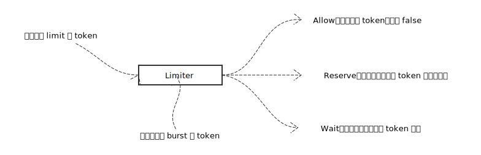

# Limiter

## 实现

首先看一下 Limiter 的简图：



### time.Duration 与 Limiter 换算关系：

- durationFromTokens

```go
func (limit Limit) durationFromTokens(tokens float64) time.Duration {
	// 计算在 limit 限速下，生成 tokens 个 token，需要的秒数
	seconds := tokens / float64(limit)
	return time.Nanosecond * time.Duration(1e9*seconds)
}
```

- tokensFromDuration

```go
func (limit Limit) tokensFromDuration(d time.Duration) float64 {
	// 在 limit 限速下，d 时间间隔可产生的 token 数量
	return d.Seconds() * float64(limit)
}
```

### 生成 token

```go
func (lim *Limiter) advance(now time.Time) (newNow time.Time, newLast time.Time, newTokens float64) {
	// 获取最后一次请求时间
	last := lim.last

	// 保护性代码，如果系统时间倒表，刷新最后请求时间
	if now.Before(last) {
		last = now
	}

	// 如果很长时间没有调用过方法，那么最多允许 burst 个 token 存在；否则，可能造成 token 数量超限，造成限速失败；
	// lim.burst >= lim.tokens
	maxElapsed := lim.limit.durationFromTokens(float64(lim.burst) - lim.tokens)
	elapsed := now.Sub(last)

	// 两次调用间隔超过最长间隔
	if elapsed > maxElapsed {
		elapsed = maxElapsed
	}

	// 由于两次调用有时间间隔，需要计算新增的 token 数量
	delta := lim.limit.tokensFromDuration(elapsed)
	tokens := lim.tokens + delta

	// 保证 lim.burst >= lim.tokens
	if burst := float64(lim.burst); tokens > burst {
		tokens = burst
	}

	// 返回当前时间，最后一次调用时间，剩余 token 数量
	return now, last, tokens
}
```

### 获取 token

```go
func (lim *Limiter) reserveN(now time.Time, n int, maxFutureReserve time.Duration) Reservation {
	lim.mu.Lock()

	if lim.limit == Inf { // 不限速
		lim.mu.Unlock()
		return Reservation{
			ok:        true, // 永远返回 true
			lim:       lim,
			tokens:    n,	// 获取的 token 数量
			timeToAct: now,
		}
	}

	// 生成 token，并返回剩余 token 数量
	now, last, tokens := lim.advance(now)

	// 预留 n 个 token
	tokens -= float64(n)

	// token 不够，设置需要等待的时间
	var waitDuration time.Duration
	if tokens < 0 {
		waitDuration = lim.limit.durationFromTokens(-tokens)
	}

	// n 没有超过 token 最大数量
	// 需要等待的时间没有超过最大等待时间
	ok := n <= lim.burst && waitDuration <= maxFutureReserve

	r := Reservation{
		ok:    ok,
		lim:   lim,
		limit: lim.limit,
	}

	// 如果 token 获取成功，记录数量
	if ok {
		r.tokens = n
		r.timeToAct = now.Add(waitDuration)
	}

	// 刷新 Limiter 状态
	if ok {
		lim.last = now
		lim.tokens = tokens
		lim.lastEvent = r.timeToAct
	} else {
		lim.last = last
	}

	lim.mu.Unlock()
	return r
}
```

## References

- [Token Bucket](https://en.wikipedia.org/wiki/Token_bucket)
