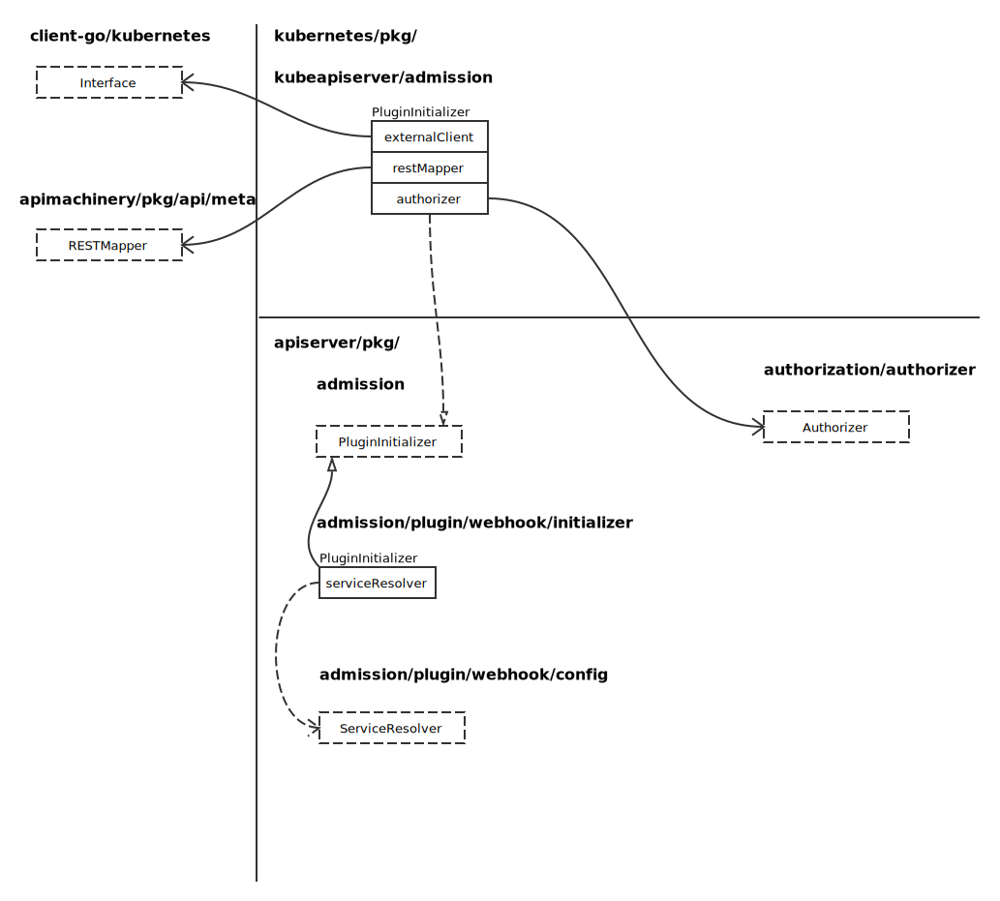
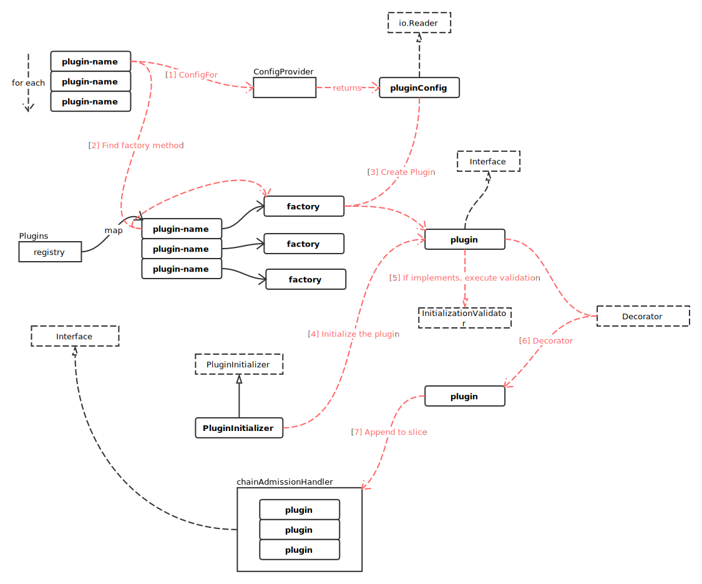

# Admission

## Admission Option Overview

创建配置：

```go
func NewAdmissionOptions() *AdmissionOptions {
	options := &AdmissionOptions{
		Plugins: admission.NewPlugins(),
		RecommendedPluginOrder: []string{lifecycle.PluginName, initialization.PluginName, mutatingwebhook.PluginName, validatingwebhook.PluginName},
		DefaultOffPlugins:      sets.NewString(initialization.PluginName),
	}
	server.RegisterAllAdmissionPlugins(options.Plugins)
	return options
}
```

代码```go server.RegisterAllAdmissionPlugins(options.Plugins)``` 执行完毕后，结构如下图：


Handler 结构，实现了默认的 Operation 接口：

```go
func (h *Handler) Handles(operation Operation) bool {
	return h.operations.Has(string(operation))
}
```

然后注册更多的插件：

```go
func RegisterAllAdmissionPlugins(plugins *admission.Plugins) {
	admit.Register(plugins) // DEPRECATED as no real meaning
	alwayspullimages.Register(plugins)
	antiaffinity.Register(plugins)
	defaulttolerationseconds.Register(plugins)
	deny.Register(plugins) // DEPRECATED as no real meaning
	eventratelimit.Register(plugins)
	exec.Register(plugins)
	extendedresourcetoleration.Register(plugins)
	gc.Register(plugins)
	imagepolicy.Register(plugins)
	initialresources.Register(plugins)
	limitranger.Register(plugins)
	autoprovision.Register(plugins)
	exists.Register(plugins)
	noderestriction.Register(plugins)
	label.Register(plugins) // DEPRECATED in favor of NewPersistentVolumeLabelController in CCM
	podnodeselector.Register(plugins)
	podpreset.Register(plugins)
	podtolerationrestriction.Register(plugins)
	resourcequota.Register(plugins)
	podsecuritypolicy.Register(plugins)
	podpriority.Register(plugins)
	scdeny.Register(plugins)
	serviceaccount.Register(plugins)
	setdefault.Register(plugins)
	resize.Register(plugins)
	storageobjectinuseprotection.Register(plugins)
}
```

- AllOrderedPlugins

```go
var AllOrderedPlugins = []string{
	admit.PluginName,                        // AlwaysAdmit
	autoprovision.PluginName,                // NamespaceAutoProvision
	lifecycle.PluginName,                    // NamespaceLifecycle
	exists.PluginName,                       // NamespaceExists
	scdeny.PluginName,                       // SecurityContextDeny
	antiaffinity.PluginName,                 // LimitPodHardAntiAffinityTopology
	initialresources.PluginName,             // InitialResources
	podpreset.PluginName,                    // PodPreset
	limitranger.PluginName,                  // LimitRanger
	serviceaccount.PluginName,               // ServiceAccount
	noderestriction.PluginName,              // NodeRestriction
	alwayspullimages.PluginName,             // AlwaysPullImages
	imagepolicy.PluginName,                  // ImagePolicyWebhook
	podsecuritypolicy.PluginName,            // PodSecurityPolicy
	podnodeselector.PluginName,              // PodNodeSelector
	podpriority.PluginName,                  // Priority
	defaulttolerationseconds.PluginName,     // DefaultTolerationSeconds
	podtolerationrestriction.PluginName,     // PodTolerationRestriction
	exec.DenyEscalatingExec,                 // DenyEscalatingExec
	exec.DenyExecOnPrivileged,               // DenyExecOnPrivileged
	eventratelimit.PluginName,               // EventRateLimit
	extendedresourcetoleration.PluginName,   // ExtendedResourceToleration
	label.PluginName,                        // PersistentVolumeLabel
	setdefault.PluginName,                   // DefaultStorageClass
	storageobjectinuseprotection.PluginName, // StorageObjectInUseProtection
	gc.PluginName,                           // OwnerReferencesPermissionEnforcement
	resize.PluginName,                       // PersistentVolumeClaimResize
	mutatingwebhook.PluginName,              // MutatingAdmissionWebhook
	initialization.PluginName,               // Initializers
	validatingwebhook.PluginName,            // ValidatingAdmissionWebhook
	resourcequota.PluginName,                // ResourceQuota
	deny.PluginName,                         // AlwaysDeny
}
```

### PluginInitializer



```go
type PluginInitializer interface {
	Initialize(plugin Interface)
}
```

### ApplyTo

通过 ApplyTo 将配置应用给 server.Config，并最终通过 server.Config 传递给 GenericAPIServer 结构。最终通过 GenericAPIServer 的 newAPIGroupVersion 方法，将 c.AdmissionControl 传入 APIGroupVersion，请参照 [HTTP Server](http.md)

```go
admissionChain, err := a.Plugins.NewFromPlugins(pluginNames, pluginsConfigProvider, initializersChain, admission.DecoratorFunc(admissionmetrics.WithControllerMetrics))
if err != nil {
	return err
}

c.AdmissionControl = admissionmetrics.WithStepMetrics(admissionChain)
```

其中，关键代码 ```go a.Plugins.NewFromPlugins ``` 执行过程如下图所示：



### chainAdmissionHandler

定义为：

```go
type chainAdmissionHandler []Interface
```

- Interface 接口实现为：

```go
func (admissionHandler chainAdmissionHandler) Handles(operation Operation) bool {
	for _, handler := range admissionHandler {
		if handler.Handles(operation) {
			return true
		}
	}
	return false
}
```

- Admit

```go
func (admissionHandler chainAdmissionHandler) Admit(a Attributes) error {
	for _, handler := range admissionHandler {
		if !handler.Handles(a.GetOperation()) {
			continue
		}
		if mutator, ok := handler.(MutationInterface); ok {
			err := mutator.Admit(a)
			if err != nil {
				return err
			}
		}
	}
	return nil
}
```
