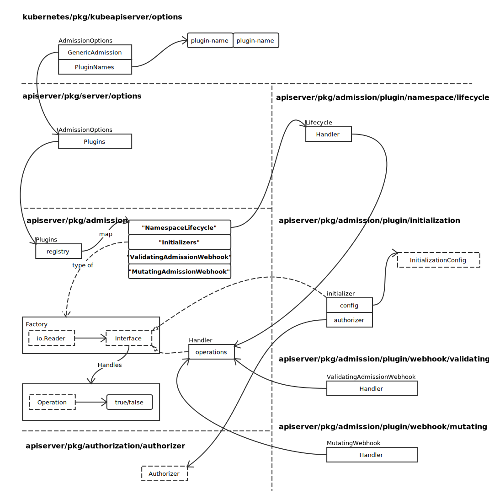

# Admission

## Admission Option Overview

创建配置：

```go
func NewAdmissionOptions() *AdmissionOptions {
	options := &AdmissionOptions{
		Plugins: admission.NewPlugins(),
		RecommendedPluginOrder: []string{lifecycle.PluginName, initialization.PluginName, mutatingwebhook.PluginName, validatingwebhook.PluginName},
		DefaultOffPlugins:      sets.NewString(initialization.PluginName),
	}
	server.RegisterAllAdmissionPlugins(options.Plugins)
	return options
}
```

代码```go Plugins: admission.NewPlugins(),``` 执行完毕后，结构如下图：



Handler 结构，实现了默认的 Operation 接口：

```go
func (h *Handler) Handles(operation Operation) bool {
	return h.operations.Has(string(operation))
}
```
