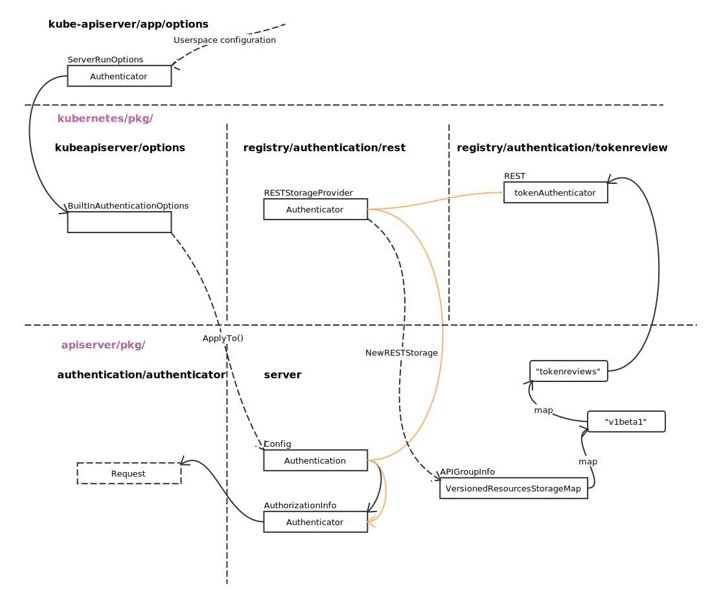

# Authentication

## Overview



BuiltInAuthenticationOptions 创建时，使用了 Option 函数模式：

```go
func (s *BuiltInAuthenticationOptions) WithAll() *BuiltInAuthenticationOptions {
	return s.
		WithAnonymous().
		WithBootstrapToken().
		WithClientCert().
		WithOIDC().
		WithPasswordFile().
		WithRequestHeader().
		WithServiceAccounts().
		WithTokenFile().
		WithWebHook()
}
```

每一个方法，修改一个 BuiltInAuthenticationOptions 域。

- 创建对象

```go
func (r *REST) Create(ctx genericapirequest.Context, obj runtime.Object, createValidation rest.ValidateObjectFunc, includeUninitialized bool) (runtime.Object, error) {
	tokenReview, ok := obj.(*authentication.TokenReview)
	if !ok {
		return nil, apierrors.NewBadRequest(fmt.Sprintf("not a TokenReview: %#v", obj))
	}
	namespace := genericapirequest.NamespaceValue(ctx)
	if len(namespace) != 0 {
		return nil, apierrors.NewBadRequest(fmt.Sprintf("namespace is not allowed on this type: %v", namespace))
	}

	if len(tokenReview.Spec.Token) == 0 {
		return nil, apierrors.NewBadRequest(fmt.Sprintf("token is required for TokenReview in authentication"))
	}

	if r.tokenAuthenticator == nil {
		return tokenReview, nil
	}

	// create a header that contains nothing but the token
	fakeReq := &http.Request{Header: http.Header{}}
	fakeReq.Header.Add("Authorization", "Bearer "+tokenReview.Spec.Token)

	tokenUser, ok, err := r.tokenAuthenticator.AuthenticateRequest(fakeReq)
	tokenReview.Status.Authenticated = ok
	if err != nil {
		tokenReview.Status.Error = err.Error()
	}
	if tokenUser != nil {
		tokenReview.Status.User = authentication.UserInfo{
			Username: tokenUser.GetName(),
			UID:      tokenUser.GetUID(),
			Groups:   tokenUser.GetGroups(),
			Extra:    map[string]authentication.ExtraValue{},
		}
		for k, v := range tokenUser.GetExtra() {
			tokenReview.Status.User.Extra[k] = authentication.ExtraValue(v)
		}
	}

	return tokenReview, nil
}
```
