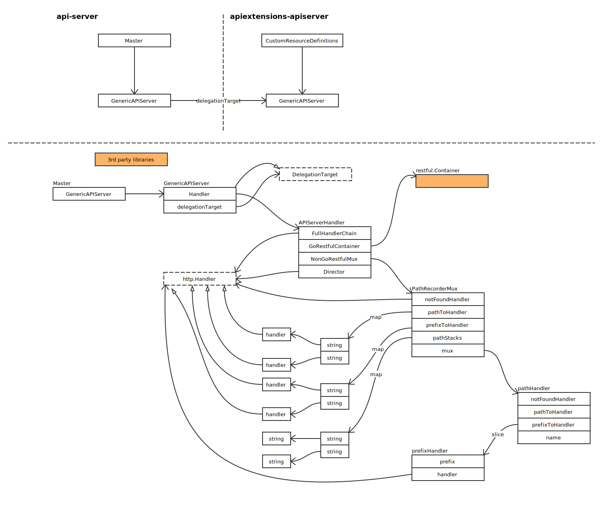
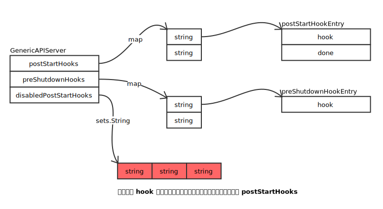
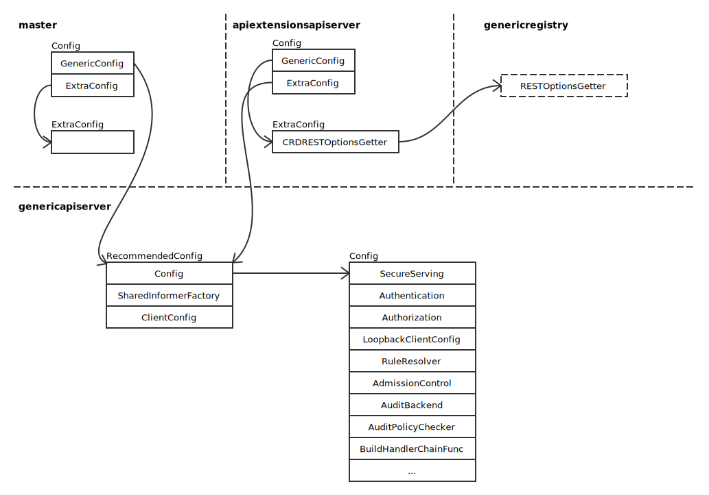
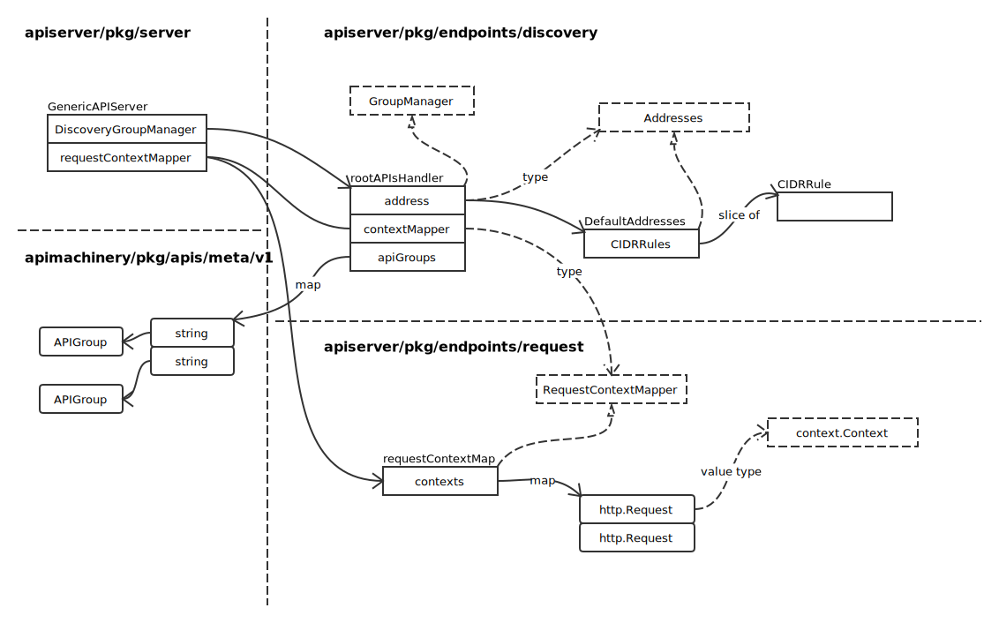
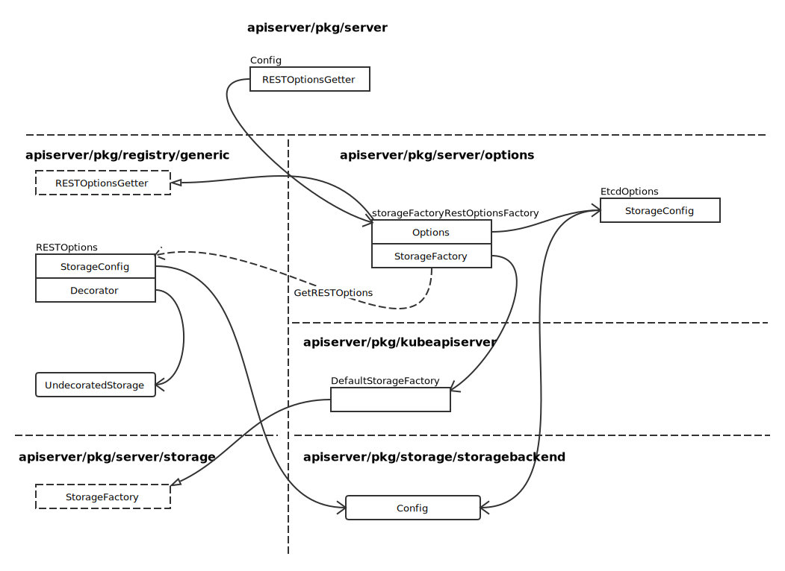
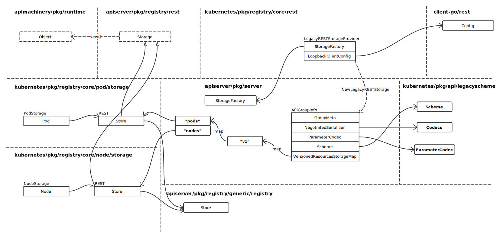
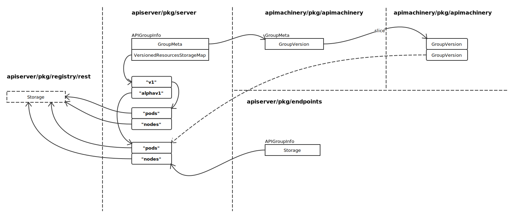
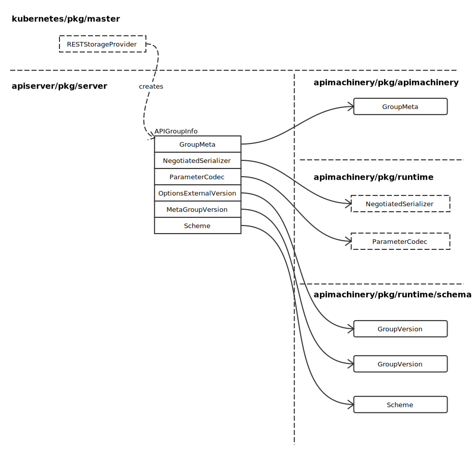
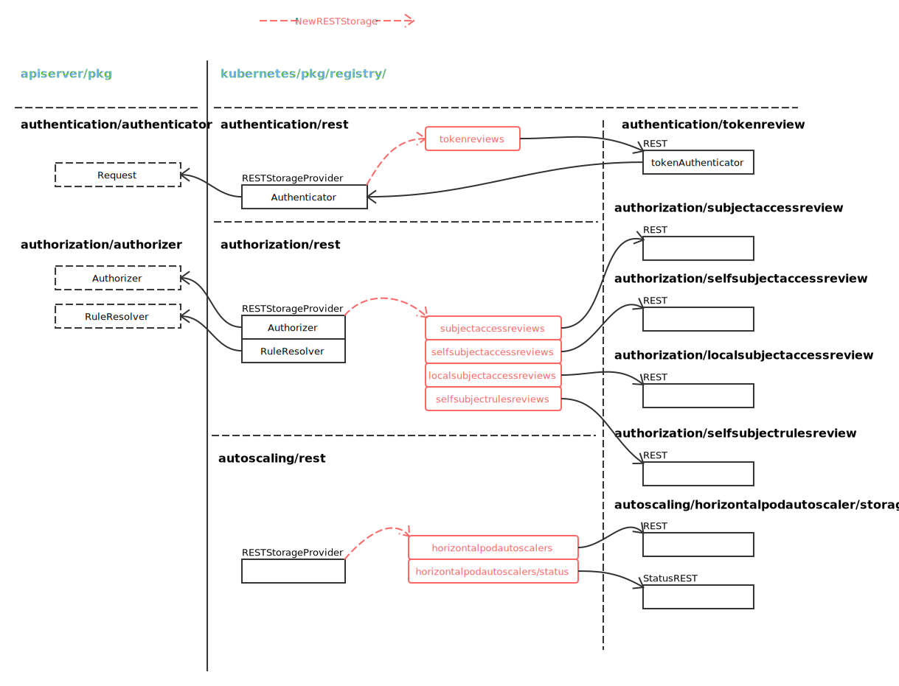

# API Server

## 概览

### 核心结构



通过将 delegationTarget 注册给服务器链前端的 notFoundHandler，实现顺序访问。

### Hooks



### 配置文件结构



## Discovery Group Manager



## 路由安装

### Legacy API 安装

- RESTOptionsGetter 概览：



安装路由代码：

```go
// install legacy rest storage
if c.ExtraConfig.APIResourceConfigSource.VersionEnabled(apiv1.SchemeGroupVersion) {
	legacyRESTStorageProvider := corerest.LegacyRESTStorageProvider{
		StorageFactory:             c.ExtraConfig.StorageFactory,
		ProxyTransport:             c.ExtraConfig.ProxyTransport,
		KubeletClientConfig:        c.ExtraConfig.KubeletClientConfig,
		EventTTL:                   c.ExtraConfig.EventTTL,
		ServiceIPRange:             c.ExtraConfig.ServiceIPRange,
		ServiceNodePortRange:       c.ExtraConfig.ServiceNodePortRange,
		LoopbackClientConfig:       c.GenericConfig.LoopbackClientConfig,
		ServiceAccountIssuer:       c.ExtraConfig.ServiceAccountIssuer,
		ServiceAccountAPIAudiences: c.ExtraConfig.ServiceAccountAPIAudiences,
	}
	m.InstallLegacyAPI(&c, c.GenericConfig.RESTOptionsGetter, legacyRESTStorageProvider)
}
```

关于 StorageFactory 请看 [Storage](./storage.md) 章节。

- LegacyRESTStorageProvider 概览



通过上图，可以看出，通过 NewLegacyRESTStorage 方法，构建出完整的 APIGroupInfo。并与后端存储关联。

- 创建 genericapi.APIGroupVersion



```go
func (s *GenericAPIServer) newAPIGroupVersion(apiGroupInfo *APIGroupInfo, groupVersion schema.GroupVersion) *genericapi.APIGroupVersion {
	return &genericapi.APIGroupVersion{
		GroupVersion:     groupVersion,
		MetaGroupVersion: apiGroupInfo.MetaGroupVersion,

		ParameterCodec:  apiGroupInfo.ParameterCodec,
		Serializer:      apiGroupInfo.NegotiatedSerializer,
		Creater:         apiGroupInfo.Scheme,
		Convertor:       apiGroupInfo.Scheme,
		UnsafeConvertor: runtime.UnsafeObjectConvertor(apiGroupInfo.Scheme),
		Defaulter:       apiGroupInfo.Scheme,
		Typer:           apiGroupInfo.Scheme,
		Linker:          apiGroupInfo.GroupMeta.SelfLinker,
		Mapper:          apiGroupInfo.GroupMeta.RESTMapper,

		Admit:                        s.admissionControl,
		Context:                      s.RequestContextMapper(),
		MinRequestTimeout:            s.minRequestTimeout,
		EnableAPIResponseCompression: s.enableAPIResponseCompression,
	}
}
```

APIGroupVersion 生成后，直接安装路由：

```go
if err := apiGroupVersion.InstallREST(s.Handler.GoRestfulContainer); err != nil {
```

### 普通路由安装

```go
restStorageProviders := []RESTStorageProvider{
	authenticationrest.RESTStorageProvider{Authenticator: c.GenericConfig.Authentication.Authenticator},
	authorizationrest.RESTStorageProvider{Authorizer: c.GenericConfig.Authorization.Authorizer, RuleResolver: c.GenericConfig.RuleResolver},
	autoscalingrest.RESTStorageProvider{},
	batchrest.RESTStorageProvider{},
	certificatesrest.RESTStorageProvider{},
	extensionsrest.RESTStorageProvider{},
	networkingrest.RESTStorageProvider{},
	policyrest.RESTStorageProvider{},
	rbacrest.RESTStorageProvider{Authorizer: c.GenericConfig.Authorization.Authorizer},
	schedulingrest.RESTStorageProvider{},
	settingsrest.RESTStorageProvider{},
	storagerest.RESTStorageProvider{},
	// keep apps after extensions so legacy clients resolve the extensions versions of shared resource names.
	// See https://github.com/kubernetes/kubernetes/issues/42392
	appsrest.RESTStorageProvider{},
	admissionregistrationrest.RESTStorageProvider{},
	eventsrest.RESTStorageProvider{TTL: c.ExtraConfig.EventTTL},
}
m.InstallAPIs(c.ExtraConfig.APIResourceConfigSource, c.GenericConfig.RESTOptionsGetter, restStorageProviders...)
```

- RESTStorageProvider 概览



实例图如下（完整版请参照代码）：


