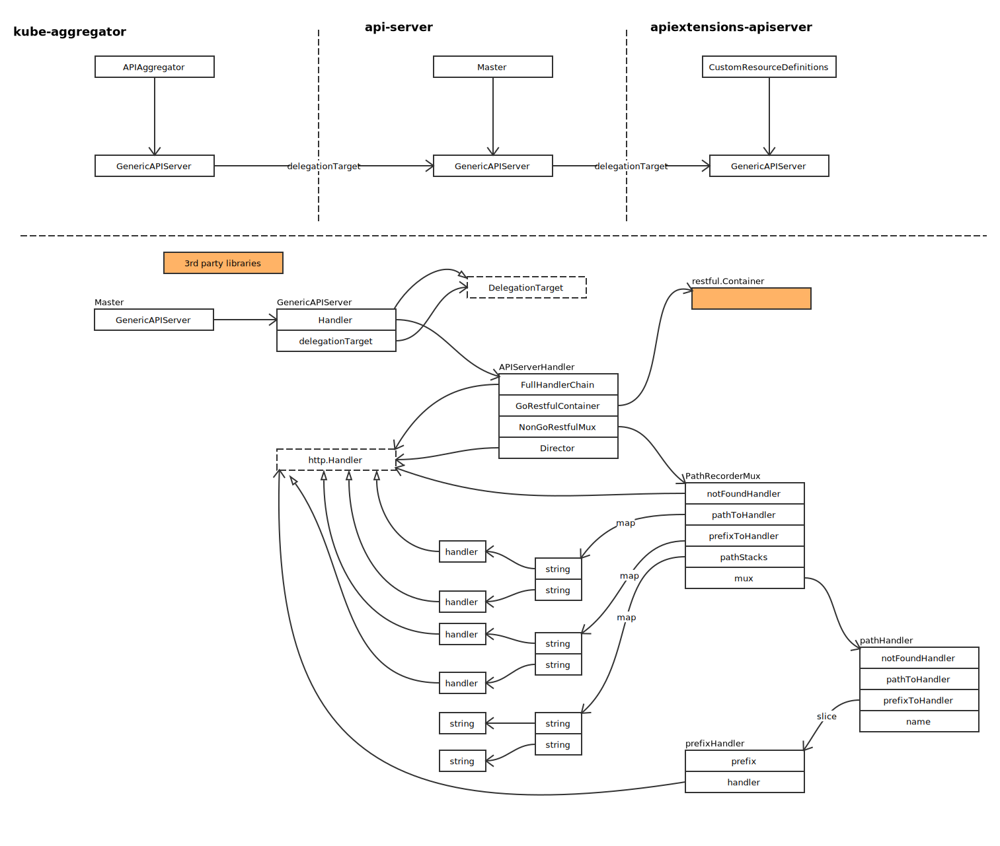

# HTTP Server

## 概览

### 核心结构



### Hooks


### 配置文件结构


### 路由安装

#### Legacy API 安装

- RESTOptionsGetter 概览：


- RESTStorageProvider 概览


- LegacyRESTStorageProvider 概览


通过上图，可以看出，通过 NewLegacyRESTStorage 方法，构建出完整的 APIGroupInfo。并与后端存储关联。

- 创建 genericapi.APIGroupVersion


```go
func (s *GenericAPIServer) newAPIGroupVersion(apiGroupInfo *APIGroupInfo, groupVersion schema.GroupVersion) *genericapi.APIGroupVersion {
	return &genericapi.APIGroupVersion{
		GroupVersion:     groupVersion,
		MetaGroupVersion: apiGroupInfo.MetaGroupVersion,

		ParameterCodec:  apiGroupInfo.ParameterCodec,
		Serializer:      apiGroupInfo.NegotiatedSerializer,
		Creater:         apiGroupInfo.Scheme,
		Convertor:       apiGroupInfo.Scheme,
		UnsafeConvertor: runtime.UnsafeObjectConvertor(apiGroupInfo.Scheme),
		Defaulter:       apiGroupInfo.Scheme,
		Typer:           apiGroupInfo.Scheme,
		Linker:          apiGroupInfo.GroupMeta.SelfLinker,
		Mapper:          apiGroupInfo.GroupMeta.RESTMapper,

		Admit:                        s.admissionControl,
		Context:                      s.RequestContextMapper(),
		MinRequestTimeout:            s.minRequestTimeout,
		EnableAPIResponseCompression: s.enableAPIResponseCompression,
	}
}
```

APIGroupVersion 生成后，直接安装路由：

```go
if err := apiGroupVersion.InstallREST(s.Handler.GoRestfulContainer); err != nil {
```
