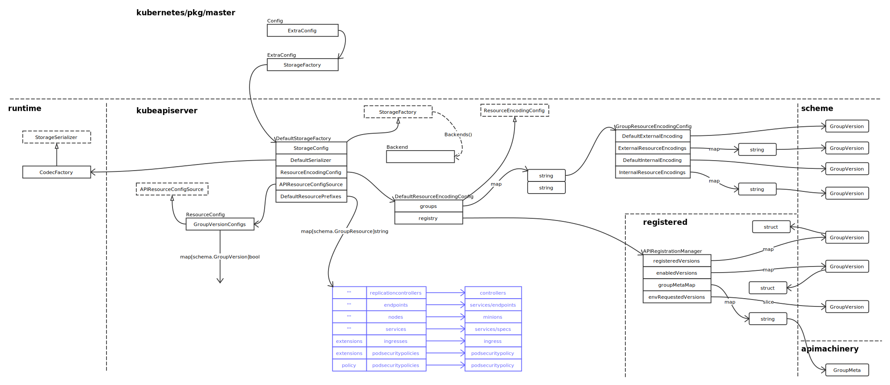
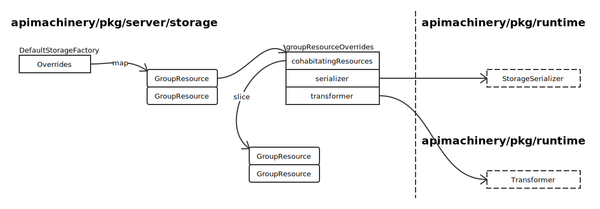
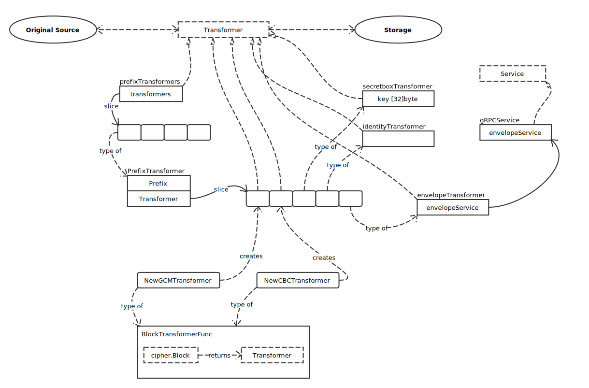

# Storage

## Storage Factory

接口定义如下：

```go
type StorageFactory interface {
	// New finds the storage destination for the given group and resource. It will
	// return an error if the group has no storage destination configured.
	NewConfig(groupResource schema.GroupResource) (*storagebackend.Config, error)

	// ResourcePrefix returns the overridden resource prefix for the GroupResource
	// This allows for cohabitation of resources with different native types and provides
	// centralized control over the shape of etcd directories
	ResourcePrefix(groupResource schema.GroupResource) string

	// Backends gets all backends for all registered storage destinations.
	// Used for getting all instances for health validations.
	Backends() []Backend
}
```

### Default Storage Factory



### Group Resource Overrides



在创建 StorageFactory 时，已经注册了以下 GroupResource:


### Transformer



### 引用关系


