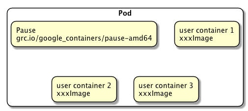
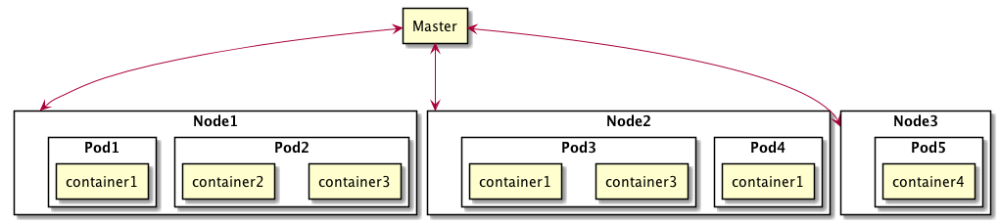
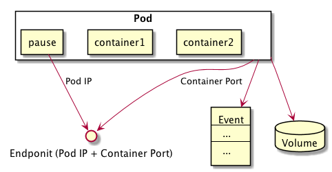

# Pod

Pod 是 Kubemetes 的最重要也最基本的概念，如图下图所示是 Pod 的组成示意图，我们看到每个 Pod 都有一个特殊的被称为“根容器”的 Pause 容器。Pause 容器对应的镜像属于 Kubemetes 平台的一部分，除了 Pause 容器，每个 Pod 还包含一个或多个紧密相关的用户业务容器。

为什么 Kubemetes 会设计出一个全新的 Pod 的概念并且 Pod 有这样特殊的组成结构？

* 原因之一：在一组容器作为一个单元的情况下，我们难以对“整体”简单地进行判断及有效地进行行动。比如，一个容器死亡了，此时算是整体死亡么？是 N/M 的死亡率么？引入业务无关并且不易死亡的 Pause 容器作为 Pod 的根容器，以它的状态代表整个容器组的状态，就简单、巧妙地解决了这个难题。
* 原因之二：Pod 里的多个业务容器共享 Pause 容器的 IP，共享 Pause 容器挂接的 Volume，这样既简化了密切关联的业务容器之间的通信问题，也很好地解决了它们之间的文件共享问题。

Kubemetes 为每个 Pod 都分配了唯一的 IP 地址，称之为 Pod IP，一个 Pod 里的多个容器共享 Pod IP 地址。Kubemetes 要求底层网络支持集群内任意两个 Pod 之间的 TCP/IP 直接通信，这通常采用虚拟二层网络技术来实现，例如 Flannel、Openvswitch 等，因此我们需要牢记一点：在 Kubemetes 里，一个 Pod 里的容器与另外主机上的 Pod 容器能够直接通信。

Pod其实有两种类型：普通的 Pod 及静态 Pod (static Pod)，后者比较特殊，它并不存放在 Kubemetes 的 etcd 存储里，而是存放在某个具体的 Node 上的一个具体文件中，并且只在此 Node 上启动运行。而普通的 Pod —旦被创建，就会被放入到 etcd 中存储，随后会被 Kubemetes Master 调度到某个具体的 Node 上并进行绑定 (Binding)，随后该 Pod 被对应的 Node 上的 kubelet 进程实例化成一组相关的 Docker 容器并启动起来。在默认情况下，当 Pod 里的某个容器停止时，  Kubemetes 会自动检测到这个问题并且重新启动这个 Pod (重启 Pod 里的所有容器)，如果 Pod 所在的 Node 宕机，则会将这个 Node 上的所有 Pod 重新调度到其他节点上。Pod、Container 与 Node 的关系如下图所示。

Pod 的 IP 加上这里的容器端口 (containerPort)，就组成了一个新的概念 ---- Endpoint，它代表着此 Pod 里的一个服务进程的对外通信地址。一个 Pod 也存在着具有多个 Endpoint 的情况。

Pod 可以挂载 Pod Volume，并同 Node 一样有 Event 记录。

每个 Pod 都可以对其能使用的服务器上的计算资源设置限额，当前可以设置限额的计算资源有 CPU 与 Memory 两种，其中 CPU 的资源单位为 CPU (Core) 的数量，是一个绝对值而非相对值。

在Kubemetes里，一个计算资源进行配额限定需要设定以下两个参数。

* Requests: 该资源的最小申请量，系统必须满足要求。
* Limits: 该资源最大允许使用的量，不能被突破，当容器试图使用超过这个量的资源时, 可能会被 Kubemetes Kill 并重启。