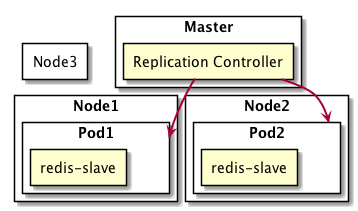
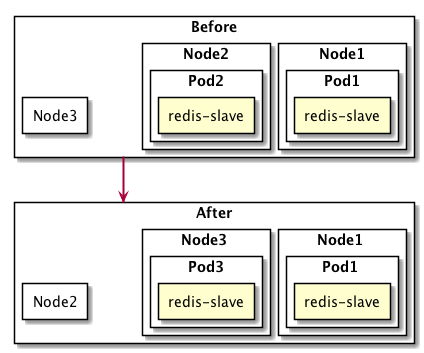
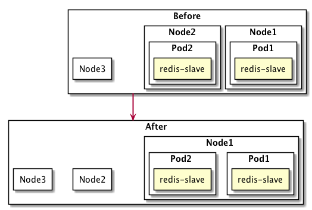

# Replication Controller and Replica Set

## Replication Controller

RC 是 Kubemetes 系统中的核心概念之一，简单来说，它其实是定义了一个期望的场景，即声明某种 Pod 的副本数量在任意时刻都符合某个预期值，所以 RC 的定义包括如下几个部分。

* Pod 期待的副本数（replicas)。
* 用于筛选目标 Pod 的 Label Selector。
* 当 Pod 的副本数量小于预期数量的时候，用于创建新 Pod 的 Pod 模板（template）。

当我们定义了一个 RC 并提交到 Kubemetes 集群中以后，Master 节点上的 Controller Manager 组件就得到通知，定期巡检系统中当前存活的目标 Pod，并确保目标 Pod 实例的数量刚好等于此 RC 的期望值，如果有过多的 Pod 副本在运行，系统就会停掉一些 Pod，否则系统就会再自动创建一些 Pod。可以说，通过 RC，Kubemetes 实现了用户应用集群的高可用性，并且大大减少了系统管理员在传统 IT 环境中需要完成的许多手工运维工作（如主机监控脚本、应用监控脚本、故障恢复脚本等）。

举一个例子，一个 3 个 Node 节点的集群，RC 里定义 redis-slave 这个 Pod 需要保持 2 个副本，系统将可能在其中的两个 Node 上创建 Pod。

假设 Node2 上的 Pod2 意外终止，根据 RC 定义的 replicas 数量 2，Kubernetes 将会自动创建并启动一个新的 Pod，以保证整个集群中始终有两个 redis-slave Pod 在运行。系统可能选择 Node3 或者 Node1 来创建一个新的 Pod。

||or||
| --- | --- | --- |

在运行时，我们可以通过使用 `kubectl scale` 命令修改 RC 的副本数量，来实现 Pod 的动态缩放（Scaling) 功能，例如：`kubectl scale rc redis-slave --replicas=3`

## Replica Set

Replica Sets 支持基于集合的 Label selector (Set-based selector)，而 Replication Controller 只支持基于等式的 Label Selector (equality-based selector)，这使得 Replica Set 的功能更强。

kubectl 命令行工具适用于 Replication Controller 的绝大部分命令都同样适用于 Replica Set。此外，当前我们很少单独使用 Replica Set，它主要被 Deployment 这个更高层的资源对象所使用，从而形成一整套 Pod 创建、删除、更新的编排机制。当我们使用 Deployment 时，无须关心它是如何创建和维护 Replica Set 的，这一切都是自动发生的。

Replication Controller/Replica Set 的一些特性与作用。（下面仅用 RC/RS 代替）

* 在大多数情况下，我们通过定义一个 RC/RS 实现 Pod 的创建过程及副本数量的自动控制。
* RC/RS 里包括完整的 Pod 定义模板。
* RC/RS 通过 Label Selector 机制实现对 Pod 副本的自动控制。
* 通过改变 RC/RS 里的 Pod 副本数量，可以实现 Pod 的扩容或缩容功能。
* 通过改变 RC/RS 里 Pod 模板中的镜像版本，可以实现 Pod 的滚动升级功能。