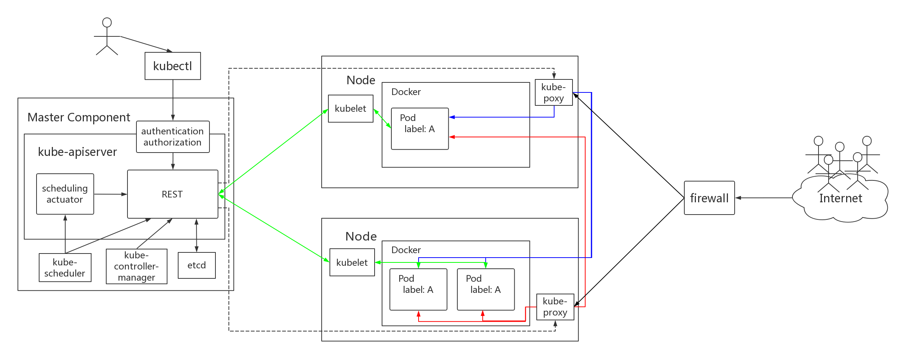

# Kubernetes Components

## Master

Master 相当于整个集群的“大脑”，提供的集群控制，对集群做出全局性决策，以及检测和响应集群事件。Master 上运行以下进程：

<!-- Master 提供的集群控制。Master 对集群做出全局性决策(例如：调度)，以及检测和响应集群事件(副本控制器的 replicas 字段不满⾜时，启动新的副本)。Master 可以在集群中的任何节点上运⾏。然⽽，为了简单起⻅，设置脚本通常会启动同⼀个虚拟机上所有 Master ，并且不会在此虚拟机上运⾏⽤户容器。 -->

* kube-apiserver 对外暴露了 Kubernetes API。它是的 Kubernetes 前端控制层。它被设计为⽔平扩展，即通过部署更多实例来缩放。
* kube-controller-manager 运行着一系列控制器。（包含 service account controller、replication controller、replica set controller 等）<!-- 运⾏控制器，它们是处理集群中常规任务的后台线程。逻辑上，每个控制器是⼀个单独的进程，但为了降低复杂性，它们都被编译成独⽴的可执⾏⽂件，并在单个进程中运⾏。这些控制器包括:  * 节点控制器: 当节点移除时，负责注意和响应。  * 副本控制器: 负责维护系统中每个副本控制器对象正确数量的 Pod。  * 端点控制器: 填充 端点(Endpoints) 对象 (即连接 Services & Pods)。  * 服务帐户和令牌控制器: 为新的命名空间创建默认帐户和 API 访牌。 -->

* kube-scheduler 监视没有分配节点的新创建的 Pod，选择⼀个节点供他们运⾏。
* etcd ⽤于 Kubernetes 的后端存储，所有集群数据都存储在此处。始终为您的 Kubernetes 群集提供 etcd 数据的备份计划。
* cloud-controller-manager 是⽤于与底层云提供商交互的控制器。（Kubernetes 1.6 引⼊的 alpha 功能，默认不开启）<!-- ，可以在在启动 kube-controller-manager 时将 `\-\-cloud-provider` 设置为 `external` 来开启。以下控制器具有云提供商依赖关系:  * 节点控制器: ⽤于检查云提供商以确定节点是否在云中停⽌响应后被删除  * 路由控制器: ⽤于在底层云基础架构中设置路由  * 服务控制器: ⽤于创建，更新和删除云提供商负载平衡器  * 数据卷控制器: ⽤于创建，附加和装载卷，并与云提供商进⾏交互以协调卷 -->

## Node

Node 在每个工作节点上运⾏，维护运⾏的 Pod 并提供 Kubernetes 运⾏时环境。

<!-- * kubelet 是在集群中的每个 Node 上运行的代理程序，它确保 Containers 在一个 Pod 中运行。提供如下功能:  * 挂载 Pod 所需要的 Volume  * 下载 Pod 的 secrets  * 通过 Docker 运⾏ (或通过 rkt) 运⾏ Pod 的容器  * 周期性的对容器⽣命周期进⾏探测  * 如果需要，通过创建 镜像 Pod (Mirror Pod) 将 Pod 的状态报告回系统的其余部分  * 将节点的状态报告回系统的其余部分 -->

* kubelet 与 master(API Server) 进行通讯，确保 pod 的正常，保存一系列 PodSpecs。
* kube-proxy 通过维护主机上的⽹络规则并执⾏连接转发，实现了 Kubernetes 服务抽象。
* container runtime 是负责运行容器的软件。Kubernetes 支持两种运行时: docker 和 rkt。

## Addons

Addons 是实现集群功能的 pod 和 service。 Pods 可以通过 deployments，replication controllers 管理。Addons 对象本身是受命名空间限制的，被创建于kube-system 命名空间。

<!-- * DNS: 虽然其他插件并不是必需的，但所有 Kubernetes 集群都应该具有 Cluster DNS。Cluster DNS 是⼀个 DNS 服务器，和您部署环境中的其他 DNS 服务器⼀起⼯作，为 Kubernetes 服务提供 DNS 记录。Kubernetes 启动的容器⾃动将 DNS 服务器包含在 DNS 搜索中。* Web UI (Dashboard): Dashboard 是 Kubernetes 集群通⽤基于 Web 的 UI 界⾯。它允许⽤户可视化的⽅式管理集群和集群上的应⽤程序。* Container Resource Monitoring: 将关于容器的⼀些常⻅的时间序列度量值保存到⼀个集中的数据库中，并提供⽤于浏览这些数据的界⾯。* Cluster-level Logging: 将容器的⽇志数据保存到⼀个集中的⽇志存储中，该存储能够提供搜索和浏览接⼝。 -->
