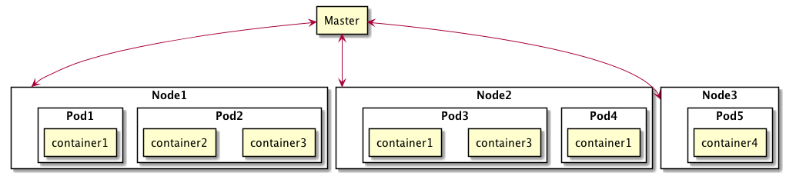

# Pod

## 什么是 Pod

Pod 是一组共享存储空间和运行选项的容器，是 Kubernetes 可以创建和管理的最小单元。一个 Pod 代表了一个运行在集群里的进程。

Pod 里封装了一个（或者多个）应用容器，存储资源，以及惟一的网络 IP，和容器如何运行的规则。 一个 Pod 表示这样一组部署：由一个容器或者一组紧耦合容器组成共享资源的 Kubernets 应用实例。

Pod 被设计成支持用多个相互协作的进程（比如说：容器）来构成一组高粘性的服务。Pod 的容器能在集群里的物理或者虚拟机上自动协同寻址、协同调度到同一台机器上。容器之间能够共享资源和依赖，能相互通信，还能相互协调容器终止的方式和终止的时间点。

Nodes、Pods 与 Containers 的关系如下图所示。

## 为什么要 Pod

### 管理需求

将实现同一功能的多个容器打包成一个整体进行管理，相较于对每一个容器进行管理会简化很多。Pod 是这样一个模式的抽象：互相协作的多个进程共同形成一个完整的服务。通过提供对应用的更高层次的抽象，Pod 简化了应用部署和管理。Pod 是部署、水平扩展以及复制的基本单元。容器的协同工作（协同调度)，共享生命周期（比如说：终止），复制协调，资源共享以及依赖管理都自动在 Pod 内部进行处理。

### 资源共享和通信

Pod 内部实现了数据共享和相互通信。

#### Pod 为它的容器们提供了两类共享资源

* 网络：每一个 Pod 都被分配了一个唯一的 IP 地址。Pod 里的所有容器共享着一个网络空间，这个网络空间包含了 IP 地址和网络端口。Pod 内部的容器彼此之间可以通过 `localhost` 相互通信。 但当 Pod 里的容器需要与 Pod 以外实体进行通信时，就要使用到这个共享网络资源了（比如说：端口）。
* 存储：Pod 可以指定一系列的共享存储 卷。Pod 里所有的容器都由权限访问这个共享卷，同时也可以使用这个共享卷来分享数据。 卷的出现使 Pod 能够支持数据持久性，这样就算是在 Pod 内部容器需要重启的场景里，数据也可以长期保持。

下面是一个 Pod 的组成示意图，每个 Pod 都会附带一个 pause 容器，pause 容器不执行实际的业务逻辑，只是对 Pod 的网络、IO 等进行控制。Pod 的 IP 加上这里的容器端口 (containerPort)，就组成了一个新的概念 -- Endpoint，它代表着此 Pod 里的一个服务进程的对外通信地址。一个 Pod 也存在着具有多个 Endpoint 的情况。

## Pod 的使用

Pods 可以被用于托管垂直集成的应用栈（比如说 LAMP)，但是 Pod 最显著的优势是支持协同定位，协作管理辅助程序。比如说：

* 内容管理系统，文件和数据的导入，本地缓存管理等。
* 日志和检查点的备份，压缩，轮转，快照等。
* 数据变化监测，日志检测，日志和监控，事件发布等。
* 代理，桥接器和连接器。
* 控制，管理，配置和更新管理。

## Pods 和 Controllers

在 Kubernets 里很少直接创建一个单独的 Pod -- 就算是在只有一个 Pod 的场景里也是这样。从设计上来说 Pod 是一个一次性的、短暂的实体，在创建一个 Pod（直接被创建，或者是通过 Controller 间接创建）时，这个 Pod 会被调用到集群里某一个节点上。除非 Pod 进程被终止，或者 Pod 对象被删除，或者由于缺少资源、节点失败等原因 Pod 被销毁，Pod 将一直存在在这个节点上。

从 Pod 本身而言，它不具备自我恢复的功能。如果 Pod 被调度到一个宕机的节点，或者调度的操作本身就失败了，那么这个 Pod 立刻会被删除，这个场景同样适用于缺少资源或者节点宕机的情况。Kubernetes 使用一个称作 Controller 高度抽象来管理相对可删除 Pod。因此与单独直接使用一个 Pod 相比，在 Kubernets 里更常见的情况是使用一个 Controller 来管理所有的 Pod。

一个 Controller 可以创建和管理很多个 Pods，也提供复制、初始化，以及提供集群范围的自我恢复的功能。比如说：如果一个节点宕机，Controller 将调度一个在其他节点上完全相同的 Pod 来自动取代当前的 Pod。

## Pod 模版

Pod 模版是为 Pod 量身定制的，其中也包含了一些额外的对象，比如说：Replication Controllers、Jobs、DaemonSets 等。Controllers 使用 Pod 模版生成 Pod。

Pod 模版像一个饼干模具：一旦饼干出炉就与模具没有任何关系。模版和实例之间不会互相纠缠，随后在模版上的改动，或者切换到新模版都不会对已创建成功的 Pod 产生影响。同样的，通过 replication controller 创建的 Pod 随后就可以直接更新。这种方法从根本上简化了系统语义，同时增加了灵活性。

## 为什么选择 Pod

### 为什么不在一个容器（Docker）里运行多个程序

1. 透明度。让 Pod 里的容器可见于框架，框架则可以很容易的给这些容器提供服务，比如说：进程管理，资源监控。 这种机制给用户带来了很大的便利。
2. 解耦软件依赖。每一个独立的容器都可以单独管理版本，也可以单独重构和重新部署。 Kubernetes 甚至有一天可以实现为单独容器的在线升级。
3. 易用性。用户们不需要运行自己的进程管理，也不需要担心信号和退出处理等等。
4. 效率。由于基础设施承担了更多的职责，容器从而变得更加轻量级。

### 为什么不支持基于亲和性的容器协同调度

这个方法可以提供协同寻址，但是不能提供大多数 pods 优势，比如说资源共享， IPC, 生命周期共享以及最简化的管理。