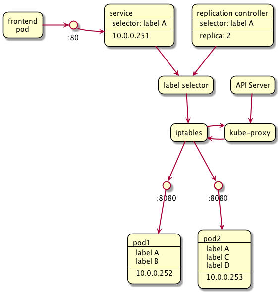
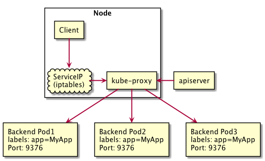
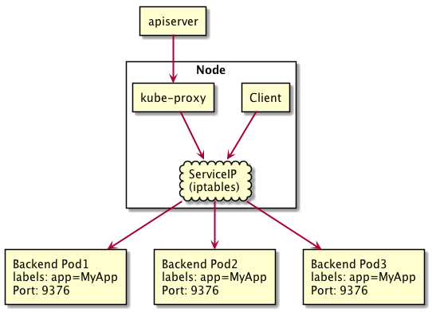
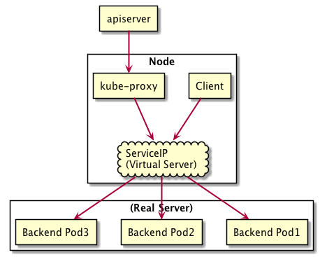

# Service

Controller 在动态管理 pod 的过程中，总有旧的 pod 被销毁，新的 pod 被创建，pod 的 IP 在这时就会发生改变。Service 是一个 pod 的逻辑分组，一种可以访问它们的策略，service 的 IP 不易改变。外部只需通过 service 的 IP 获取服务，内部会将流量代理到 pod 上。



<!-- ## 为什么有 Service

Kubernetes Pod 是有生命周期的，它们可以被创建，也可以被销毁，然而一旦被销毁生命就永远结束。通过 Replication Controller 能够动态地创建和销毁 Pod（例如，需要进行扩缩容，或者执行滚动升级）。每个 Pod 都会获取它自己的 IP 地址，即使这些 IP 地址不总是稳定可依赖的。 这会导致一个问题：如果一组 Pod（称为 backend）为其它 Pod（称为 frontend）提供服务，那么那些 frontend 该如何发现，并连接到这组 Pod 中的哪些 backend 呢？

Kubernetes Service 定义了这样一种抽象：一个 Pod 的逻辑分组，一种可以访问它们的策略 -- 通常称为微服务。 这一组 Pod 能够被 Service 访问到，通常是通过 Label Selector 实现的。如下图，Service 的 IP 不易改变，所以 frontend 不需要关心 pod 的 IP。


对 Kubernetes 集群中的应用，Kubernetes 提供了简单的 Endpoints API，只要 Service 中的一组 Pod 发生变更，应用程序就会被更新。对非 Kubernetes 集群中的应用，Kubernetes 提供了基于 VIP 的网桥的方式访问 Service，再由 Service 重定向到 backend Pod。

一个 Service 在 Kubernetes 中是一个 REST 对象，和 Pod 类似。像所有的 REST 对象一样， Service 定义可以基于 POST 方式，请求 apiserver 创建新的实例。

## 定义一个 Service

### 带有 Selector

一个 Service 在 Kubernetes 中是一个 REST 对象，和 Pod 类似。像所有的 REST 对象一样， Service 定义可以基于 POST 方式，请求 apiserver 创建新的实例。

示例文件

```yaml
kind: Service
apiVersion: v1
metadata:
  name: my-service
spec:
  selector:
    app: MyApp
  ports:
    - protocol: TCP
      port: 80
      targetPort: 9376
```

上述配置将创建一个名称为 "my-service" 的 Service 对象，它会将请求代理到使用 TCP 端口 9376，并且具有标签 "app=MyApp" 的 Pod 上。

Service 可以将传入端口映射到任何目标端口（targetPort）。默认情况下，targetPort 将被设置为与 port 字段相同的值。有趣的是，targetPort 可以是一个字符串，指的是后端 Pods 端口的名称。实际对应该名称的端口在每个后端 Pod 都可以不同。这为部署和升级 Service 提供了很大的灵活性。

Kubernetes Services 支持 TCP 和 UDP 协议，默认是 TCP。

### 没有 Selector

```yaml
kind: Service
apiVersion: v1
metadata:
  name: my-service
spec:
  ports:
  - protocol: TCP
    port: 80
    targetPort: 9376
```

由于 Service 没有 selector，因此相应的 Endpoints 不会被创建。您可以手动将 Service 映射到您自己的特定端点：

```yaml
kind: Endpoints
apiVersion: v1
metadata:
  name: my-service
subsets:
  - addresses:
      - ip: 1.2.3.4
    ports:
      - port: 9376
```

端点 IPs 不能是环回（127.0.0.0/8），链路本地（169.254.0.0/16），链路本地组播（224.0.0.0/24）。

访问没有选择器的 Service，其方式与具有选择器的方式相同。流量将被转发到用户定义的端点（1.2.3.4:9376 在上例中）。

ExternalName Service 是没有选择器的特殊服务：

```yaml
kind: Service
apiVersion: v1
metadata:
  name: my-service
  namespace: prod
spec:
  type: ExternalName
  externalName: my.database.example.com
```

访问这种服务的方式与其他服务一样，唯一的区别在于重定向发生在 DNS 级，并且没有代理或转发发生。 -->

## 虚拟 IP 和服务代理

Kubernetes 群集中的每个节点都运行一个 kube-proxy。kube-proxy 负责为 ExternalName 以外的其他类型的服务实现一种虚拟 IP 形式。

### userspace

<!-- 在此模式下，kube-proxy 监视 Kubernetes 主服务器以添加和删除 Service 和 Endpoints 对象。对于每个服务，它会在本地节点上打开一个端口（随机选择）。与此“代理端口”的任何连接都将代理到 Service 的其中的一个 Pod（如端点中所报告的）。使用哪个后端 Pod 是根据 Service 的 SessionAffinity 决定。最后，它安装 iptables 规则，该规则将流量捕获到 Service 的 clusterIP（虚拟的）和 Port，并将该流量重定向到代理后端 Pod 的代理端口。默认情况下，后端的选择是循环算法。 -->



图中，ServiceIP 是 cluster IP。

### iptables

<!-- 在此模式下，kube-proxy 监视 Kubernetes 主服务器以添加和删除 Service 和 Endpoints 对象。对于每个 Service，它都会安装 iptables 规则，这些规则将流量捕获到 Service 的 clusterIP（虚拟的）和 Port，并将该流量重定向到服务的后端集合中的一个。对于每个 Endpoints 对象，它都会安装选择后端 Pod 的 iptables 规则。默认情况下，选择的方法是随机的。

显然，iptables 不需要在用户空间和内核空间之间切换，它应该比 userspace 代理更快，更可靠。然而，与 userspace 代理器不同，如果最初选择 Pod 的不响应，iptables 代理器不能自动重试连接另一个 Pod，因此它依赖于正在工作的 [readiness probes](https://kubernetes.io/docs/tasks/configure-pod-container/configure-liveness-readiness-probes/#defining-readiness-probes)。 -->



图中，ServiceIP 是 cluster IP。

### ipvs

`Kubernetes v1.9 beta`

<!-- 在此模式下，Kubernetes Services 和 Endpoints 调用 netlink 接口来相应地创建 ipvs 规则，并定期与 Kubernetes Services 和 Endpoints 同步 ipvs 规则，以确保 ipvs 状态与预期一致。当访问服务时，流量将被重定向到其中一个后端 Pod。 -->



## 服务发现

Kubernetes 支持两种主要的服务发现模式：环境变量和 DNS

* 环境变量：
* DNS：
