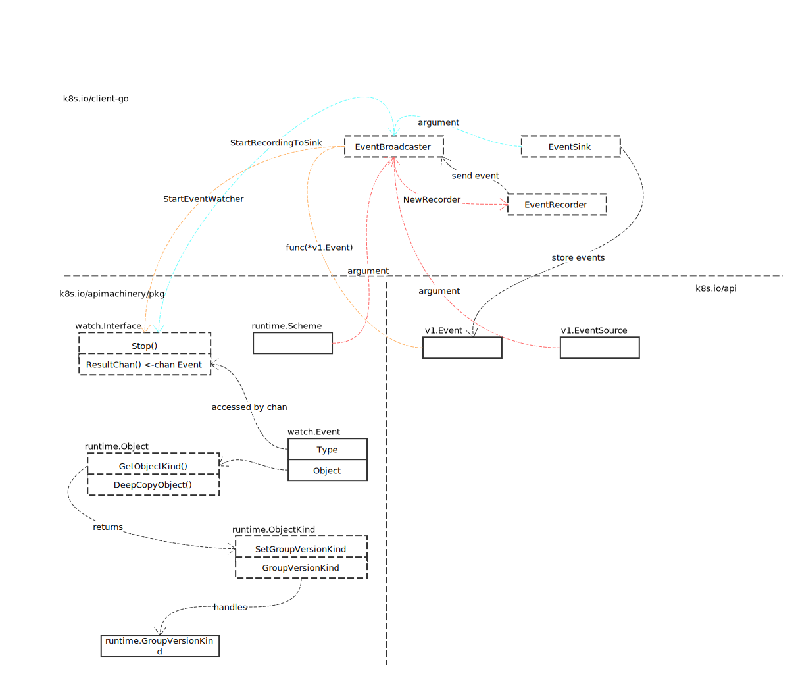
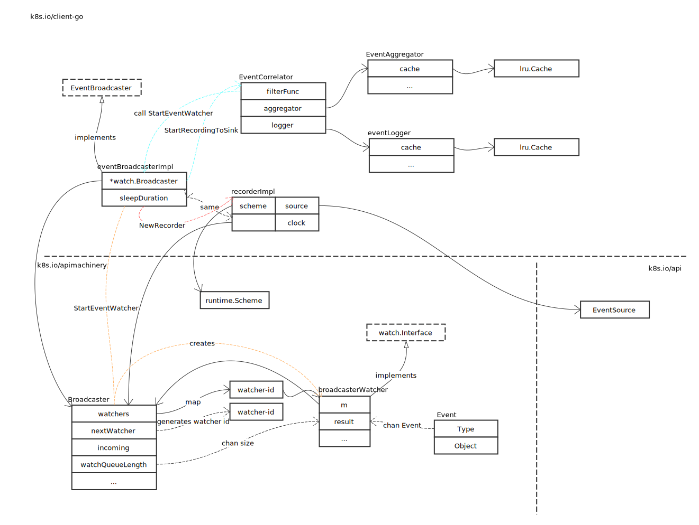
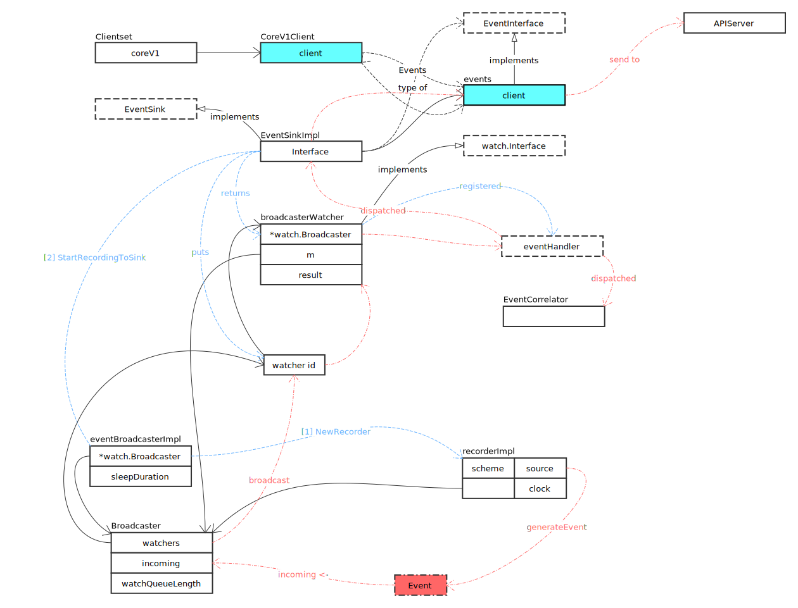

# Event

## Overview



主要接口定义如下：

- EventSink

存储事件相关操作

```go
type EventSink interface {
	Create(event *v1.Event) (*v1.Event, error)
	Update(event *v1.Event) (*v1.Event, error)
	Patch(oldEvent *v1.Event, data []byte) (*v1.Event, error)
}
```

- Interface

停止观察，及获取 Event

```go
type Interface interface {
	Stop()

	ResultChan() <-chan Event
}
```

- EventRecorder

生成事件

```go
type EventRecorder interface {
	Event(object runtime.Object, eventtype, reason, message string)

	Eventf(object runtime.Object, eventtype, reason, messageFmt string, args ...interface{})

	PastEventf(object runtime.Object, timestamp metav1.Time, eventtype, reason, messageFmt string, args ...interface{})
}
```

## EventBroadcaster

### 核心结构

来看一下 EventBroadcaster 实例关系图：



#### Broadcaster

从上图不难看出，Broadcaster 结构是所有实现的核心。

首先 eventBroadcasterImpl 和 recorderImpl均包含匿名 Broadcaster 引用，那么就意味着 Broadcaster 所有共有方法，可被这两个对象直接使用。

其次，Broadcaster 处于关系的中轴位置，关联起其他对象。在创建 Broadcaster 对象时，同时启动了事件分发协程 loop：

```go
func (m *Broadcaster) loop() {
	// 分发事件
	for {
		event, ok := <-m.incoming
		if !ok {
			break
		}

		// 事件类型处理
		if event.Type == internalRunFunctionMarker {
			event.Object.(functionFakeRuntimeObject)()
			continue
		}

		// 分发事件
		m.distribute(event)
	}

	// 善后操作
	m.closeAll()
	m.distributing.Done()
}
```

- Action

```go
func (m *Broadcaster) Action(action EventType, obj runtime.Object) {
	m.incoming <- Event{action, obj}
}
```

#### EventRecorder

EventRecorder 的实例为 recorderImpl，定义如下：

```go
type recorderImpl struct {
	scheme *runtime.Scheme
	source v1.EventSource
	*watch.Broadcaster
	clock clock.Clock
}
```

核心功能是生成事件：

```go
func (recorder *recorderImpl) generateEvent(object runtime.Object, timestamp metav1.Time, eventtype, reason, message string) {
	// 获取对象的 Reference 对象
	ref, err := ref.GetReference(recorder.scheme, object)
	if err != nil {
		glog.Errorf("Could not construct reference to: '%#v' due to: '%v'. Will not report event: '%v' '%v' '%v'", object, err, eventtype, reason, message)
		return
	}

	if !validateEventType(eventtype) {
		glog.Errorf("Unsupported event type: '%v'", eventtype)
		return
	}

	// 创建事件
	event := recorder.makeEvent(ref, eventtype, reason, message)
	event.Source = recorder.source

	// 发送事件
	go func() {
		defer utilruntime.HandleCrash()
		recorder.Action(watch.Added, event)
	}()
}
```

请参照 [ObjectReference](../general/object_reference.md)。

### StartEventWatcher

StartEventWatcher 被用于创建事件观察者，起到承上启下的作用。

```go
func (eventBroadcaster *eventBroadcasterImpl) StartEventWatcher(eventHandler func(*v1.Event)) watch.Interface {
	// 创建 watcher，满足 watch.Interface 接口
	watcher := eventBroadcaster.Watch()

	// 事件处理 goroutine
	go func() {
		defer utilruntime.HandleCrash()
		for {
			watchEvent, open := <-watcher.ResultChan()

			// chan 已关闭
			if !open {
				return
			}

			// 事件类型转换
			event, ok := watchEvent.Object.(*v1.Event)
			if !ok {
				// 保护性代码，不应该执行到此
				continue
			}

			// 处理事件
			eventHandler(event)
		}
	}()
	return watcher
}
```

注意上面的实现，是 go 常用的模式之一。在方法内部启动 goroutine，可隐藏实现细节。同时，通过直接或间接返回控制 chan，外部代码可通过关闭 chan 来中断内部 goroutine 的执行。

### 场景分析

#### StartRecordingToSink


