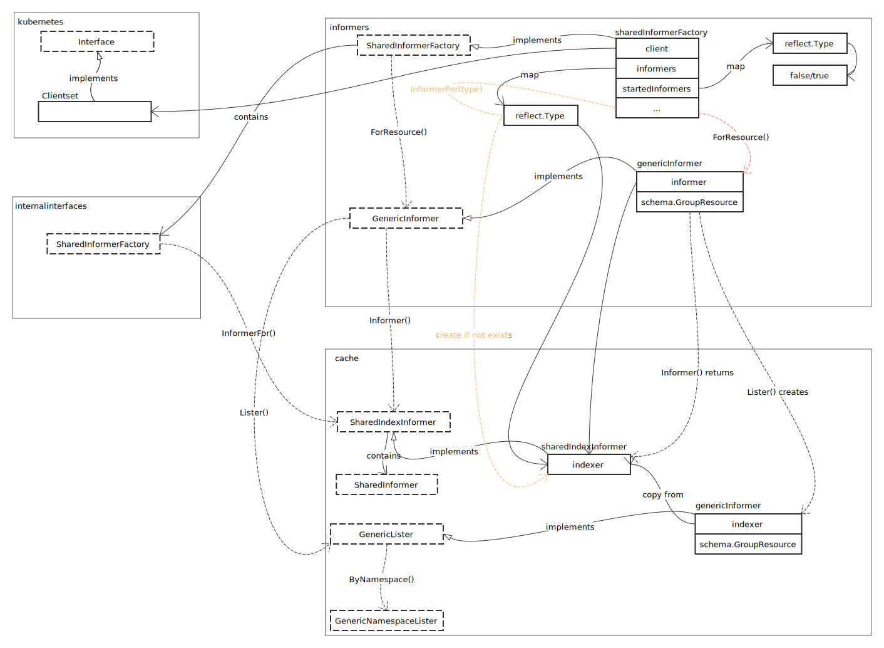
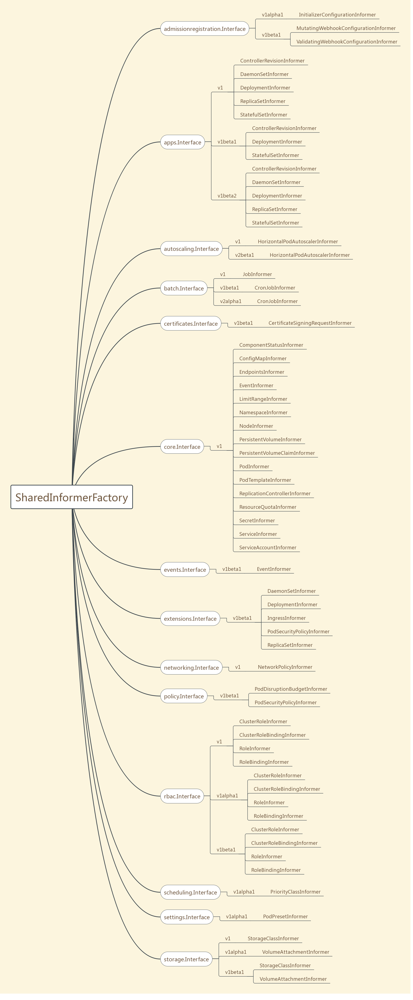
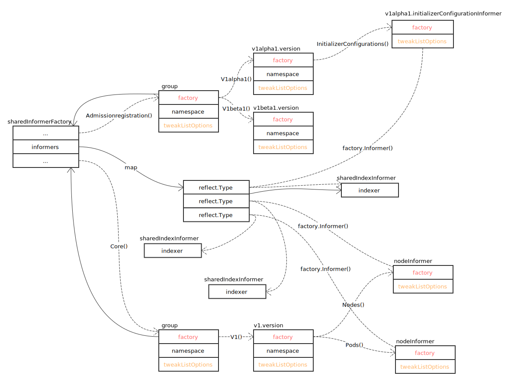

# Informer

## 概览

Informer 是 Kubernetes 中的异步分发模型，用于通知 Kubernetes 各个基础组件的状态变更。



## SharedInformerFactory 全景图



通过上图，可以看到，SharedInformerFactory 包含了各个基础组件的各版本接口实现。看一下具体的构建过程：



## sharedInformerFactory

- 启动分发机制

```go
func (f *sharedInformerFactory) Start(stopCh <-chan struct{}) {
	f.lock.Lock()
	defer f.lock.Unlock()

	// 遍历全部已注册的 informer
	for informerType, informer := range f.informers {
		// 如果没有启动，启动
		if !f.startedInformers[informerType] {
			go informer.Run(stopCh)
			f.startedInformers[informerType] = true
		}
	}
}
```

## References

- [Factory Method Pattern](https://en.wikipedia.org/wiki/Factory_method_pattern)
- [Abstract Factory Pattern](https://en.wikipedia.org/wiki/Abstract_factory_pattern)
