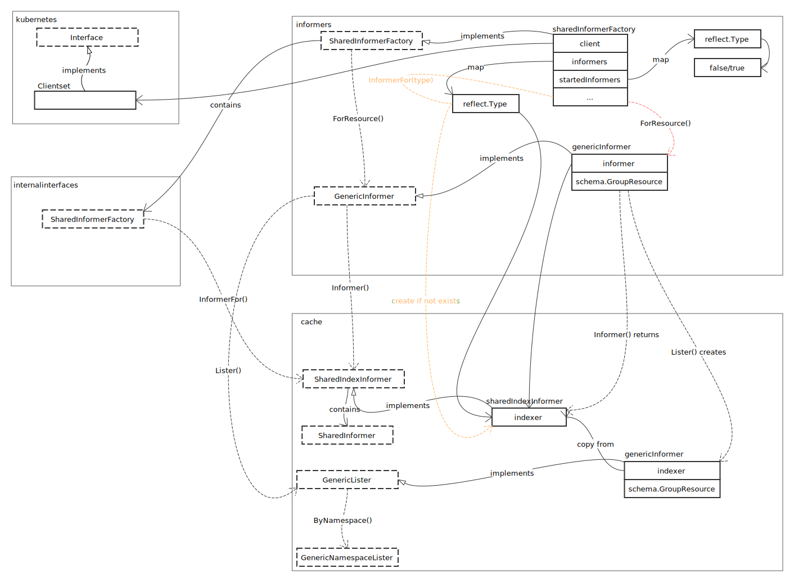
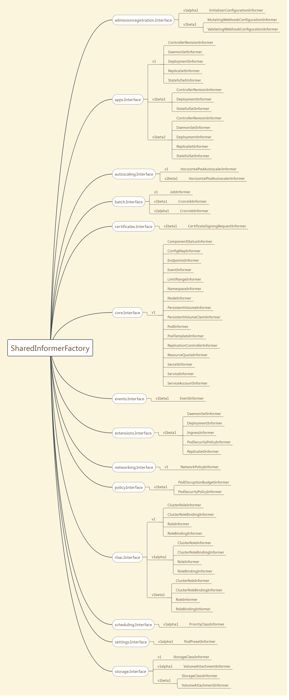

# Informer Factory

## 概览

Informer 是 Kubernetes 中的异步分发模型，用于通知 Kubernetes 各个基础组件的状态变更。



## SharedInformerFactory 全景图



通过上图，可以看到，SharedInformerFactory 包含了各个基础组件的各版本接口实现。看一下具体的构建过程：


构建过程需要注意，虽然 InformerFor 看似可直接创建对象，但不要直接使用。[Factory Method Pattern](https://en.wikipedia.org/wiki/Factory_method_pattern) 下，要使用 Factory 提供的方法来构建对象。

## sharedInformerFactory

- 启动分发机制

```go
func (f *sharedInformerFactory) Start(stopCh <-chan struct{}) {
	f.lock.Lock()
	defer f.lock.Unlock()

	// 遍历全部已注册的 informer
	for informerType, informer := range f.informers {
		// 如果没有启动，启动
		if !f.startedInformers[informerType] {
			go informer.Run(stopCh)
			f.startedInformers[informerType] = true
		}
	}
}
```

通过 chan 控制协程运行，是 go 常用策略。

- WaitForCacheSync

```go
func (f *sharedInformerFactory) WaitForCacheSync(stopCh <-chan struct{}) map[reflect.Type]bool {
	informers := func() map[reflect.Type]cache.SharedIndexInformer {
		f.lock.Lock()
		defer f.lock.Unlock()

		// 获取已经启动的 informer
		informers := map[reflect.Type]cache.SharedIndexInformer{}
		for informerType, informer := range f.informers {
			if f.startedInformers[informerType] {
				informers[informerType] = informer
			}
		}
		return informers
	}()

	res := map[reflect.Type]bool{}
	// 等待全部 informer 同步
	for informType, informer := range informers {
		res[informType] = cache.WaitForCacheSync(stopCh, informer.HasSynced)
	}
	return res
}
```

具体的同步操作，请看 [SharedIndexInformer](./shared_index_informer.md)。

## References

- [Factory Method Pattern](https://en.wikipedia.org/wiki/Factory_method_pattern)
- [Abstract Factory Pattern](https://en.wikipedia.org/wiki/Abstract_factory_pattern)
