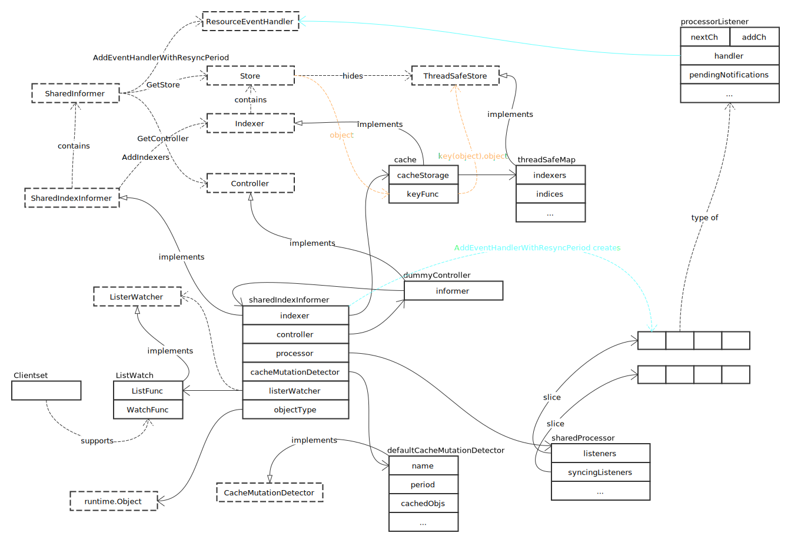
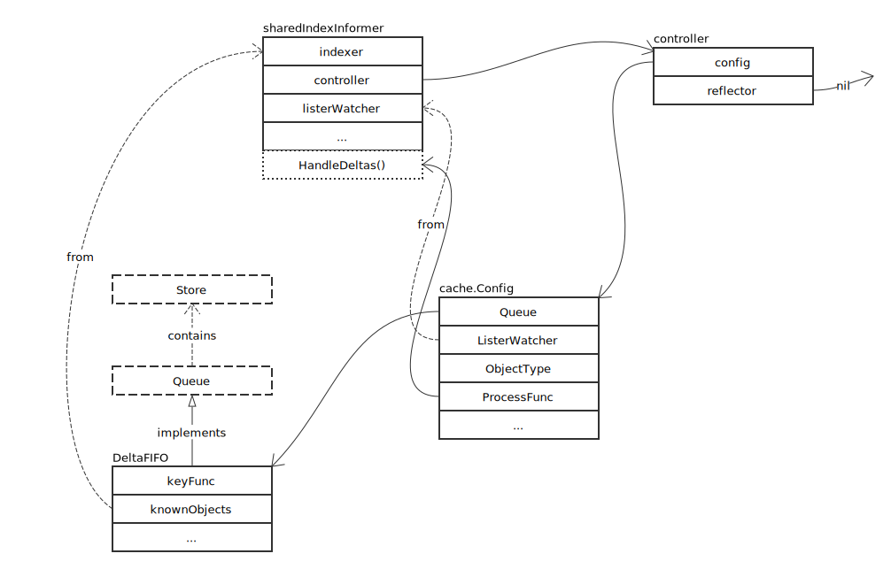
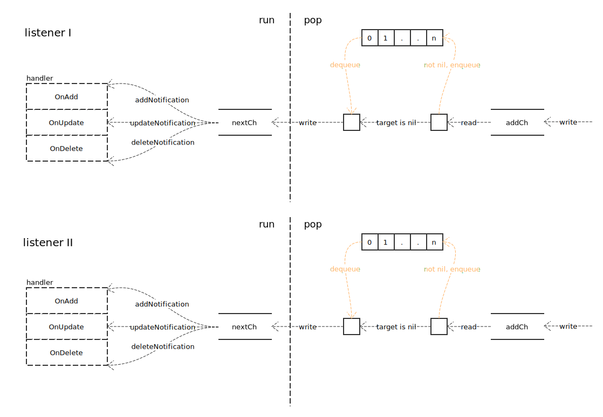
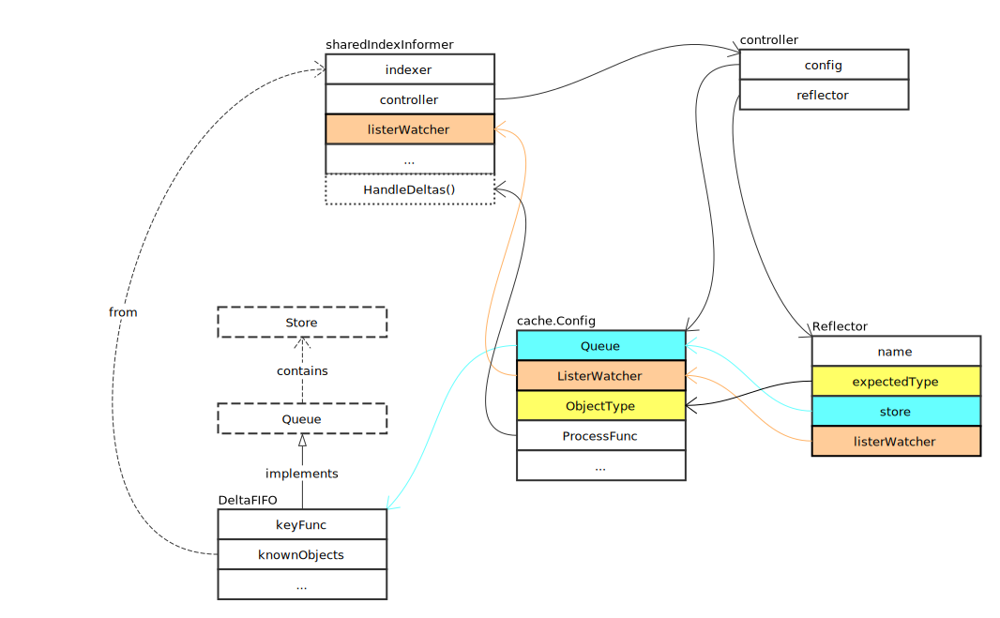

# SharedIndexInformer

## 概览



### 接口定义

- SharedInformer

```go
type SharedInformer interface {
	AddEventHandler(handler ResourceEventHandler)
	AddEventHandlerWithResyncPeriod(handler ResourceEventHandler, resyncPeriod time.Duration)
	GetStore() Store
	GetController() Controller
	Run(stopCh <-chan struct{})
	HasSynced() bool
	LastSyncResourceVersion() string
}
```

- SharedIndexInformer

```go
type SharedIndexInformer interface {
	SharedInformer
	AddIndexers(indexers Indexers) error
	GetIndexer() Indexer
}
```

## 关键方法分析

### Run

在 SharedIndexFactory 的 Start 方法中，会为每个 informer 启动一个协程，运行 informer 的 Run 方法。首先，创建一个 Controller：

```go
// 创建队列
fifo := NewDeltaFIFO(MetaNamespaceKeyFunc, s.indexer)

// 创建 controller 配置文件
cfg := &Config{
	Queue:            fifo,
	ListerWatcher:    s.listerWatcher,
	ObjectType:       s.objectType,
	FullResyncPeriod: s.resyncCheckPeriod,
	RetryOnError:     false,
	ShouldResync:     s.processor.shouldResync,

	Process: s.HandleDeltas,
}

// 新建 controller
func() {
	s.startedLock.Lock()
	defer s.startedLock.Unlock()

	s.controller = New(cfg)
	s.controller.(*controller).clock = s.clock
	s.started = true
}()
```

执行完成后，如下图所示：



然后，启动 cache 变更检查：

```go
processorStopCh := make(chan struct{})
var wg wait.Group
defer wg.Wait()
defer close(processorStopCh)

wg.StartWithChannel(processorStopCh, s.cacheMutationDetector.Run)
```

启动 processor 事件分发执行：

```go
wg.StartWithChannel(processorStopCh, s.processor.run)
```

执行完毕后，processor 每个 listener 建立好了内部 pipe：



注册善后代码：

```go
defer func() {
	s.startedLock.Lock()
	defer s.startedLock.Unlock()
	s.stopped = true
}()
```

执行 Controller 的 Run 方法：

```go
s.controller.Run(stopCh)
```

执行结束后的数据结构如下图：



在 Run 内部，启动了 Reflector.Run 协程：

```go
wg.StartWithChannel(stopCh, r.Run)
```

并每秒执行一次 controller.processLoop：

```go
wait.Until(c.processLoop, time.Second, stopCh)
```
