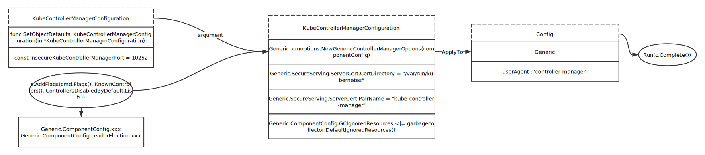
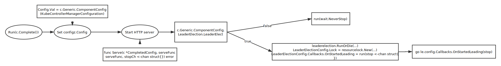
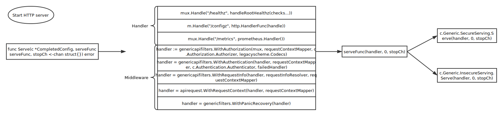
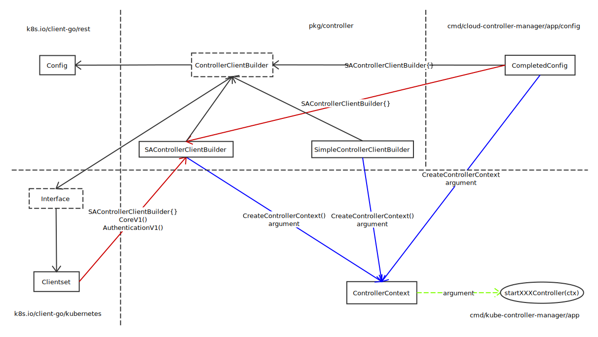
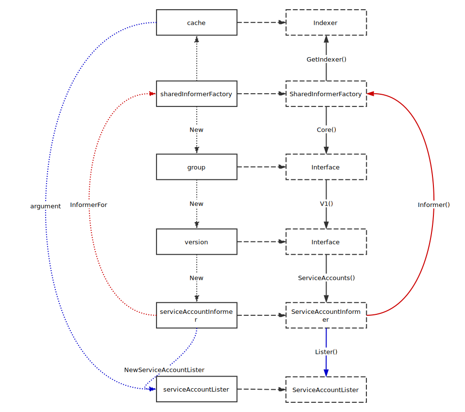

# Controller

## 注册配置



## 



## 启动 HTTP Server



Secure Serve

TLSConfig: vendor/k8s.io/apiserver/pkg/server/serve.go Serve

## 创建 



## 创建 informer

这里以 serviceAccountInformer 为例



重要代码

```go
func NewSharedIndexInformer(lw ListerWatcher, objType runtime.Object, defaultEventHandlerResyncPeriod time.Duration, indexers Indexers) SharedIndexInformer {
	realClock := &clock.RealClock{}
	sharedIndexInformer := &sharedIndexInformer{
		processor:                       &sharedProcessor{clock: realClock},
		indexer:                         NewIndexer(DeletionHandlingMetaNamespaceKeyFunc, indexers),
		listerWatcher:                   lw,
		objectType:                      objType,
		resyncCheckPeriod:               defaultEventHandlerResyncPeriod,
		defaultEventHandlerResyncPeriod: defaultEventHandlerResyncPeriod,
		cacheMutationDetector:           NewCacheMutationDetector(fmt.Sprintf("%T", objType)),
		clock: realClock,
	}
	return sharedIndexInformer
}
```

## References

* [informer factory](../client-go/informer_factory.md)
