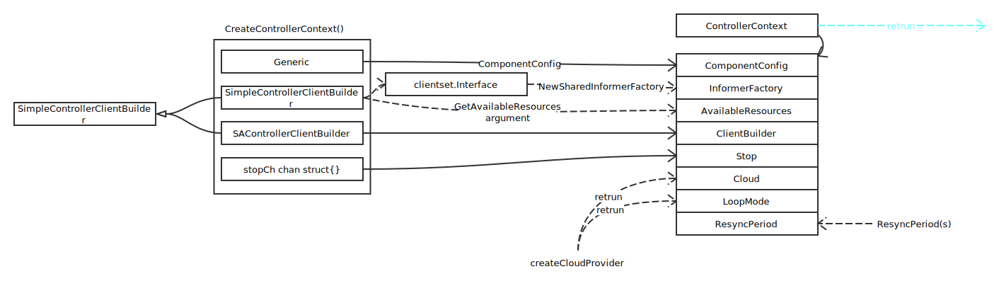
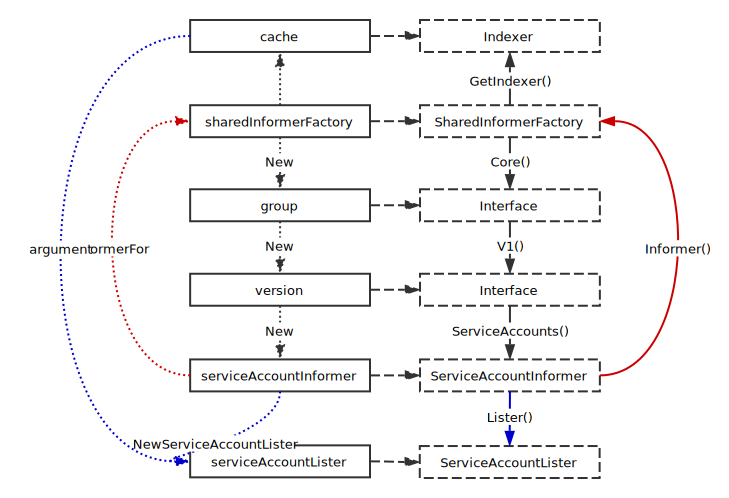

# Controller

## 全景图

## 启动的大概过程

## Config

细节请看: [scheme](../general/scheme.md), [flags](https://github.com/kubernetes/kubernetes/blob/master/cmd/kube-controller-manager/app/options/options.go#L68:40), [feature](../general/feature.md)

## 启动 HTTP Server

细节请看: [server](../general/server.md)

## 创建 context

## Informer

这里以 serviceAccountInformer 为例

细节请看: [informer factory](../client-go/informer_factory.md)
