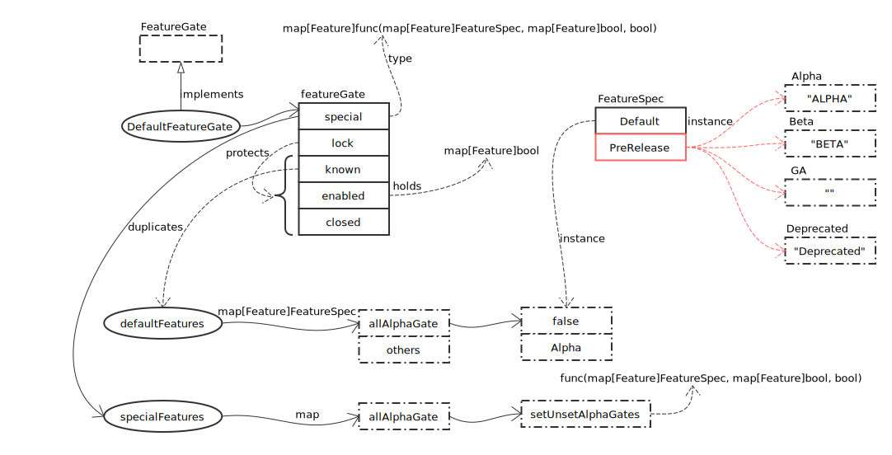

# Feature

## 概览



## FeatureGate 接口实现

- Enabled

```go
func (f *featureGate) Enabled(key Feature) bool {
	// 优先获取 enabled 状态
	if v, ok := f.enabled.Load().(map[Feature]bool)[key]; ok {
		return v
	}

	// 再从 known 中查找
	return f.known.Load().(map[Feature]FeatureSpec)[key].Default
}
```

- Set

```go
func (f *featureGate) Set(value string) error {
	// 锁保护
	f.lock.Lock()
	defer f.lock.Unlock()

	// 复制当前状态
	known := map[Feature]FeatureSpec{}
	for k, v := range f.known.Load().(map[Feature]FeatureSpec) {
		known[k] = v
	}
	enabled := map[Feature]bool{}
	for k, v := range f.enabled.Load().(map[Feature]bool) {
		enabled[k] = v
	}

	// 处理 value，value 为 "key1=value1,key2=value2..." 的形式
	for _, s := range strings.Split(value, ",") {
		if len(s) == 0 {
			continue
		}
		arr := strings.SplitN(s, "=", 2)
		k := Feature(strings.TrimSpace(arr[0]))

		featureSpec, ok := known[k]
		// feature 不存在
		if !ok {
			return fmt.Errorf("unrecognized key: %s", k)
		}
		if len(arr) != 2 {
			return fmt.Errorf("missing bool value for %s", k)
		}
		v := strings.TrimSpace(arr[1])

		// 输入值类型不是 bool
		boolValue, err := strconv.ParseBool(v)
		if err != nil {
			return fmt.Errorf("invalid value of %s: %s, err: %v", k, v, err)
		}

		// 更改设置
		enabled[k] = boolValue

		// 设置了 Deprecated 属性时，提示
		if boolValue && featureSpec.PreRelease == Deprecated {
			glog.Warningf("enabling deprecated feature gate %s", k)
		}

		// 如果是 special 特性，执行处理函数
		if fn, found := f.special[k]; found {
			fn(known, enabled, boolValue)
		}
	}

	// 保存更改
	f.known.Store(known)
	f.enabled.Store(enabled)

	glog.Infof("feature gates: %v", enabled)
	return nil
}
```

## 全局设置

```go
var defaultKubernetesFeatureGates = map[utilfeature.Feature]utilfeature.FeatureSpec{
	AppArmor:                                    {Default: true, PreRelease: utilfeature.Beta},
	DynamicKubeletConfig:                        {Default: false, PreRelease: utilfeature.Alpha},
	ExperimentalHostUserNamespaceDefaultingGate: {Default: false, PreRelease: utilfeature.Beta},
	ExperimentalCriticalPodAnnotation:           {Default: false, PreRelease: utilfeature.Alpha},
	Accelerators:                                {Default: false, PreRelease: utilfeature.Alpha},
	DevicePlugins:                               {Default: true, PreRelease: utilfeature.Beta},
	TaintBasedEvictions:                         {Default: false, PreRelease: utilfeature.Alpha},
	RotateKubeletServerCertificate:              {Default: false, PreRelease: utilfeature.Alpha},
	RotateKubeletClientCertificate:              {Default: true, PreRelease: utilfeature.Beta},
	PersistentLocalVolumes:                      {Default: true, PreRelease: utilfeature.Beta},
	LocalStorageCapacityIsolation:               {Default: true, PreRelease: utilfeature.Beta},
	HugePages:                                   {Default: true, PreRelease: utilfeature.Beta},
	DebugContainers:                             {Default: false, PreRelease: utilfeature.Alpha},
	PodShareProcessNamespace:                    {Default: false, PreRelease: utilfeature.Alpha},
	PodPriority:                                 {Default: false, PreRelease: utilfeature.Alpha},
	EnableEquivalenceClassCache:                 {Default: false, PreRelease: utilfeature.Alpha},
	TaintNodesByCondition:                       {Default: false, PreRelease: utilfeature.Alpha},
	MountPropagation:                            {Default: true, PreRelease: utilfeature.Beta},
	ExpandPersistentVolumes:                     {Default: false, PreRelease: utilfeature.Alpha},
	CPUManager:                                  {Default: true, PreRelease: utilfeature.Beta},
	ServiceNodeExclusion:                        {Default: false, PreRelease: utilfeature.Alpha},
	MountContainers:                             {Default: false, PreRelease: utilfeature.Alpha},
	VolumeScheduling:                            {Default: true, PreRelease: utilfeature.Beta},
	CSIPersistentVolume:                         {Default: true, PreRelease: utilfeature.Beta},
	CustomPodDNS:                                {Default: true, PreRelease: utilfeature.Beta},
	BlockVolume:                                 {Default: false, PreRelease: utilfeature.Alpha},
	StorageObjectInUseProtection:                {Default: true, PreRelease: utilfeature.Beta},
	ResourceLimitsPriorityFunction:              {Default: false, PreRelease: utilfeature.Alpha},
	SupportIPVSProxyMode:                        {Default: true, PreRelease: utilfeature.Beta},
	SupportPodPidsLimit:                         {Default: false, PreRelease: utilfeature.Alpha},
	HyperVContainer:                             {Default: false, PreRelease: utilfeature.Alpha},
	ScheduleDaemonSetPods:                       {Default: false, PreRelease: utilfeature.Alpha},
	TokenRequest:                                {Default: false, PreRelease: utilfeature.Alpha},
	CRIContainerLogRotation:                     {Default: false, PreRelease: utilfeature.Alpha},
	GCERegionalPersistentDisk:                   {Default: true, PreRelease: utilfeature.Beta},
	RunAsGroup:                                  {Default: false, PreRelease: utilfeature.Alpha},
	VolumeSubpath:                               {Default: true, PreRelease: utilfeature.GA},

	// inherited features from generic apiserver, relisted here to get a conflict if it is changed
	// unintentionally on either side:
	genericfeatures.StreamingProxyRedirects: {Default: true, PreRelease: utilfeature.Beta},
	genericfeatures.AdvancedAuditing:        {Default: true, PreRelease: utilfeature.Beta},
	genericfeatures.APIResponseCompression:  {Default: false, PreRelease: utilfeature.Alpha},
	genericfeatures.Initializers:            {Default: false, PreRelease: utilfeature.Alpha},
	genericfeatures.APIListChunking:         {Default: true, PreRelease: utilfeature.Beta},

	// inherited features from apiextensions-apiserver, relisted here to get a conflict if it is changed
	// unintentionally on either side:
	apiextensionsfeatures.CustomResourceValidation:   {Default: true, PreRelease: utilfeature.Beta},
	apiextensionsfeatures.CustomResourceSubresources: {Default: false, PreRelease: utilfeature.Alpha},

	// features that enable backwards compatibility but are scheduled to be removed
	ServiceProxyAllowExternalIPs: {Default: false, PreRelease: utilfeature.Deprecated},
	ReadOnlyAPIDataVolumes:       {Default: true, PreRelease: utilfeature.Deprecated},
}
```

在导入 feature 包时，执行了如下操作：

```go
func init() {
	utilfeature.DefaultFeatureGate.Add(defaultKubernetesFeatureGates)
}
```
