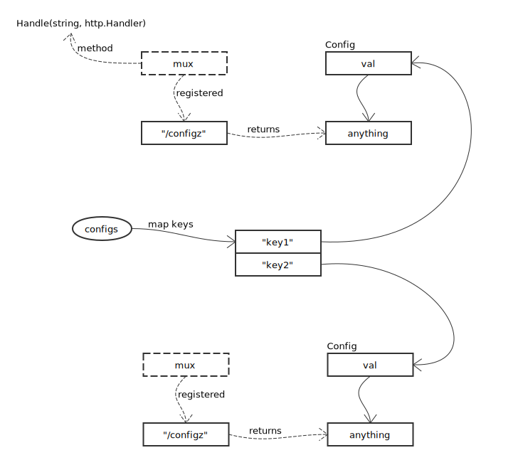
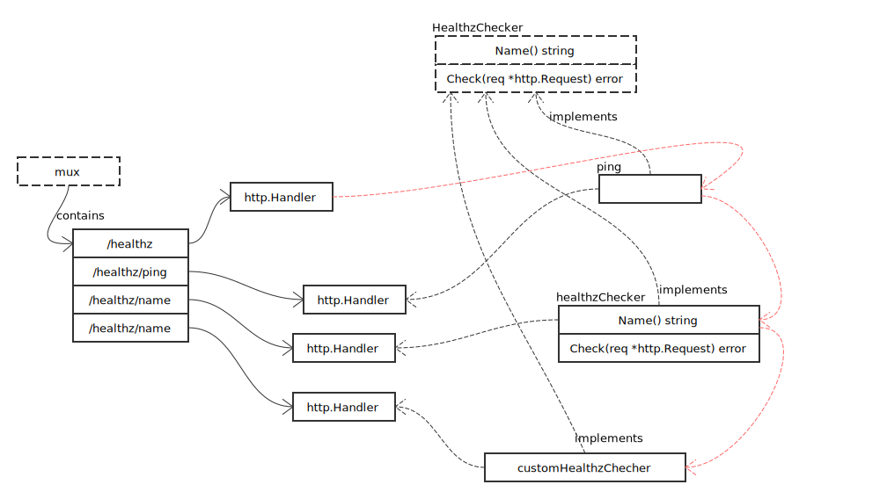

# Health

## configz



关键方法 InstallHandler，接收一个 mux 参数，注册路径 "/configz"，并返回 Config 对象的 val 对象。

```go
func InstallHandler(m mux) {
	m.Handle("/configz", http.HandlerFunc(handle))
}
```

## HealthzChecker

数据结构全景图：



先看最重要的 HealthzChecker 接口定义：

```go
type HealthzChecker interface {
	Name() string
	Check(req *http.Request) error
}
```

使用时，可以通过 InstallHandler 安装需要的 Checker：

```go
func InstallHandler(mux mux, checks ...HealthzChecker) {
	// 默认至少添加 ping
	if len(checks) == 0 {
		glog.V(5).Info("No default health checks specified. Installing the ping handler.")
		checks = []HealthzChecker{PingHealthz}
	}

	glog.V(5).Info("Installing healthz checkers:", strings.Join(checkerNames(checks...), ", "))

	// 注册总路由，将执行全部 checker
	mux.Handle("/healthz", handleRootHealthz(checks...))

	// 单独注册每个 checker 的路由
	for _, check := range checks {
		mux.Handle(fmt.Sprintf("/healthz/%v", check.Name()), adaptCheckToHandler(check.Check))
	}
}
```

HealthzChecker 到 http.Handler 的转换自行阅读 handleRootHealthz, adaptCheckToHandler 实现。

路由部分请参照 [Server](./server.md)。
