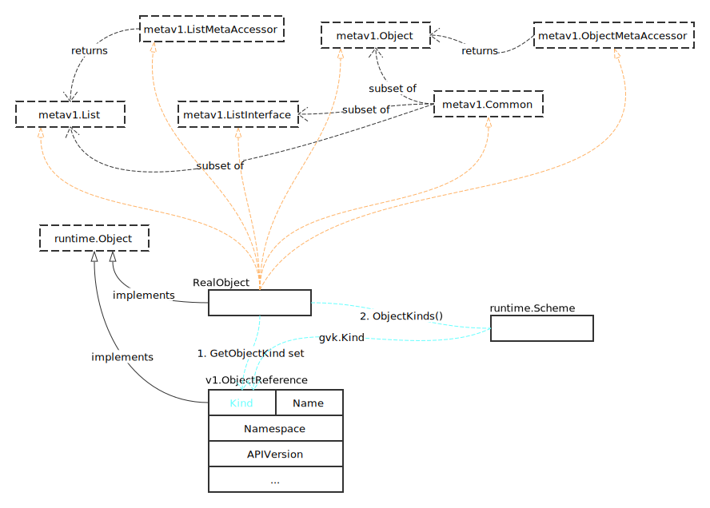

# ObjectReference

## Overview



看一下关键数据结构的定义。

```go
type ObjectReference struct {
	Kind string `json:"kind,omitempty" protobuf:"bytes,1,opt,name=kind"`
	Namespace string `json:"namespace,omitempty" protobuf:"bytes,2,opt,name=namespace"`
	Name string `json:"name,omitempty" protobuf:"bytes,3,opt,name=name"`
	UID types.UID `json:"uid,omitempty" protobuf:"bytes,4,opt,name=uid,casttype=k8s.io/apimachinery/pkg/types.UID"`
	APIVersion string `json:"apiVersion,omitempty" protobuf:"bytes,5,opt,name=apiVersion"`
	ResourceVersion string `json:"resourceVersion,omitempty" protobuf:"bytes,6,opt,name=resourceVersion"`
	FieldPath string `json:"fieldPath,omitempty" protobuf:"bytes,7,opt,name=fieldPath"`
}
```

可以看出，通过 ObjectReference，我们可以唯一确认一个类型的对象。

## 通过对象构建引用

```go
func GetReference(scheme *runtime.Scheme, obj runtime.Object) (*v1.ObjectReference, error) {
	// 保护性代码
	if obj == nil {
		return nil, ErrNilObject
	}
	if ref, ok := obj.(*v1.ObjectReference); ok {
		// 已经是 ObjectReference，不再构建，直接返回
		return ref, nil
	}

	// 获取对象的 GVK 对象
	gvk := obj.GetObjectKind().GroupVersionKind()

	// 优先使用 obj 的类型
	kind := gvk.Kind
	if len(kind) == 0 {
		// 从 scheme 中获取对象的类型
		gvks, _, err := scheme.ObjectKinds(obj)
		if err != nil {
			return nil, err
		}
		kind = gvks[0].Kind
	}

	// 获取 meta 对象
	var listMeta metav1.Common
	objectMeta, err := meta.Accessor(obj)
	if err != nil {
		listMeta, err = meta.CommonAccessor(obj)
		if err != nil {
			return nil, err
		}
	} else {
		listMeta = objectMeta
	}

	// 获取版本
	version := gvk.GroupVersion().String()

	// 无版本信息
	if len(version) == 0 {
		// 从自身链接中解析版本信息
		selfLink := listMeta.GetSelfLink()
		if len(selfLink) == 0 {
			return nil, ErrNoSelfLink
		}
		selfLinkUrl, err := url.Parse(selfLink)
		if err != nil {
			return nil, err
		}
		// example paths: /<prefix>/<version>/*
		parts := strings.Split(selfLinkUrl.Path, "/")
		if len(parts) < 3 {
			return nil, fmt.Errorf("unexpected self link format: '%v'; got version '%v'", selfLink, version)
		}
		version = parts[2]
	}

	// 只有 list metadata
	if objectMeta == nil {
		return &v1.ObjectReference{
			Kind:            kind,
			APIVersion:      version,
			ResourceVersion: listMeta.GetResourceVersion(),
		}, nil
	}

	return &v1.ObjectReference{
		Kind:            kind,
		APIVersion:      version,
		Name:            objectMeta.GetName(),
		Namespace:       objectMeta.GetNamespace(),
		UID:             objectMeta.GetUID(),
		ResourceVersion: objectMeta.GetResourceVersion(),
	}, nil
}
```
