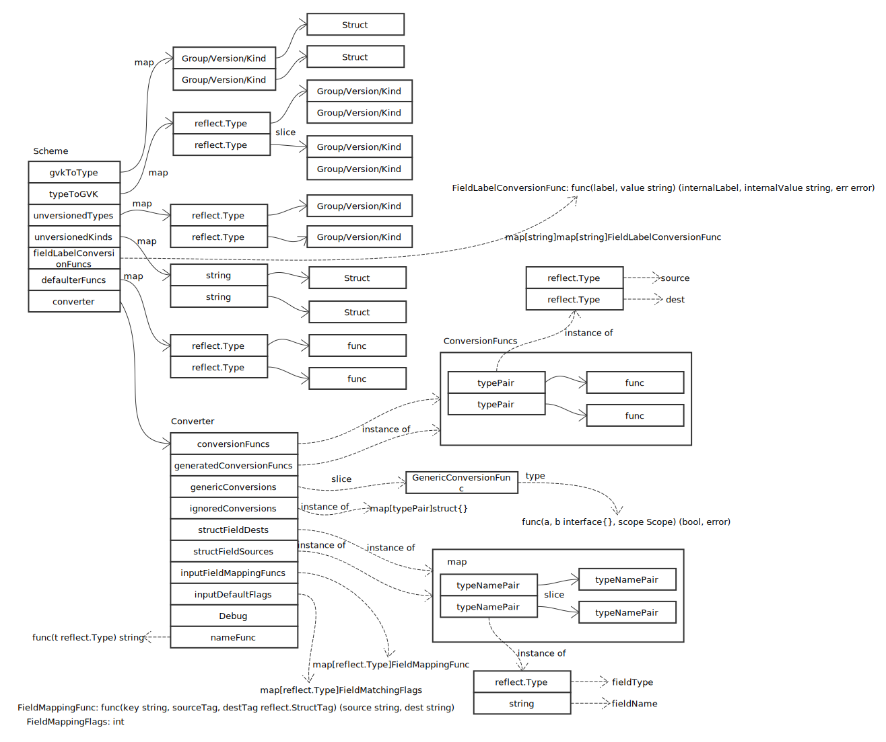

# Scheme

## 概览



## Scheme 关键方法

### AddKnownTypes

```go
func (s *Scheme) AddKnownTypes(gv schema.GroupVersion, types ...Object) {
	// 遍历 Object slice
	for _, obj := range types {
		// 获取实际类型
		t := reflect.TypeOf(obj)

		// 类型必须为指针
		if t.Kind() != reflect.Ptr {
			panic("All types must be pointers to structs.")
		}
		t = t.Elem()

		// 注册 Group/Version/Kind 及 obj
		s.AddKnownTypeWithName(gv.WithKind(t.Name()), obj)
	}
}
```

从本方法看到，要注册的类型，必须满足 Object 接口，定义如下：

```go
type Object interface {
	GetObjectKind() schema.ObjectKind
	DeepCopyObject() Object
}
```

### AddKnownTypeWithName

```go
func (s *Scheme) AddKnownTypeWithName(gvk schema.GroupVersionKind, obj Object) {
	// 获取实际类型
	t := reflect.TypeOf(obj)

	// 参数验证
	if len(gvk.Version) == 0 {
		panic(fmt.Sprintf("version is required on all types: %s %v", gvk, t))
	}
	if t.Kind() != reflect.Ptr {
		panic("All types must be pointers to structs.")
	}

	t = t.Elem()
	// 实际类型必须为 Struct
	if t.Kind() != reflect.Struct {
		panic("All types must be pointers to structs.")
	}

	// 已经注册相同类型对象
	if oldT, found := s.gvkToType[gvk]; found && oldT != t {
		panic(fmt.Sprintf("Double registration of different types for %v: old=%v.%v, new=%v.%v", gvk, oldT.PkgPath(), oldT.Name(), t.PkgPath(), t.Name()))
	}

	// 添加 Group/Version/Kind -> struct 映射
	s.gvkToType[gvk] = t

	// struct -> Group/Version/Kind 已经构建
	for _, existingGvk := range s.typeToGVK[t] {
		if existingGvk == gvk {
			return
		}
	}

	// 添加 struct -> Group/Version/Kind 映射
	s.typeToGVK[t] = append(s.typeToGVK[t], gvk)
}
```

### convertToVersion

```go
func (s *Scheme) convertToVersion(copy bool, in Object, target GroupVersioner) (Object, error) {
	var t reflect.Type

	// 输入结构满足 Unstructured 接口
	if u, ok := in.(Unstructured); ok {
		typed, err := s.unstructuredToTyped(u)
		if err != nil {
			return nil, err
		}

		in = typed
		// 获取结构类型
		t = reflect.TypeOf(in).Elem()

	} else {
		// 获取结构类型
		t = reflect.TypeOf(in)

		// 必须为指针
		if t.Kind() != reflect.Ptr {
			return nil, fmt.Errorf("only pointer types may be converted: %v", t)
		}
		t = t.Elem()
		if t.Kind() != reflect.Struct {
			return nil, fmt.Errorf("only pointers to struct types may be converted: %v", t)
		}
	}

	// 获取类型支持的版本列表
	kinds, ok := s.typeToGVK[t]
	if !ok || len(kinds) == 0 {
		return nil, NewNotRegisteredErrForType(t)
	}

	// 找到适应目标版本的 Group/Version/Kind
	gvk, ok := target.KindForGroupVersionKinds(kinds)
	if !ok {
		// 没有找到，从 unversioned 中尝试查找
		if unversionedKind, ok := s.unversionedTypes[t]; ok {
			if gvk, ok := target.KindForGroupVersionKinds([]schema.GroupVersionKind{unversionedKind}); ok {
				return copyAndSetTargetKind(copy, in, gvk)
			}
			return copyAndSetTargetKind(copy, in, unversionedKind)
		}
		return nil, NewNotRegisteredErrForTarget(t, target)
	}

	// 遍历支持的版本列表，确认存在
	for _, kind := range kinds {
		if gvk == kind {
			return copyAndSetTargetKind(copy, in, gvk)
		}
	}

	// 结构无版本支持需要，直接构造
	if unversionedKind, ok := s.unversionedTypes[t]; ok {
		if gvk, ok := target.KindForGroupVersionKinds([]schema.GroupVersionKind{unversionedKind}); ok {
			return copyAndSetTargetKind(copy, in, gvk)
		}
		return copyAndSetTargetKind(copy, in, unversionedKind)
	}

	// 构造新对象
	out, err := s.New(gvk)
	if err != nil {
		return nil, err
	}

	// 如果 copy 为 true，深度拷贝
	if copy {
		in = in.DeepCopyObject()
	}

	flags, meta := s.generateConvertMeta(in)
	meta.Context = target
	if err := s.converter.Convert(in, out, flags, meta); err != nil {
		return nil, err
	}

	setTargetKind(out, gvk)
	return out, nil
}
```

## SchemeBuilder

类型定义：

```go
type SchemeBuilder []func(*Scheme) error
```

从定义可以看出，SchemeBuilder 是通过一组函数处理 Scheme 实例的。

创建 SchemeBuilder：

```go
func NewSchemeBuilder(funcs ...func(*Scheme) error) SchemeBuilder {
	var sb SchemeBuilder
	sb.Register(funcs...)
	return sb
}
```

注册 builder 函数：

```go
func (sb *SchemeBuilder) Register(funcs ...func(*Scheme) error) {
	for _, f := range funcs {
		*sb = append(*sb, f)
	}
}
```

Build Scheme：

```go
func (sb *SchemeBuilder) AddToScheme(s *Scheme) error {
	for _, f := range *sb {
		if err := f(s); err != nil {
			return err
		}
	}
	return nil
}
```
