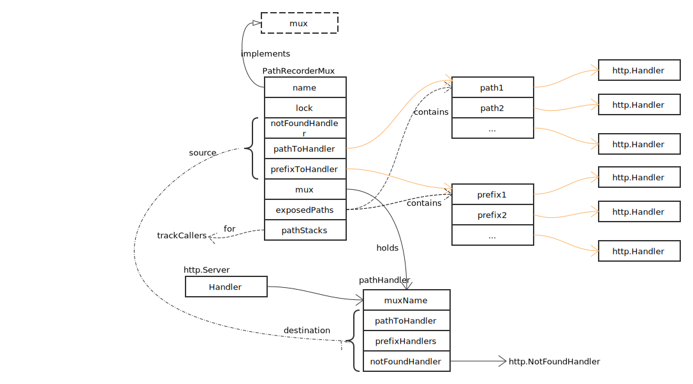

# Server

## Mux 设计



看一下 ServeHTTP 的实现：

```go
func (m *PathRecorderMux) ServeHTTP(w http.ResponseWriter, r *http.Request) {
	m.mux.Load().(*pathHandler).ServeHTTP(w, r)
}
```

简单调用了 pathHandler 的 ServeHTTP 方法：

```go
func (h *pathHandler) ServeHTTP(w http.ResponseWriter, r *http.Request) {
	// 优先匹配完整路径
	if exactHandler, ok := h.pathToHandler[r.URL.Path]; ok {
		glog.V(5).Infof("%v: %q satisfied by exact match", h.muxName, r.URL.Path)
		exactHandler.ServeHTTP(w, r)
		return
	}

	// 再尝试匹配前缀路径
	for _, prefixHandler := range h.prefixHandlers {
		if strings.HasPrefix(r.URL.Path, prefixHandler.prefix) {
			glog.V(5).Infof("%v: %q satisfied by prefix %v", h.muxName, r.URL.Path, prefixHandler.prefix)
			prefixHandler.handler.ServeHTTP(w, r)
			return
		}
	}

	// 路径不存在
	glog.V(5).Infof("%v: %q satisfied by NotFoundHandler", h.muxName, r.URL.Path)
	h.notFoundHandler.ServeHTTP(w, r)
}
```
