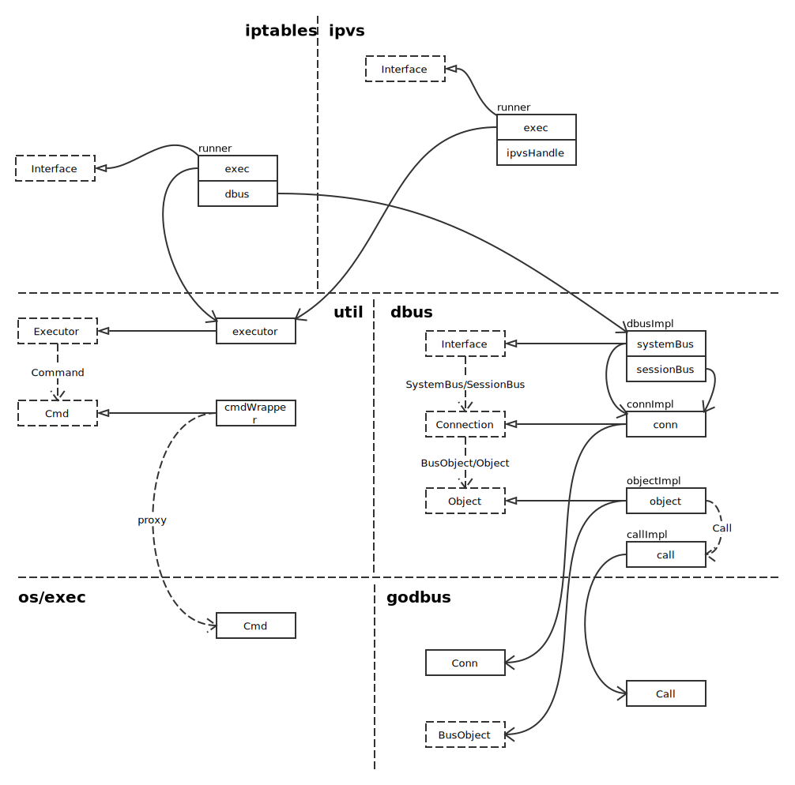

# Proxy

## 注册 scheme

注册 scheme 是在 NewOptions 中执行的。

```go
func NewOptions() *Options {
	return &Options{
		config:      new(kubeproxyconfig.KubeProxyConfiguration),
		healthzPort: ports.ProxyHealthzPort,
		scheme:      scheme.Scheme,  // <--- 此处
		codecs:      scheme.Codecs,
		CleanupIPVS: true,
	}
}
```

具体来说，就是定义全局变量 Scheme：

```go
Scheme = runtime.NewScheme()
```

全局变量 Codec：

```go
Codecs = serializer.NewCodecFactory(Scheme)
```

然后通过定义文件的 init 方法初始化：

```go
func init() {
	AddToScheme(Scheme)
}
```

顺着这个跟踪下去，就能看到全貌。

在 scheme 中注册了默认值，然后在 NewProxyCommand 中调用注册的默认值进行初始化：

```go
opts.config, err = opts.ApplyDefaults(opts.config)
```

## Overview



## References

- [iptables](https://en.wikipedia.org/wiki/Iptables)
- [Linux Virtual Server](https://en.wikipedia.org/wiki/Linux_Virtual_Server)
