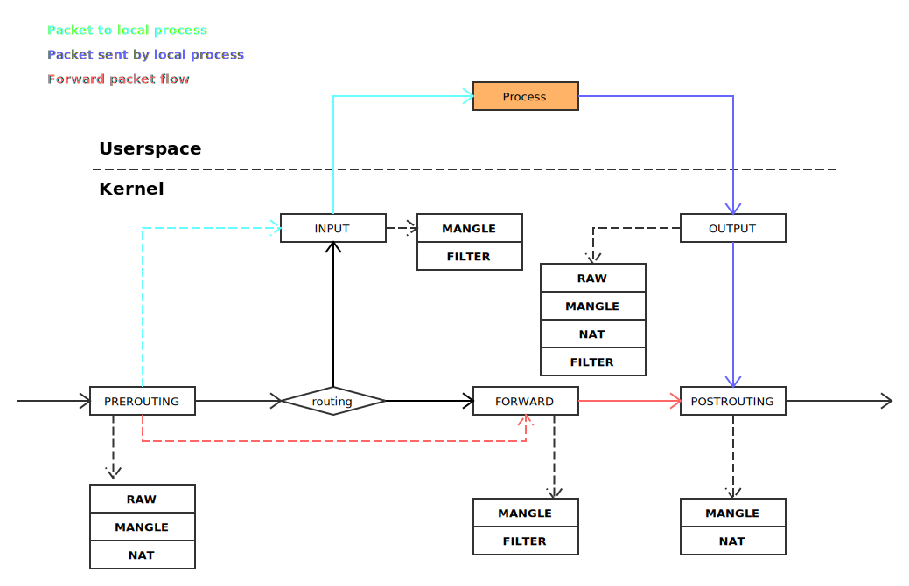

# iptables

## netfilter

## 规则链与规则表

本质上来说，规则链与规则表从表达能力上是一样的。表的引入是为了功能划分及方便管理。每一个表都包含一条规则链。

最后，看一下 iptables 的路由过程：

## References

- [Redhat Security Guild](https://access.redhat.com/documentation/en-us/red_hat_enterprise_linux/6/html-single/security_guide/index#sect-Security_Guide-Firewalls)
