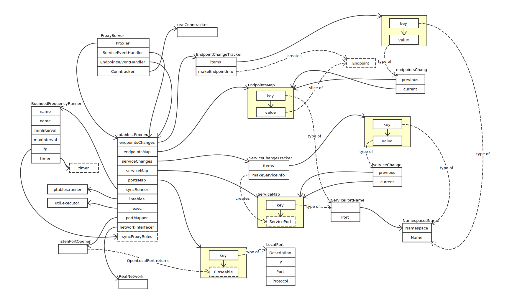
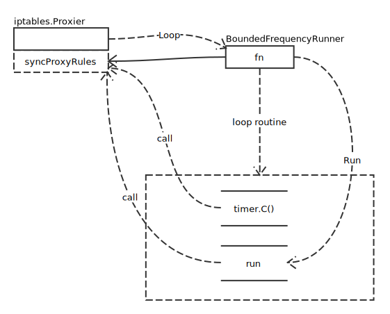
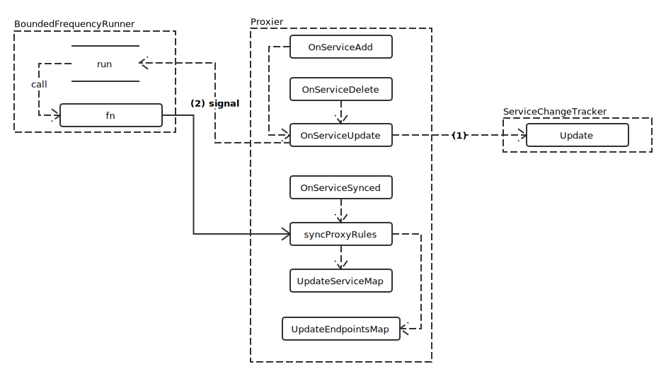
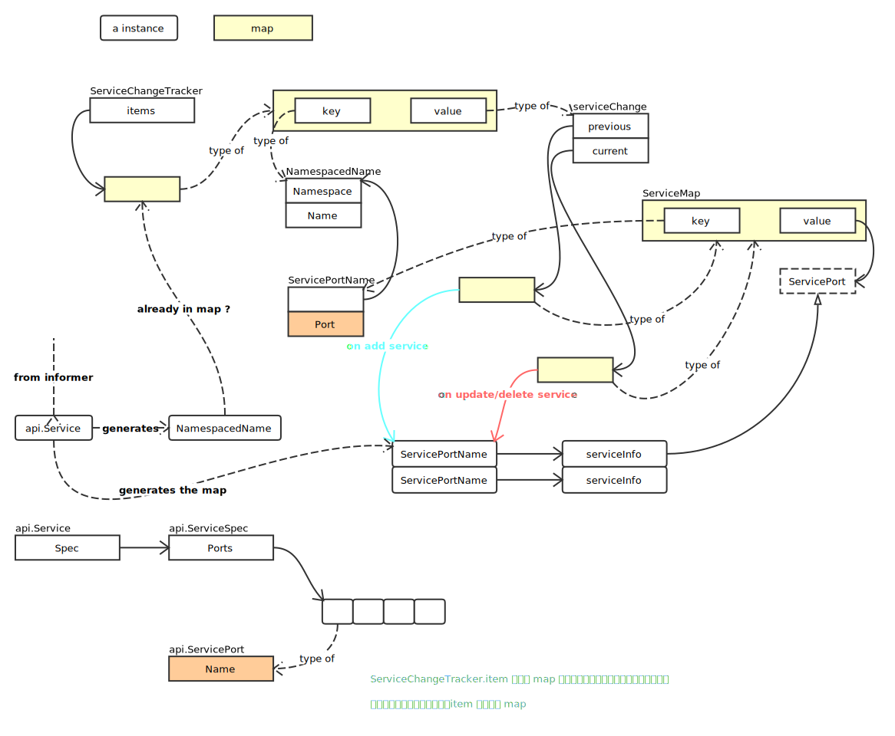
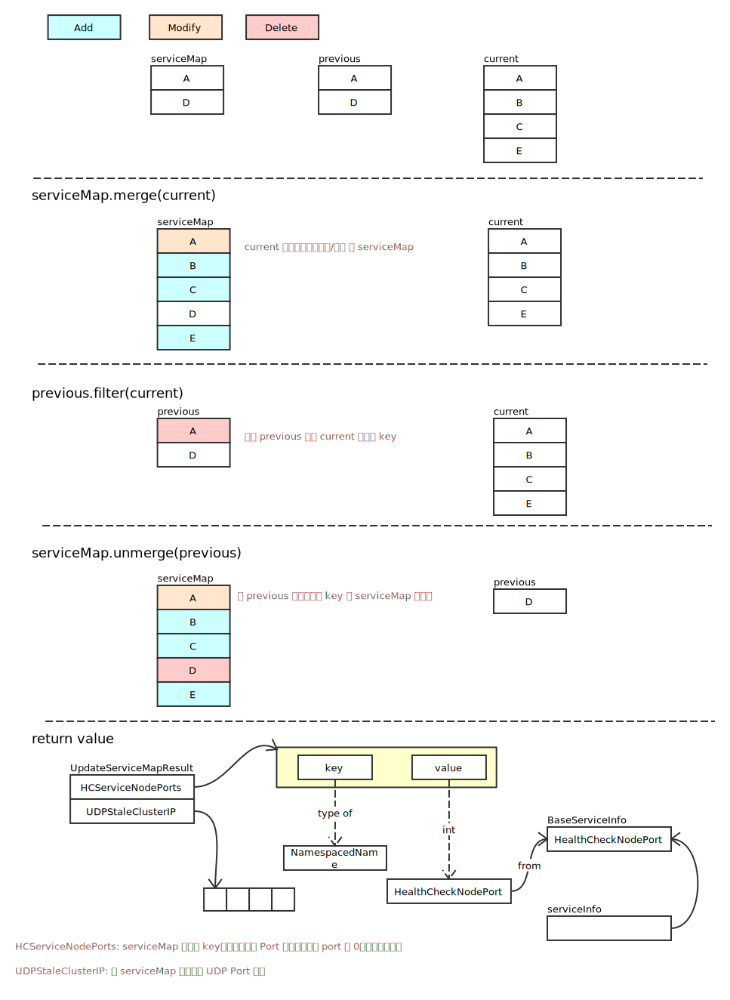

# Iptables Mode

## 概览



## 启动过程

注册 informer 的 EventHandler，通过 APIServer 监控 Etcd 状态变化。

```go
serviceConfig := config.NewServiceConfig(informerFactory.Core().InternalVersion().Services(), s.ConfigSyncPeriod)
serviceConfig.RegisterEventHandler(s.ServiceEventHandler)
go serviceConfig.Run(wait.NeverStop)

endpointsConfig := config.NewEndpointsConfig(informerFactory.Core().InternalVersion().Endpoints(), s.ConfigSyncPeriod)
endpointsConfig.RegisterEventHandler(s.EndpointsEventHandler)
go endpointsConfig.Run(wait.NeverStop)
```

两个 go 分别执行 iptables.Proxier 的 OnServiceSynced 及 OnEndpointsSynced 方法。

最终的执行为：

```go
s.Proxier.SyncLoop()
```

执行完成后，如下图所示：



## Service 变更处理

调用关系图如下：



结合 [SharedIndexInformer](../client-go/shared_index_informer.md) 中内容，proxy 需要处理从 APIServer 获取的服务信息变更。

### ServiceChangeTracker.Update

这个方法将 informer 回调中传入的 api.Service 对象进行处理，确认本对象是否真的发生变化。虽然注册在 informer 中的回调方法，仅会在检测到变更时才会触发，但是，为了防止网络同步过程中可能会发生的一致性问题，还需要再进行确认。



如果检查后，发现 previous 和 current 一致，需要删除当前服务记录：

```go
if reflect.DeepEqual(change.previous, change.current) {
	delete(sct.items, namespacedName)
}
```

判定是否需要触发同步的条件，也很容易知道，即 items 是否为空：

```go
return len(sct.items) > 0
```

### Proxier.syncProxyRules

```go
serviceUpdateResult := proxy.UpdateServiceMap(proxier.serviceMap, proxier.serviceChanges)
```

模拟执行过程及返回值如下：



## References

- [IP Sysctl Options](https://www.kernel.org/doc/Documentation/networking/ip-sysctl.txt)
- [Martian Packet](https://en.wikipedia.org/wiki/Martian_packet)
