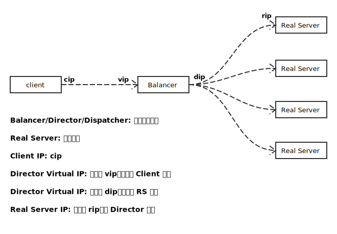
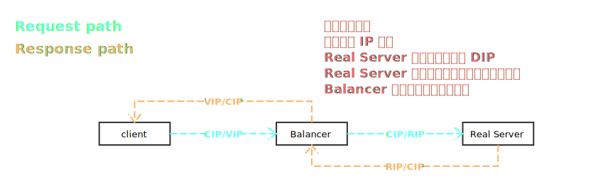
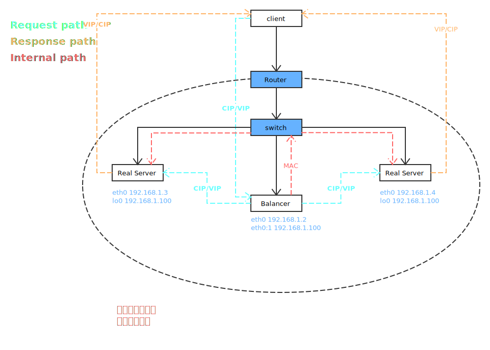
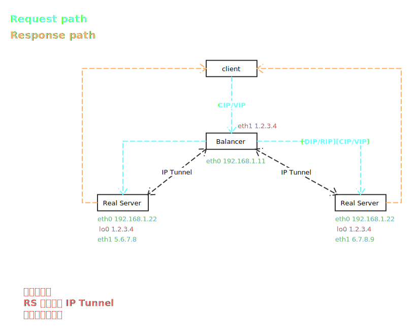

# Linux Virtual Server

## LVS 术语定义

## 三种模式

### NAT

### DR

这里注意一下 IP 分配规则即可：

Balancer: eth0 分配 DIP，eth0:1 分配 VIP;
Real Servers: eth0 分配 RIP，lo0 分配 VIP;

当数据到达 Balancer 后，通过算法选择一个 RS，并将包 MAC 地址修改为 RS 的 MAC 地址，转发后，进入交换机，到达 RS；

由于 RS 将 VIP 配置到 lo0 上，RS 可看到应答，但不能通过 lo0 发送数据。RS 处理完毕，发送应答时，使用 eth0，此时，保留了 CIP，直接通过网络，发送至 Client。

为了进一步提升效率，Balancer 上会记录 Client 分发记录。只有第一次 Client 到达时或就有分配服务器连接超时，才会使用算法调度。

### TUN

## References

- [LVS Documents](http://www.linuxvirtualserver.org/Documents.html)
- [LVS NAT](http://www.linuxvirtualserver.org/VS-NAT.html)
- [LVS DRouting](http://www.linuxvirtualserver.org/VS-DRouting.html)
- [LVS IPTunneling](http://www.linuxvirtualserver.org/VS-IPTunneling.html)
