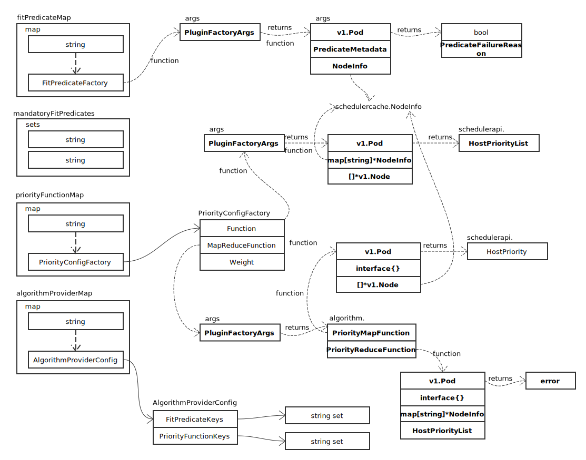
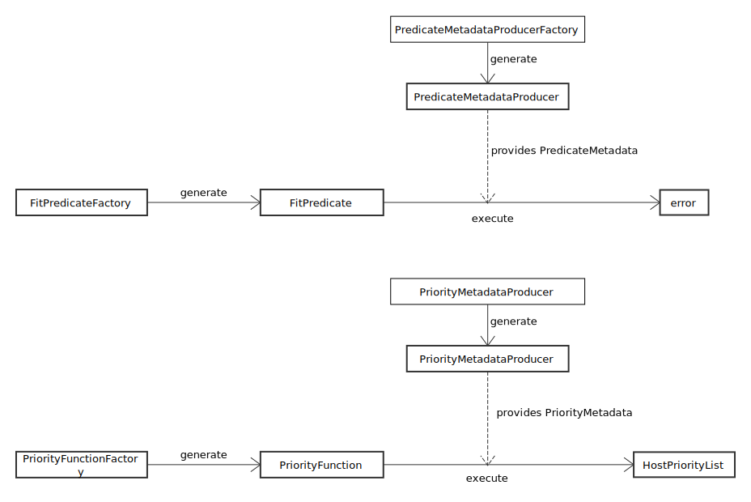
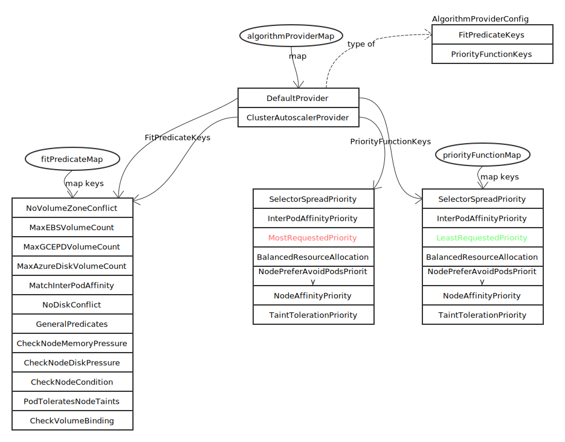

# Algorithm

## 概览



核心的方法类型定义如下：

```go
type PredicateMetadataProducerFactory func(PluginFactoryArgs) algorithm.PredicateMetadataProducer
type PredicateMetadataProducer func(pod *v1.Pod, nodeNameToInfo map[string]*schedulercache.NodeInfo) PredicateMetadata
type FitPredicateFactory func(PluginFactoryArgs) algorithm.FitPredicate
type FitPredicate func(pod *v1.Pod, meta PredicateMetadata, nodeInfo *schedulercache.NodeInfo) (bool, []PredicateFailureReason, error)

type PriorityMetadataProducerFactory func(PluginFactoryArgs) algorithm.PriorityMetadataProducer
type PriorityMetadataProducer func(pod *v1.Pod, nodeNameToInfo map[string]*schedulercache.NodeInfo) interface{}
type PriorityFunctionFactory func(PluginFactoryArgs) algorithm.PriorityFunction
type PriorityFunction func(pod *v1.Pod, nodeNameToInfo map[string]*schedulercache.NodeInfo, nodes []*v1.Node) (schedulerapi.HostPriorityList, error)
```

关系如图：



## 方法

### init

在导入包 pkg/scheduler/algorithmprovider/defaults 时，通过 init 初始化调度算法相关变量，初始化完成后，内容如下：


