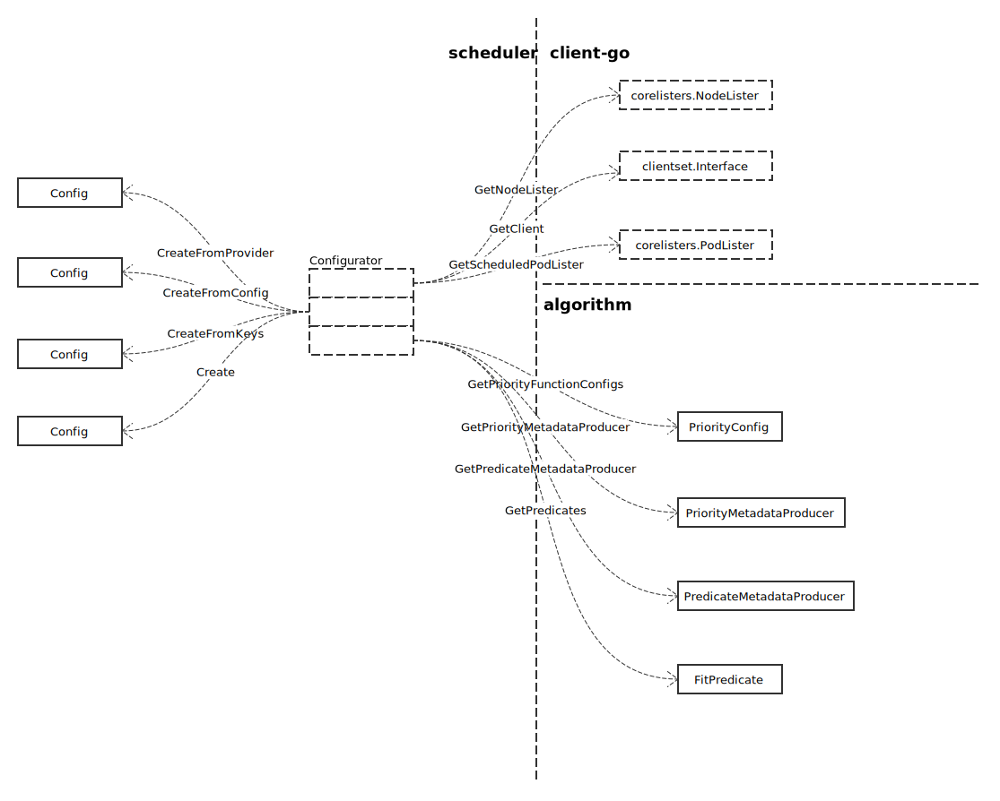
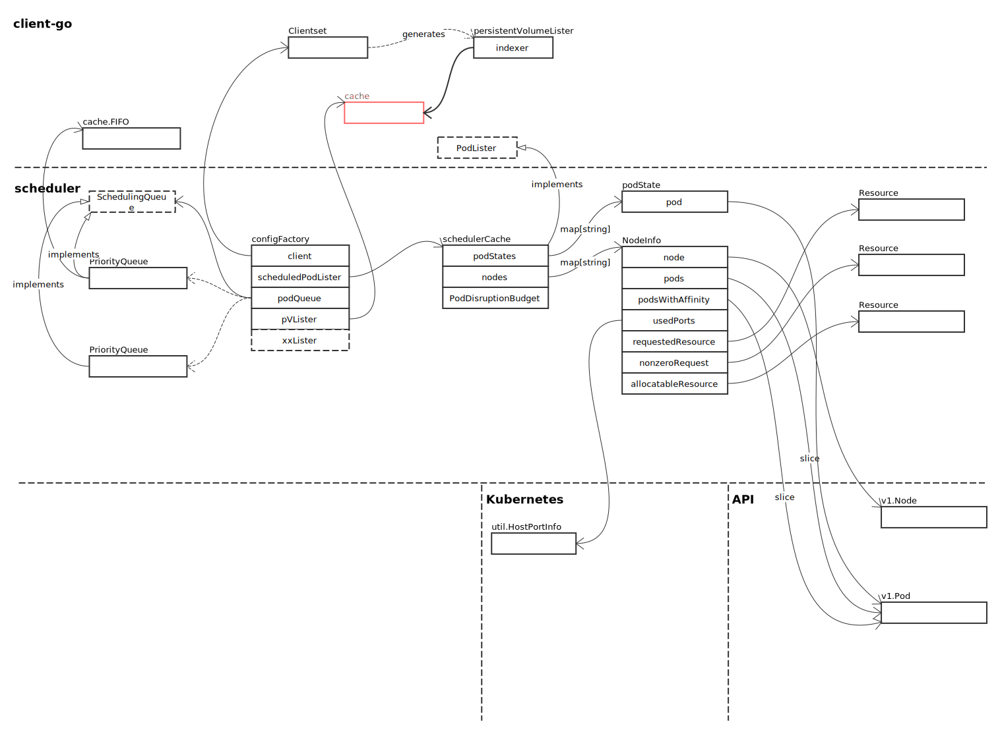
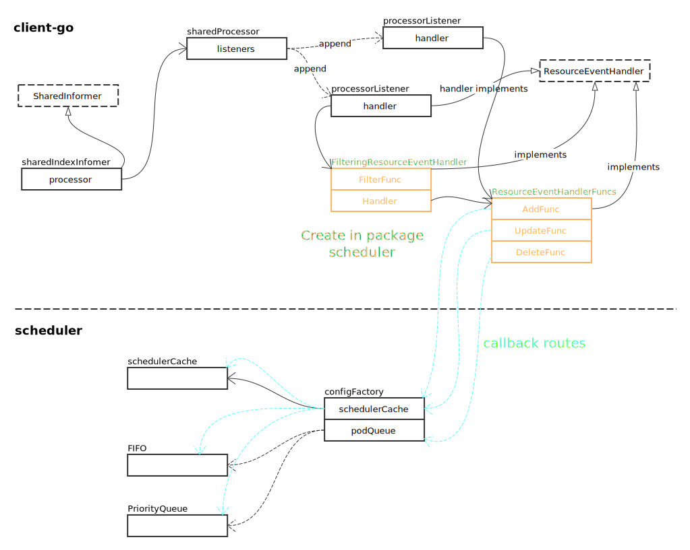
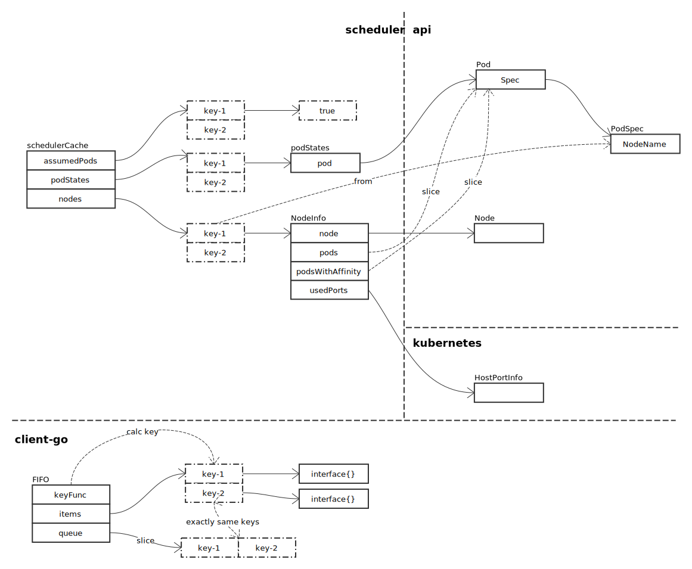

# Configuration

## Configuration Factory 概览



## Configuration Factory 实例

### 构建实例

#### 数据结构概览



上图中 pVLister 及一系例的 xxLister 均指向一个 xxLister 结构，xxLister 包含一个 [SharedIndexInformer](../client-go/shared_index_informer.md) 中的 Indexer 接口，其实例为 cache。

#### Informer 事件注册

在 NewConfigFactory 注册了一系列 ResourceEventHandler，关于 ResourceEventHandler，请参照 [SharedIndexInformer](../client-go/shared_index_informer.md)。下图是注册 ResourceEventHandler 后的数据结构关系图：



注册的全部 ResourceEventHandler，我们不一一列举。各个 handler 最终处理，我们只要记住下面图中两个主要数据结构，基本就能理解各个 handler 的处理逻辑。先看 Scheduler Cache：



先考虑调度时的实际情况：

- 当要调度 Pod 时，需要找到一个 Node
- Pod 需要 CPU、Memory、Volumn 等资源，而这些资源都来自 Node
- Pod 需要占用网络端口
- Pod 可以不指定 Node（所以，podInfomer 注册了两个 ResourceEventHandler，一个用于处理指定了 Node；一个用于处理不指定 Node）
- 从结果上看，一个 Pod 应该属于一个 Node

#### 信号量处理

使用信号量，检测混存中内容与 Lister 中内容的区别

```go
comparer := &cacheComparer{
		podLister:  podInformer.Lister(),
		nodeLister: nodeInformer.Lister(),
		pdbLister:  pdbInformer.Lister(),
		cache:      c.schedulerCache,
		podQueue:   c.podQueue,
	}

	ch := make(chan os.Signal, 1)
	signal.Notify(ch, compareSignal)

	go func() {
		for {
			select {
			case <-c.StopEverything:
				return
			case <-ch:
				comparer.Compare()
			}
		}
	}()
	```

### 场景分析

#### Pod
