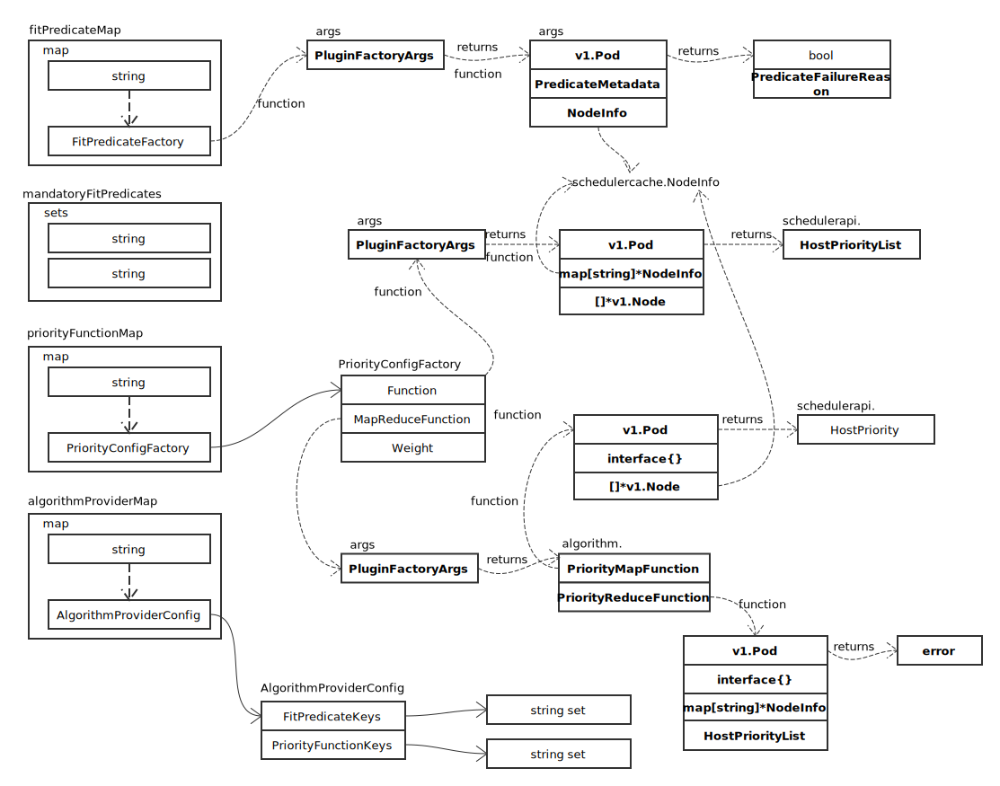

# Scheduler

## 注册配置对象

创建配置文件过程中，通过以下代码，向系统注册对象：

```go
if err := componentconfig.AddToScheme(o.scheme); err != nil {
	return nil, err
}
if err := componentconfigv1alpha1.AddToScheme(o.scheme); err != nil {
	return nil, err
}
```

具体看注册相关的变量定义：


```go
const GroupName = "componentconfig"
var SchemeGroupVersion = schema.GroupVersion{Group: GroupName, Version: runtime.APIVersionInternal}

SchemeBuilder = runtime.NewSchemeBuilder(addKnownTypes)
AddToScheme   = SchemeBuilder.AddToScheme
```

componentconfig 实际的注册代码为：

```go
func addKnownTypes(scheme *runtime.Scheme) error {
	// TODO this will get cleaned up with the scheme types are fixed
	scheme.AddKnownTypes(SchemeGroupVersion,
		&KubeSchedulerConfiguration{},
	)
	return nil
}
```

请参照 [Scheme](../general/scheme.md) 章节。

componentconfigv1alpha1 注册代码不在此罗列，原理完全一样。

## Algorithm


