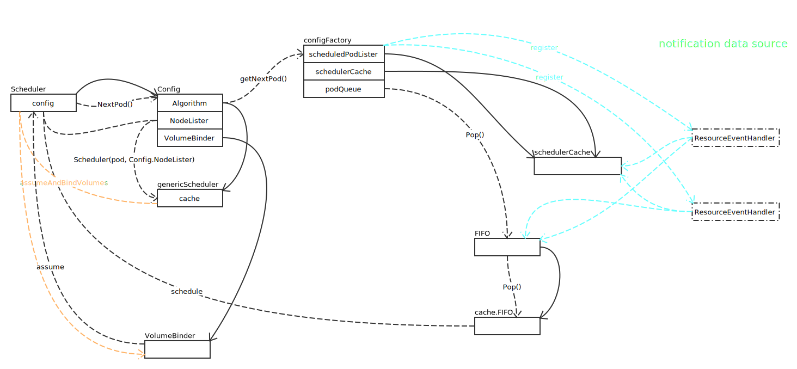

# Scheduler

## 数据结构全景图


- Binder 来源

```go
func (c *configFactory) getBinderFunc(extenders []algorithm.SchedulerExtender) func(pod *v1.Pod) scheduler.Binder {
	var extenderBinder algorithm.SchedulerExtender

	// 优先从扩展中查找
	for i := range extenders {
		if extenders[i].IsBinder() {
			extenderBinder = extenders[i]
			break
		}
	}
	defaultBinder := &binder{c.client}

	return func(pod *v1.Pod) scheduler.Binder {
		// 优先使用扩展
		if extenderBinder != nil && extenderBinder.IsInterested(pod) {
			return extenderBinder
		}

		// 使用默认
		return defaultBinder
	}
}
```

- EquivalenceCache

```go
if c.enableEquivalenceClassCache && getEquivalencePodFuncFactory != nil {
	pluginArgs, err := c.getPluginArgs()
	if err != nil {
		return nil, err
	}
	c.equivalencePodCache = core.NewEquivalenceCache(
		getEquivalencePodFuncFactory(*pluginArgs),
	)
	glog.Info("Created equivalence class cache")
}
```

从上面的代码看， EquivalenceCache 开启是有条件的。从 [Feature Gates](https://kubernetes.io/docs/reference/feature-gates/)，可以看到 EnableEquivalenceClassCache 默认是 false 状态。所以，图中 Ecache 指向 nil。

- PodConditionUpdater, PodPreemptor

通过封装 Clientset 完成，最终是通过 HTTP 完成操作。

## Run 方法

```go
func (sched *Scheduler) Run() {
	// 同步 cache，失败后只能退出
	if !sched.config.WaitForCacheSync() {
		return
	}

	if utilfeature.DefaultFeatureGate.Enabled(features.VolumeScheduling) {
		go sched.config.VolumeBinder.Run(sched.bindVolumesWorker, sched.config.StopEverything)
	}

	// 调度算法启动
	go wait.Until(sched.scheduleOne, 0, sched.config.StopEverything)
}
```

### 调度过程详解



- Scheduler.schedule()

```go
func (sched *Scheduler) schedule(pod *v1.Pod) (string, error) {
	// 使用算法进行调度
	host, err := sched.config.Algorithm.Schedule(pod, sched.config.NodeLister)

	// 调度失败
	if err != nil {
		glog.V(1).Infof("Failed to schedule pod: %v/%v", pod.Namespace, pod.Name)
		pod = pod.DeepCopy()
		sched.config.Error(pod, err)

		// 记录失败事件，通过 Broadcaster 发送
		sched.config.Recorder.Eventf(pod, v1.EventTypeWarning, "FailedScheduling", "%v", err)

		// 更新 Pod 状态为失败，并记录失败原因
		sched.config.PodConditionUpdater.Update(pod, &v1.PodCondition{
			Type:    v1.PodScheduled,
			Status:  v1.ConditionFalse,
			Reason:  v1.PodReasonUnschedulable,
			Message: err.Error(),
		})
		return "", err
	}
	return host, err
}
```

## References

- [Feature Gates](https://kubernetes.io/docs/reference/feature-gates/)