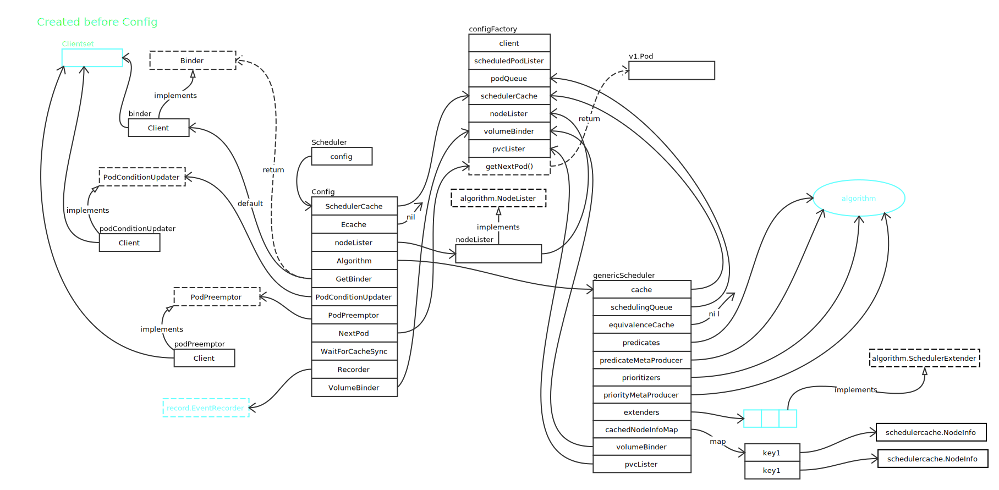

# Scheduler

## 全景图



- Binder 来源

```go
func (c *configFactory) getBinderFunc(extenders []algorithm.SchedulerExtender) func(pod *v1.Pod) scheduler.Binder {
	var extenderBinder algorithm.SchedulerExtender

	// 优先从扩展中查找
	for i := range extenders {
		if extenders[i].IsBinder() {
			extenderBinder = extenders[i]
			break
		}
	}
	defaultBinder := &binder{c.client}

	return func(pod *v1.Pod) scheduler.Binder {
		// 优先使用扩展
		if extenderBinder != nil && extenderBinder.IsInterested(pod) {
			return extenderBinder
		}

		// 使用默认
		return defaultBinder
	}
}
```

- EquivalenceCache

```go
if c.enableEquivalenceClassCache && getEquivalencePodFuncFactory != nil {
	pluginArgs, err := c.getPluginArgs()
	if err != nil {
		return nil, err
	}
	c.equivalencePodCache = core.NewEquivalenceCache(
		getEquivalencePodFuncFactory(*pluginArgs),
	)
	glog.Info("Created equivalence class cache")
}
```

从上面的代码看， EquivalenceCache 开启是有条件的。从 [Feature Gates](https://kubernetes.io/docs/reference/feature-gates/)，可以看到 EnableEquivalenceClassCache 默认是 false 状态。所以，图中 Ecache 指向 nil。

- PodConditionUpdater, PodPreemptor

通过封装 Clientset 完成，最终是通过 HTTP 完成操作。

## References

- [Feature Gates](https://kubernetes.io/docs/reference/feature-gates/)