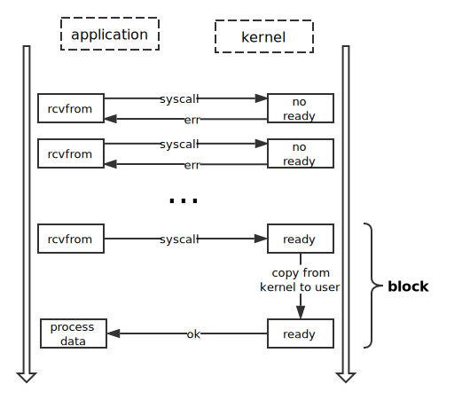

## Netstack(II) 链路层

> 链路层没有特别指明 Protocol 的接口，不过其 endpoint 如下：

```go
// LinkEndpoint 被以太网、环回、raw 等链路层协议实现，网络层协议用它来往外发送数据。
type LinkEndpoint interface {
	// MTU is the maximum transmission unit for this endpoint. This is
	// usually dictated by the backing physical network; when such a
	// physical network doesn't exist, the limit is generally 64k, which
	// includes the maximum size of an IP packet.
	MTU() uint32

	// Capabilities returns the set of capabilities supported by the
	// endpoint.
	Capabilities() LinkEndpointCapabilities

	// MaxHeaderLength returns the maximum size the data link (and
	// lower level layers combined) headers can have. Higher levels use this
	// information to reserve space in the front of the packets they're
	// building.
	MaxHeaderLength() uint16

	// LinkAddress returns the link address (typically a MAC) of the
	// link endpoint.
	LinkAddress() tcpip.LinkAddress

	// WritePacket writes a packet with the given protocol through the given
	// route.
	WritePacket(r *Route, hdr *buffer.Prependable, payload buffer.View, protocol tcpip.NetworkProtocolNumber) *tcpip.Error

	// Attach attaches the data link layer endpoint to the network-layer
	// dispatcher of the stack.
	Attach(dispatcher NetworkDispatcher)
}
```

通常用一个 endpointID 和它联系起来:

```go
type LinkEndpointID uint64
```


### fdbased endpoint

LinkEndpoint 的实现有多种，这里我们主要看一下基于文件描述符的。

```go
type endpoint struct {
	fd int
	mtu uint32
	hdrSize int 
    // 指链路层首部长度，这里特别讨论一下，可能有两个值，0 或 14。14 好理解，6 字节 dst MAC 地址，6字节 src MAC 地址，2 字节类型。为什么可能是 0 呢，如果是 localhost 的数据，是不需要 dst 和 src Mac地址的。
	addr tcpip.LinkAddress
	caps stack.LinkEndpointCapabilities

	// closed is a function to be called when the FD's peer (if any) closes
	// its end of the communication pipe.
	closed func(*tcpip.Error)

	vv     *buffer.VectorisedView
	iovecs []syscall.Iovec
	views  []buffer.View
}
```

这里 主要了解 View 和 VectorisedView：

```go
type View []byte

type VectorisedView struct {
	views []View
	size  int
}
```

另外还有一个 Prependable：

```go
type Prependable struct {
	buf View
	usedIdx int
}
```

这三个结构是整个系统里用的最多的底层结构，用来表示要传输的包。特别是 Prependable，它是可以扩展的，并且是在数据的开始处扩展，想想各层网络协议的首部，是在上一层数据的最前面添加这一层的首部。

#### iovec

> 这里重点提一下 **向量IO** 的概念。这是一种在单词系统调用中操作多个缓冲区的 I/O 方法，可以将单个数据流的内容写到多个缓冲区，或者把单个数据流读到多个缓冲区中。
>
> - 效率：单个向量I/O 操作能代替多个线性I/O 操作
> - 性能：除了系统调用次数的降低，由于内部优化，向量I /O 比线性I/O 提供更好的性能。
> - 原子性：不同于多个线性I/O 操作，一个进程可以执行单个向量I/O操作而且避免了与其它进程交叉操作的风险。
>
> 实际上，内核里的所有I/O 都是向量I/O，read()和 write()是只有一个向量的向量I/O，且向量中只有一个段。

代码里这个 iovecs 字段就是用于向量 IO，内存分配如下：

```go
var BufConfig = []int{128, 256, 256, 512, 1024, 2048, 4096, 8192, 16384, 32768} 
// 总共接近 64KB，其实有点困惑，真的需要这么多内存吗？因为 MTU 也就 1500B

func (e *endpoint) allocateViews(bufConfig []int) {
	for i, v := range e.views {
		if v != nil {
			break
		}
		b := buffer.NewView(bufConfig[i])
		e.views[i] = b
		e.iovecs[i] = syscall.Iovec{
			Base: &b[0],
			Len:  uint64(len(b)),
		}
	}
}
```

#### 发送数据

先看发送，就是系统调用往对应的 fd 里写入内容，需要注意的是这是*非阻塞*写入。

```go
// WritePacket writes outbound packets to the file descriptor. If it is not
// currently writable, the packet is dropped.
func (e *endpoint) WritePacket(r *stack.Route, hdr *buffer.Prependable, payload buffer.View, protocol tcpip.NetworkProtocolNumber) *tcpip.Error {
	if e.hdrSize > 0 { // 不是 localhost，需要加上首部
		eth := header.Ethernet(hdr.Prepend(header.EthernetMinimumSize))
		eth.Encode(&header.EthernetFields{
			DstAddr: r.RemoteLinkAddress,
			SrcAddr: e.addr,
			Type:    protocol,
		})
	}

	if len(payload) == 0 {
		return rawfile.NonBlockingWrite(e.fd, hdr.UsedBytes())
	}

	return rawfile.NonBlockingWrite2(e.fd, hdr.UsedBytes(), payload)
}

// 非阻塞写
func NonBlockingWrite(fd int, buf []byte) *tcpip.Error {
	var ptr unsafe.Pointer
	if len(buf) > 0 {
		ptr = unsafe.Pointer(&buf[0])
	}

	_, _, e := syscall.RawSyscall(syscall.SYS_WRITE, uintptr(fd), uintptr(ptr), uintptr(len(buf)))
	if e != 0 {
		return TranslateErrno(e)
	}

	return nil
}


// 利用 '向量 IO' 写入
func NonBlockingWrite2(fd int, b1, b2 []byte) *tcpip.Error {
	...
	iovec := [...]syscall.Iovec{ // 
		{
			Base: &b1[0],
			Len:  uint64(len(b1)),
		},
		{
			Base: &b2[0],
			Len:  uint64(len(b2)),
		},
	}

	_, _, e := syscall.RawSyscall(syscall.SYS_WRITEV, uintptr(fd), uintptr(unsafe.Pointer(&iovec[0])), uintptr(len(iovec)))
	if e != 0 {
		return TranslateErrno(e)
	}

	return nil
}
```

#### 接收数据

链路层 endpoint 在运行起来后会进入一个接收循环：

```go
func (e *endpoint) dispatchLoop(d stack.NetworkDispatcher) *tcpip.Error {
	v := buffer.NewView(header.MaxIPPacketSize)
	for {
		cont, err := e.dispatch(d, v) // note: if no data to deliver, it blocks.
		...
	}
}


func (e *endpoint) dispatch(d stack.NetworkDispatcher, largeV buffer.View) (bool, *tcpip.Error) {
	e.allocateViews(BufConfig) // 分配内存

	n, err := rawfile.BlockingReadv(e.fd, e.iovecs) // 注意这里会阻塞
	if err != nil {
		return false, err
	}

    ...
    
	used := e.capViews(n, BufConfig)
	e.vv.SetViews(e.views[:used])
	e.vv.SetSize(n)
	e.vv.TrimFront(e.hdrSize) // note: trim eth header, leave the IP protocol

	d.DeliverNetworkPacket(e, addr, p, e.vv)

	// Prepare e.views for another packet: release used views.
	for i := 0; i < used; i++ {
		e.views[i] = nil
	}

	return true, nil
}
```

以上 dispatch 先分配内存，然后读取，而且很明显只读取一个帧数据，由于 MTU 限制，通常大小为 1518B，所以不明白为什么会分配大约 64KB 的内存。

特别看一下 blockReadv 的实现，这个函数将底层的非阻塞读封装成了阻塞读。先回顾一下非阻塞 IO 模型：



```go
func BlockingReadv(fd int, iovecs []syscall.Iovec) (int, *tcpip.Error) {
	for {
		n, _, e := syscall.RawSyscall(syscall.SYS_READV, uintptr(fd), uintptr(unsafe.Pointer(&iovecs[0])), uintptr(len(iovecs)))
		// 注意这里可能阻塞，也可能不阻塞。首先这是一个 NonBlocking IO，如上图。数据没有准备好时，立即返回，数据准备好时，阻塞拷贝到 user 空间。
		if e == 0 {
			return int(n), nil
		}

		event := struct {
			fd      int32
			events  int16
			revents int16
		}{
			fd:     int32(fd),
			events: 1, // POLLIN
		}

		_, e = blockingPoll(unsafe.Pointer(&event), 1, -1) 
        // 这里会阻塞直到有事件触发。第二个参数是 event 个数，第三个参数是指等待的时间，时间到了，不论有没有事件到来，都要返回，-1 代表无限等待。关于 poll 可以参考这里:
        // http://www.cnblogs.com/Anker/archive/2013/08/15/3261006.html
		if e != 0 && e != syscall.EINTR { // err=EINTR 代表需要重新发起调用
			return 0, TranslateErrno(e)
		}
	}
}
```

读取到一个数据帧后，调用`d.DeliverNetworkPacket(e, addr, p, e.vv)`把数据分发到 network 层。这里涉及到 NetworkDispatcher 接口，在代码里由 NIC 实现，这次就不讨论了。

```go
type NetworkDispatcher interface {
	// DeliverNetworkPacket finds the appropriate network protocol
	// endpoint and hands the packet over for further processing.
	DeliverNetworkPacket(linkEP LinkEndpoint, remoteLinkAddr tcpip.LinkAddress, protocol tcpip.NetworkProtocolNumber, vv *buffer.VectorisedView)
}
```

### channel 、loopback、sniffer endpoint

这里简单讨论一下其他的 endpoint 实现。

##### channel endpoint

```go
type PacketInfo struct {
	Header  buffer.View
	Payload buffer.View
	Proto   tcpip.NetworkProtocolNumber
}

type Endpoint struct {
	dispatcher stack.NetworkDispatcher
	mtu        uint32
	linkAddr   tcpip.LinkAddress

	// C is where outbound packets are queued.
	C chan PacketInfo
}
```

channel 主要是实现内部通信，所以写数据就是直接把帧放到 channel 形成队列：

```go
// WritePacket stores outbound packets into the channel.
func (e *Endpoint) WritePacket(_ *stack.Route, hdr *buffer.Prependable, payload buffer.View, protocol tcpip.NetworkProtocolNumber) *tcpip.Error {
	p := PacketInfo{
		Header: hdr.View(),
		Proto:  protocol,
	}

	if payload != nil {
		p.Payload = make(buffer.View, len(payload))
		copy(p.Payload, payload)
	}

	select {
	case e.C <- p:
	default:
	}

	return nil
}
```

#### loopback endpoint

环回的 endpoint 就更简单了，不需要经过网卡，经过它发送的数据立即被looped back到IP层的输入队列中。

```go
func (e *endpoint) WritePacket(_ *stack.Route, hdr *buffer.Prependable, payload buffer.View, protocol tcpip.NetworkProtocolNumber) *tcpip.Error {
	if len(payload) == 0 {
		// We don't have a payload, so just use the buffer from the
		// header as the full packet.
		v := hdr.View()
		vv := v.ToVectorisedView([1]buffer.View{})
		e.dispatcher.DeliverNetworkPacket(e, "", protocol, &vv)
	} else {
		views := []buffer.View{hdr.View(), payload}
		vv := buffer.NewVectorisedView(len(views[0])+len(views[1]), views)
		e.dispatcher.DeliverNetworkPacket(e, "", protocol, &vv)
	}

	return nil
}
```

另外特别的是，由于不经过实际链路，所以没有通常意义的 MTU，它的 MTU 可以取到最大值：

```go
func (*endpoint) MTU() uint32 {
	return 65536
}
```

#### sniffer endpoint

sniffer 意思是探测器，这个 endpoint 只是对一个正常的 endpoint 的包装，实现 LinkEndpoint 接口的函数都是调用它所包装的 endpoint。它所实现的功能是记录所有经过它的包，可以用它实现抓包。

```go
type endpoint struct {
	dispatcher stack.NetworkDispatcher
	lower      stack.LinkEndpoint
	file       *os.File
}

func LogPacket(prefix string, protocol tcpip.NetworkProtocolNumber, b, plb []byte) {
...
}
```

