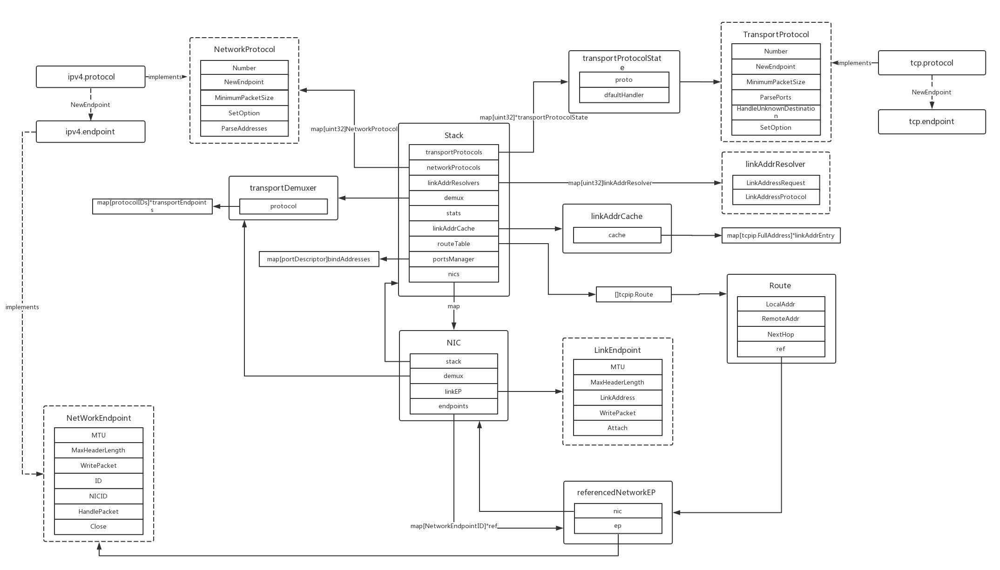

## netstack 总览

### stack

> stack 结构体代表了整个网络协议栈，它协调着各层协议的工作。



stack 包含了各层的 Protocol，通过 Protocol 可以创建对应的 endpoint。其中，transportProtocols 、networkProtocols 和 linkAddrResolvers 都是一个  map，不同版本的协议对应不同的内容。如 UDP 的编号是 17，TCP 的是 6；network 的有 4 和 6。linkAddrCache 是 MAC 地址和 IP 地址的映射缓存，这个字段用于 ARP。NIC 是指 Network Interface Card，每个网卡绑定一个 LinkEndpoint。

接下来我们从网卡收到数据开始，逐层网上分析。

### link layer

这一层实现了多种 endpoint，有基于 channel 的、基于 文件描述符的、环回地址的。。。都实现了 LinkEndpoint 接口。我们选择 fdBased 的来看。

New：

```go
func New(fd int, mtu uint32, closed func(*tcpip.Error)) tcpip.LinkEndpointID {
	syscall.SetNonblock(fd, true)

	e := &endpoint{
		fd:     fd,
		mtu:    mtu,
		closed: closed,
		views:  make([]buffer.View, len(BufConfig)),
		iovecs: make([]syscall.Iovec, len(BufConfig)),
	}
	vv := buffer.NewVectorisedView(0, e.views)
	e.vv = &vv
	return stack.RegisterLinkEndpoint(e) // 注册到全局 map 对象 linkEndpoints 里
}
```

Attach：

```go
// 把当前 endpoint 和一个网络层 dispatcher 绑定，进入循环
func (e *endpoint) Attach(dispatcher stack.NetworkDispatcher) {
	go e.dispatchLoop(dispatcher)
}

// 
func (e *endpoint) dispatchLoop(d stack.NetworkDispatcher) *tcpip.Error {
	v := buffer.NewView(header.MaxIPPacketSize)
	for {
		cont, err := e.dispatch(d, v)
		...
	}
}

// 
type NetworkDispatcher interface {
	// DeliverNetworkPacket finds the appropriate network protocol
	// endpoint and hands the packet over for further processing.
	DeliverNetworkPacket(linkEP LinkEndpoint, remoteLinkAddr tcpip.LinkAddress, protocol tcpip.NetworkProtocolNumber, vv *buffer.VectorisedView)
}
```

e.dispatch() 主要做一件事：调用 NetworkDispatcher 接口的分发函数，把数据传给 network 层。

```go
	d.DeliverNetworkPacket(e, "", p, e.vv)
```

这里的 NetworkDispatcher 是由 NIC 来实现的:

```go
func (n *NIC) DeliverNetworkPacket(linkEP LinkEndpoint, remoteLinkAddr tcpip.LinkAddress, protocol tcpip.NetworkProtocolNumber, vv *buffer.VectorisedView) {
	netProto, ok := n.stack.networkProtocols[protocol]
	if !ok {
		atomic.AddUint64(&n.stack.stats.UnknownProtocolRcvdPackets, 1)
		return
	}

	if len(vv.First()) < netProto.MinimumPacketSize() {
		atomic.AddUint64(&n.stack.stats.MalformedRcvdPackets, 1)
		return
	}
    ref := n.endpoints[id]
	...
	ref.ep.HandlePacket(&r, vv) // 调用网络层 endpoint 的 handlePacket
}
```


### network

