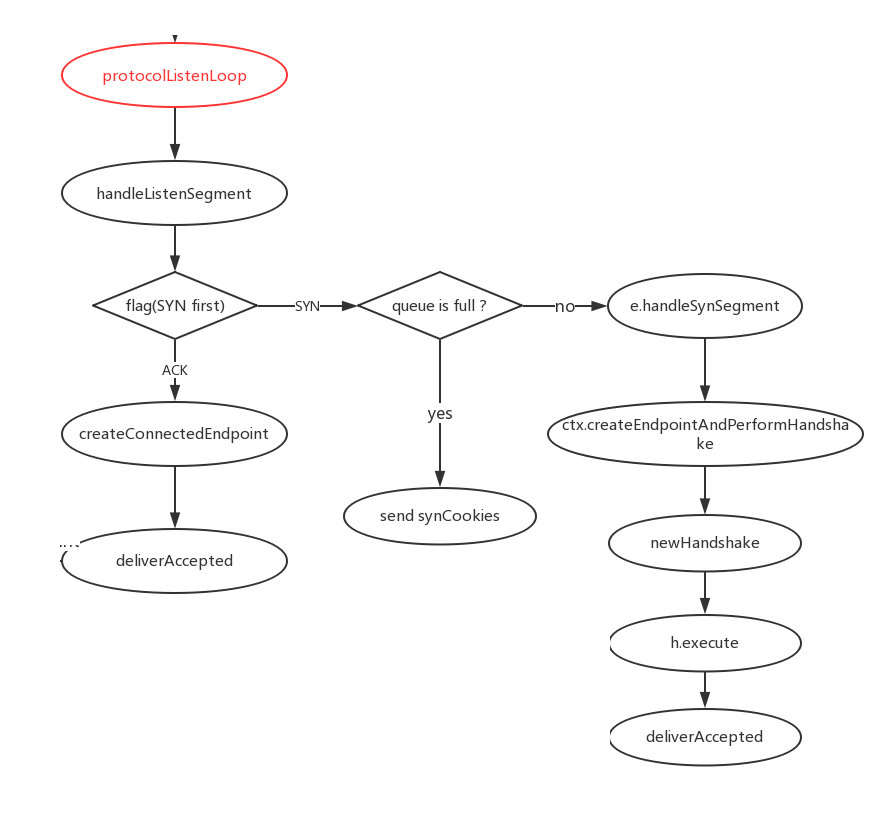
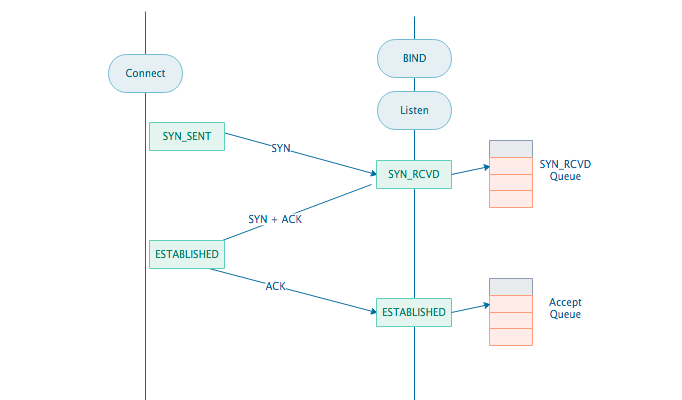
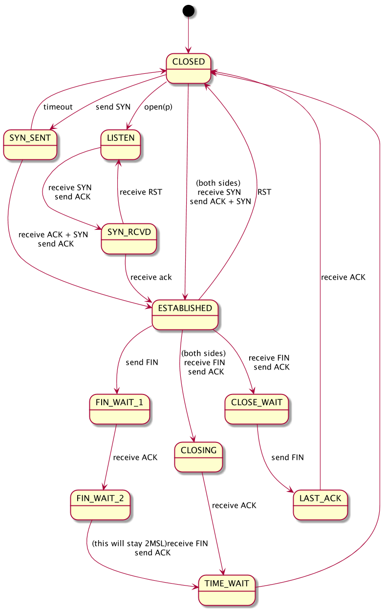

## Netsatck TCP(II) 连接的建立与三次握手

#### protocolListenLoop

当新建一个 endpoint 并且将其 Bind 到一个端口后，这个endpoint 进入 protocolListenLoop，负责监听与连接建立。

```go
e.protocolListenLoop(seqnum.Size(e.receiveBufferAvailable())){// 同时设置了 rcvBuf 的大小
    ctx := newListenContext(e.stack, rcvWnd, v6only, e.netProto)// 只是为了带一些参数

	s := sleep.Sleeper{}
	s.AddWaker(&e.notificationWaker, wakerForNotification)
	s.AddWaker(&e.newSegmentWaker, wakerForNewSegment)
	for {
		switch index, _ := s.Fetch(true); index {
		case wakerForNotification:
			n := e.fetchNotifications()
			if n&notifyClose != 0 {	// 表示收到退出通知
				return nil
			}

		case wakerForNewSegment:
			// Process at most maxSegmentsPerWake segments.
			mayRequeue := true
			for i := 0; i < maxSegmentsPerWake; i++ { 
                // maxSegmentsPerWake==100,因为收到一个通知可能对应受到了多个数据包，所以每次 wake
                // 都处理多次
				s := e.segmentQueue.dequeue()
                if s == nil {
                    break
                }
				e.handleListenSegment(ctx, s)
			}

			if mayRequeue && !e.segmentQueue.empty() {
				e.newSegmentWaker.Assert()
				// maxSegmentsPerWake 次循环仍然没有处理完所有的包，再次唤醒 waker，继续处理
			}
		}
	}
} 
```




handleListenSegment  处理收到的数据包，优先判定是否有 SYN 标识。如果改数据包没有 SYN 而有 ACK 标识的话，那么根据三次握手，它属于第三步，验证其合法后，该数据包对应的连接已经建立，那么为该连接创建一个新的 endpoint，将其发给 Accept 队列。

只要包含 SYN标识，那么说明该连接处于三步握手的第一步。为什么不是第二步？因为这是 Listen 函数，当前处于连接的被动方。这里会有一个队列，称为 SYN_RCVD 队列或半连接队列。长度为 max(64,/proc/sys/net/ipv4/tcp_max_syn_backlog) ，在机器的tcp_max_syn_backlog值在/proc/sys/net/ipv4/tcp_max_syn_backlog下配置。



当这个队列满了，不开启 syncookies 的时候，Server 会丢弃新来的 SYN 包，而 Client 端在多次重发 SYN 包得不到响应而返回（`connection time out`）错误。但是，当 Server 端开启了 syncookies=1，那么 SYN 半连接队列就没有逻辑上的最大值了，并且 /proc/sys/net/ipv4/tcp_max_syn_backlog 设置的值也会被忽略。在 netstack 中开启了 syncookies。

```go
func (e *endpoint) handleListenSegment(ctx *listenContext, s *segment) {
	switch s.flags {
	case flagSyn:
		opts := parseSynSegmentOptions(s)
		if incSynRcvdCount() { // 半连接队列长度 +1，成功返回 true，队列已满返回 false
			go e.handleSynSegment(ctx, s, &opts)
		} else {
            // 这里采用 SYNCookies 策略，SYN 半连接队列就没有逻辑上的最大值
			cookie := ctx.createCookie(s.id, s.sequenceNumber, encodeMSS(opts.MSS))
			...
			sendSynTCP(&s.route, s.id, flagSyn|flagAck, cookie, s.sequenceNumber+1, ctx.rcvWnd, synOpts)
		}

	case flagAck:
		if data, ok := ctx.isCookieValid(s.id, s.ackNumber-1, s.sequenceNumber-1); ok && int(data) < len(mssTable) { // 验证 ACK 的正确性
			...
			n, err := ctx.createConnectedEndpoint(s, s.ackNumber-1, s.sequenceNumber-1, rcvdSynOptions)
			if err == nil {
				e.deliverAccepted(n)
			}
		}
	}
}
```

e.handleSynSegment 做的事情就是创建 handshake 结构体，执行三步握手，然后将完成握手的新的 endpoint 传入 Accept 队列。

```go
func (e *endpoint) handleSynSegment(ctx *listenContext, s *segment, opts *header.TCPSynOptions) {
	defer decSynRcvdCount() // 不论最后有没有成功建立连接，把半连接数量 -1
	
	n, err := ctx.createEndpointAndPerformHandshake(s, opts)
	if err != nil {
		return
	}
	e.deliverAccepted(n)
}
```

```go
func (l *listenContext) createEndpointAndPerformHandshake(s *segment, opts *header.TCPSynOptions) (*endpoint, *tcpip.Error) {
	// Create new endpoint.
    irs := s.sequenceNumber // irs: initial remote sequenceNUmber
	cookie := l.createCookie(s.id, irs, encodeMSS(opts.MSS)) // 同样需要使用 cookie 来实现验证
	ep, err := l.createConnectedEndpoint(s, cookie, irs, opts)
	...

	// Perform the 3-way handshake.
	h, err := newHandshake(ep, l.rcvWnd)
	...
	if err := h.execute(); err != nil {
		ep.Close()
		return nil, err
	}
    ...
	return ep, nil
}
```

主要看下 handshake 的 excute 方法，也就是具体执行握手的方法。在看代码之前我们要做到心中有 B 树，哦不，是连接状态机：



注意这个函数可以在被动的 Listen 函数里调用，也可以在主动的 Connect 里被调用，所以记住这个函数里，endpoint 有两种角色，区分不同角色及其状态很重要：

```go
func (h *handshake) execute() *tcpip.Error {
	// Initialize the resend timer.
	resendWaker := sleep.Waker{}
	timeOut := time.Duration(time.Second) // 设置初始 RTO 为 1s
	rt := time.AfterFunc(timeOut, func() {
		resendWaker.Assert() // RTO 后触发超时重传
	})
	defer rt.Stop()

	// Set up the wakers.
	s := sleep.Sleeper{}
	s.AddWaker(&resendWaker, wakerForResend)
	s.AddWaker(&h.ep.notificationWaker, wakerForNotification)
	s.AddWaker(&h.ep.newSegmentWaker, wakerForNewSegment)
	defer s.Done()

	synOpts := header.TCPSynOptions{
		WS:    h.rcvWndScale, // 这里设置的是自己这一端的 wndScale
		TS:    true,
		TSVal: h.ep.timestamp(),
		TSEcr: h.ep.recentTS,
	}

	if h.state == handshakeSynRcvd {
		synOpts.TS = h.ep.sendTSOk 
        // handshakeSynRcvd 说明当前是由 Listen 调用的被动连接，由对方决定是否使用 TS 选项
	}
	// 注意一个细节，虽然画图的时候三步握手第一步都只画了一个 SYN，但其实还包含了一个 ACK，只不过值为 0.以下的 ACK 序列号，如果是主动发起连接，该值为 0，相反，则值为 irs + 1
	sendSynTCP(&h.ep.route, h.ep.id, h.flags, h.iss, h.ackNum, h.rcvWnd, synOpts)
    
	for h.state != handshakeCompleted {
		switch index, _ := s.Fetch(true); index {
		case wakerForResend: // SYN+ACK 超时重传的情况
			timeOut *= 2 // 指数退避行为
			if timeOut > 60*time.Second { // 最大超时时间
				return tcpip.ErrTimeout
			}
			rt.Reset(timeOut)
			sendSynTCP(&h.ep.route, h.ep.id, h.flags, h.iss, h.ackNum, h.rcvWnd, synOpts)

		case wakerForNotification: // 收到关闭信号
			n := h.ep.fetchNotifications()
			if n&notifyClose != 0 {
				return tcpip.ErrAborted
			}

		case wakerForNewSegment: // 等待并处理新的 SYN 数据包或握手第三步的 ACK
			if err := h.processSegments(); err != nil {
				return err
			}
		}
	}

	return nil
}
```

如上，excute 首先发送一个 SYN + ACK 报文（注意这里对应主动和被动两种情况），然后进入循环直到建立连接。同理，h.processSegments 也对应两种情况。如果自己是主动连接，那么自己目前处于 SYN_SENT 状态，等待一个 SYN + ACK 报文并执行 synSentState：

```go
func (h *handshake) synSentState(s *segment) *tcpip.Error {
	// RFC 793, page 37, states that in the SYN-SENT state, a reset is
	// acceptable if the ack field acknowledges the SYN.
	if s.flagIsSet(flagRst) {
		if s.flagIsSet(flagAck) && s.ackNumber == h.iss+1 {
			return tcpip.ErrConnectionRefused
		}
		return nil
	}

	if !h.checkAck(s) || !s.flagIsSet(flagSyn) {
		return nil
	}

	rcvSynOpts := parseSynSegmentOptions(s)
	h.ep.maybeEnableTimestamp(&rcvSynOpts) // 设置是否允许时间戳选项

	h.ackNum = s.sequenceNumber + 1
	h.flags |= flagAck
	h.mss = rcvSynOpts.MSS
	h.sndWndScale = rcvSynOpts.WS

	if s.flagIsSet(flagAck) { // 发出 SYN 后收到了 SYN + ACK，再发送一个 ACK，连接就完成建立了
		h.state = handshakeCompleted
		h.ep.sendRaw(nil, flagAck, h.iss+1, h.ackNum, h.rcvWnd>>h.effectiveRcvWndScale())
		return nil
	}

	// 以下这一端对应的是状态机那张图里的‘同时连接’的情况，此时作为主动方已经发出了一个 SYN，然后又收到了一个 SYN，此时只要发送一个 SYN + ACK，对于对方来说这个连接就已经建立了，对于自己来说，再收到一个 SYN + ACK 也算完成连接。
	h.state = handshakeSynRcvd
	synOpts := header.TCPSynOptions{
		WS:    h.rcvWndScale,
		TS:    rcvSynOpts.TS,
		TSVal: h.ep.timestamp(),
		TSEcr: h.ep.recentTS,
	}
	sendSynTCP(&s.route, h.ep.id, h.flags, h.iss, h.ackNum, h.rcvWnd, synOpts)

	return nil
}
```

如果是被动连接，那么自己目前处于 SYN_RCVD 状态，等待一个 ACK：

```go
func (h *handshake) synRcvdState(s *segment) *tcpip.Error {
	if s.flagIsSet(flagRst) { //
		if s.sequenceNumber.InWindow(h.ackNum, h.rcvWnd) {
			return tcpip.ErrConnectionRefused
		}
		return nil
	}

	if !h.checkAck(s) {
		return nil
	}

	if s.flagIsSet(flagSyn) && s.sequenceNumber != h.ackNum-1 {
		// 之前已经收到过了一个 SYN，然后又收到了一个 SYN，并且两次 seq 不同，那么认为对方抽风，发送 RST 关闭连接。
		ack := s.sequenceNumber.Add(s.logicalLen())
		seq := seqnum.Value(0)
		if s.flagIsSet(flagAck) {
			seq = s.ackNumber
		}
		h.ep.sendRaw(nil, flagRst|flagAck, seq, ack, 0)

		if !h.active {
			return tcpip.ErrInvalidEndpointState
		}

		if err := h.resetState(); err != nil {
			return err
		}
		synOpts := header.TCPSynOptions{
			WS:    h.rcvWndScale,
			TS:    h.ep.sendTSOk,
			TSVal: h.ep.timestamp(),
			TSEcr: h.ep.recentTS,
		}
		sendSynTCP(&s.route, h.ep.id, h.flags, h.iss, h.ackNum, h.rcvWnd, synOpts)
		return nil
	}

	if s.flagIsSet(flagAck) {
		// 如果之前协商好了要带上 timeStamp 选项，但是握手第三步没有带上时间戳，那么丢弃这个 ACK 数据包
		if h.ep.sendTSOk && !s.parsedOptions.TS {
			atomic.AddUint64(&h.ep.stack.MutableStats().DroppedPackets, 1)
			return nil
		}

		// 更新时间戳
		h.ep.updateRecentTimestamp(s.parsedOptions.TSVal, h.ackNum, s.sequenceNumber)

		h.state = handshakeCompleted 
		return nil
	}
	return nil
}
```

以上，基本就是建立 TCP 连接的完整过程。