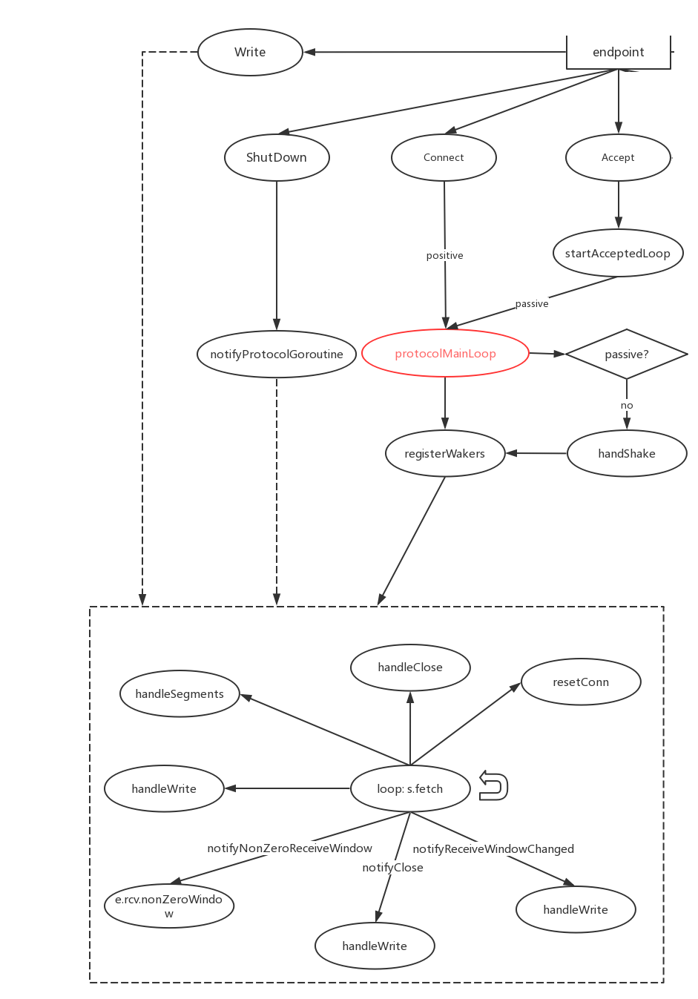

## Netstack TCP(III) 收发数据(上)

> 上一篇我们讨论了 TCP 连接建立的过程，这篇接着讨论连接建立以后的故事。

如果是被动建立连接，这个连接会经过 deliverAccept 函数被放到 Accept 队列，然后由应用程序去调用 Accept 来获取一个连接，Go SDK 1.9.2 的 net/http/server.go 中是这样调用的：

```go
func (srv *Server) Serve(l net.Listener) error {
	defer l.Close()
	...
	for {
		rw, e := l.Accept()
		if e != nil {
			if ne, ok := e.(net.Error); ok && ne.Temporary() {
				...
				time.Sleep(tempDelay)
				continue
			}
			return e
		}
		tempDelay = 0
		c := srv.newConn(rw)
		c.setState(c.rwc, StateNew) // before Serve can return
		go c.serve(ctx)
	}
}
```

在这个程序中，循环去调用 Accept 去获取一个可读写的连接，但是可能会有一个暂时性的错误，所以让它 `sleep` 了一小会儿。当然，这里的 Accept 是对系统调用的封装， 和 netstack 的 Accept 不是同一个，但是基本原理是一样的。来看下 netstack 的 Accept：

```go
func (e *endpoint) Accept() (tcpip.Endpoint, *waiter.Queue, *tcpip.Error) {
	e.mu.RLock()
	defer e.mu.RUnlock()

	// Endpoint must be in listen state before it can accept connections.
	if e.state != stateListen {
		return nil, nil, tcpip.ErrInvalidEndpointState
	}

	// Get the new accepted endpoint.
	var n *endpoint
	select {
	case n = <-e.acceptedChan:
	default:
		return nil, nil, tcpip.ErrWouldBlock // 注意这里，当没有新的连接时，没有一直阻塞，而是返回一个 ‘暂时不可用’ 的错误。这也是上一段代码里 sleep 一小会儿的原因。
	}

	// Start the protocol goroutine.
	wq := &waiter.Queue{}
	n.startAcceptedLoop(wq)

	return n, wq, nil
}
```

获取到新的连接后进入 `startAcceptedLoop，` `startAcceptedLoop`只是对 `protocolMainLoop`的简单封装。

而如果是主动建立连接，三次握手后，直接进入 `protocolMainLoop`循环。

#### protocolMainLoop



如图，虚线框里的就是 protocolMainLoop 的主要内容。代码如下：

```go
func protocolMainLoop() *tcpip.Error{
    ...
    // One time set-up.
    s := sleep.Sleeper{}

    funcs := []struct {
            w *sleep.Waker
            f func() bool
        }{
            {
                w: &e.sndWaker,
                f: e.handleWrite,
            },
            {
                w: &e.sndCloseWaker,
                f: e.handleClose,
            },
            {
                w: &e.newSegmentWaker,
                f: e.handleSegments,
            },
        	...
    }

    for i := range funcs {
        s.AddWaker(funcs[i].w, i)
    }
    // Called repeatedly.
    for {
        v, _ := s.Fetch(true)
        if !funcs[v].f() {
            return nil
        }
    }   
}
```

可以看到，主要是注册一些回调，添加到 sleeper 的 waker 里，然后进入循环，Fetch 拿到触发了的事件，然后执行这些事件对应的回调。这是大体框架，接下来详细了解一些比较重要的事件及其回调。

####sender

先来关注一个连接作为发送方需要的功能，sender 是比较复杂的，它需要关注 TCP 窗口大小、流量控制、超时重传、拥塞控制、保活探测等一系列机制，同时由于一个 endpoint 只有一个 sender 和 receiver，收到数据后返回 ACK 或者 SACK 的工作也需要 sender 来控制。

在 endpoint 上和发送有关的域有如下几个：

```go
	sndBufMu      sync.Mutex
	sndBufSize    int
	sndBufUsed    int
	sndClosed     bool
	sndBufInQueue seqnum.Size
	sndQueue      segmentList // 用来保存还未发出的数据
	sndWaker      sleep.Waker
	sndCloseWaker sleep.Waker
```

在 sender 上也有一个`writeList   segmentList` 域，这里 segmentList 是一个有头有尾的链表结构。这两个 segmentList 分别有什么作用和区别呢？我们通过 Write 函数来看下：

```go
// 这是 socket 的标准接口之一，调用的时候通常放在一个循环里，确保数据被写入
func (e *endpoint) Write(p tcpip.Payload, opts tcpip.WriteOptions) (uintptr, *tcpip.Error) {
    ...
	// Check against the limit.
	avail := e.sndBufSize - e.sndBufUsed // 检查发送窗口大小
	if avail <= 0 { // 可用窗口 <= 0,暂时不可发送，返回一个‘暂时性’的错误，表示多试几次即可
		return 0, tcpip.ErrWouldBlock
	}

	v, perr := p.Get(avail)
	l := len(v)

	var err *tcpip.Error
	if p.Size() > avail {
		err = tcpip.ErrWouldBlock
	}
	l := len(v)
	s := newSegmentFromView(&e.route, e.id, v) // 把整块的数据根据当前窗口大小切出一个包，也就是说数据在此之前是‘流式’的

	...
	e.sndQueue.PushBack(s) // 注意这里先把数据包存在了 endpoint 的链表里。
	...
	e.handleWrite()
	return uintptr(l), err
}
```

需要注意的是，这里的 sendQueue 是可以被多个 goroutine 访问的，所以操作它要加锁（以上代码里为了简要删掉了）。在调用 e.handleWrite() 里，把 e.sendQueue 整个链表追加到了 endpoint.snd.writeList 尾部，由sender 接管，在这里由于调用 handlewrite 已经加了锁，所以 sender 的writeList 只能被一个 goroutine 操作，不需要再加锁。e.handleWrite 做了另一件事就是调用了 sendData 函数。涉及了 TCP 发送方的诸多细节和算法，如超时重传、慢启动、拥塞避免、快速恢复、Reno、newReno、窗口探测等等，读这段代码前需要对 TCP 协议有详细的了解，否则可以先跳过这段。

```go
func (s *sender) sendData() {
	limit := s.maxPayloadSize

	// Reduce the congestion window to min(IW, cwnd) per RFC 5681, page 10.
	// "A TCP SHOULD set cwnd to no more than RW before beginning
	// transmission if the TCP has not sent data in the interval exceeding
	// the retrasmission timeout."
	if !s.fr.active && time.Now().Sub(s.lastSendTime) > s.rto {
		if s.sndCwnd > InitialCwnd {
			s.sndCwnd = InitialCwnd
		}
	}

	// TODO: We currently don't merge multiple send buffers
	// into one segment if they happen to fit. We should do that
	// eventually.
	var seg *segment
	end := s.sndUna.Add(s.sndWnd)
	for seg = s.writeNext; seg != nil && s.outstanding < s.sndCwnd; seg = seg.Next() {
		// We abuse the flags field to determine if we have already
		// assigned a sequence number to this segment.
		if seg.flags == 0 {
			seg.sequenceNumber = s.sndNxt
			seg.flags = flagAck | flagPsh
		}

		var segEnd seqnum.Value
		if seg.data.Size() == 0 {
			seg.flags = flagAck

			s.ep.rcvListMu.Lock()
			rcvBufUsed := s.ep.rcvBufUsed
			s.ep.rcvListMu.Unlock()

			s.ep.mu.Lock()
			// We're sending a FIN by default
			fl := flagFin
			if (s.ep.shutdownFlags&tcpip.ShutdownRead) != 0 && rcvBufUsed > 0 {
				// If there is unread data we must send a RST.
				// For more information see RFC 2525 section 2.17.
				fl = flagRst
			}
			s.ep.mu.Unlock()
			seg.flags |= uint8(fl)

			segEnd = seg.sequenceNumber.Add(1)
		} else {
			// We're sending a non-FIN segment.
			if !seg.sequenceNumber.LessThan(end) {
				break
			}

			available := int(seg.sequenceNumber.Size(end))
			if available > limit {
				available = limit
			}

			if seg.data.Size() > available {
				// Split this segment up.
				nSeg := seg.clone()
				nSeg.data.TrimFront(available)
				nSeg.sequenceNumber.UpdateForward(seqnum.Size(available))
				s.writeList.InsertAfter(seg, nSeg)
				seg.data.CapLength(available)
			}

			s.outstanding++
			segEnd = seg.sequenceNumber.Add(seqnum.Size(seg.data.Size()))
		}

		s.sendSegment(&seg.data, seg.flags, seg.sequenceNumber)

		// Update sndNxt if we actually sent new data (as opposed to
		// retransmitting some previously sent data).
		if s.sndNxt.LessThan(segEnd) {
			s.sndNxt = segEnd
		}
	}

	// Remember the next segment we'll write.
	s.writeNext = seg

	// Enable the timer if we have pending data and it's not enabled yet.
	if !s.resendTimer.enabled() && s.sndUna != s.sndNxt {
		s.resendTimer.enable(s.rto)
	}
}
```

最后实际发送是调用 sender.sendSegment —> endpoint.sendRaw —> sendTCP —> route.ref.ep.WritePacket，route 是这条连接对应的路由，WritePacket 把这个数据包传到对应的网络层endpoint，TCP  sender 的工作到此结束了。

```go
func (s *sender) sendSegment(data *buffer.VectorisedView, flags byte, seq seqnum.Value) *tcpip.Error {
	...
	rcvNxt, rcvWnd := s.ep.rcv.getSendParams()
	...
	return s.ep.sendRaw(data.First(), flags, seq, rcvNxt, rcvWnd)
}


func (e *endpoint) sendRaw(data buffer.View, flags byte, seq, ack seqnum.Value, rcvWnd seqnum.Size) *tcpip.Error {
	...
	err := sendTCP(&e.route, e.id, data, flags, seq, ack, rcvWnd)
	return err
}


func sendTCP(r *stack.Route, id stack.TransportEndpointID, data buffer.View, flags byte, seq, ack seqnum.Value, rcvWnd seqnum.Size) *tcpip.Error {
	// 添加 TCP 首部
	hdr := buffer.NewPrependable(header.TCPMinimumSize + int(r.MaxHeaderLength()))
	tcp := header.TCP(hdr.Prepend(header.TCPMinimumSize))
	tcp.Encode(&header.TCPFields{
		SrcPort:    id.LocalPort,
		DstPort:    id.RemotePort,
		SeqNum:     uint32(seq),
		AckNum:     uint32(ack),
		DataOffset: header.TCPMinimumSize,
		Flags:      flags,
		WindowSize: uint16(rcvWnd),
	})

	...
	return r.WritePacket(&hdr, data, ProtocolNumber)
}


func (r *Route) WritePacket(hdr *buffer.Prependable, payload buffer.View, protocol tcpip.TransportProtocolNumber) *tcpip.Error {
	return r.ref.ep.WritePacket(r, hdr, payload, protocol)
}
```

