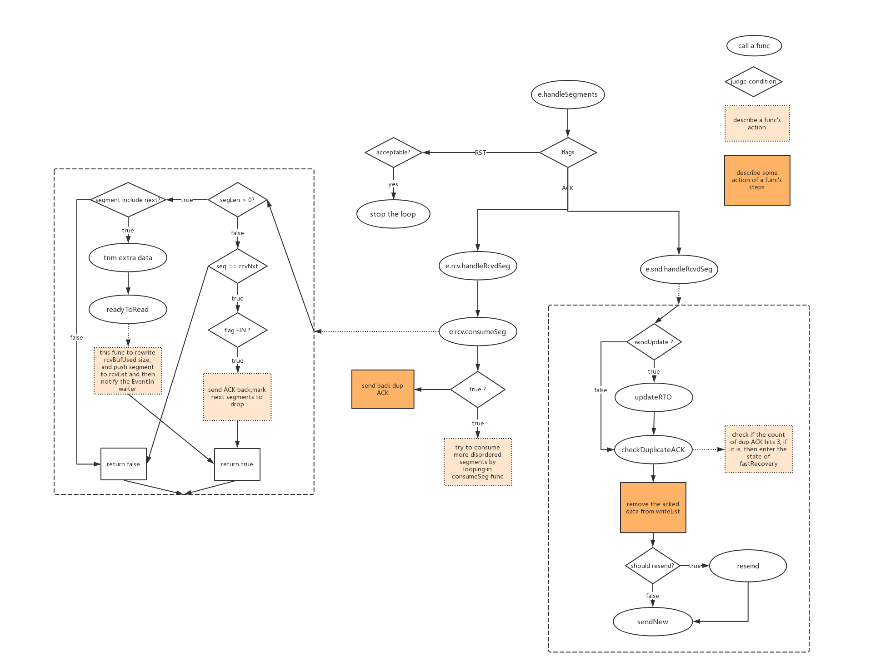

## Netstack TCP(IV) 收发数据(下)

> 接上文，现在看一下 receiver 是如何接收数据的。

endpoint 上关于接收数据的字段如下：

```go
	rcvListMu  sync.Mutex
	rcvList    segmentList
	rcvClosed  bool
	rcvBufSize int
	rcvBufUsed int
	segmentQueue segmentQueue
```

存储结构有 segmentList 和 segmentQueue 。而在 receiver 上主要是 `pendingRcvdSegments segmentHeap`，一个堆。记住这三个结构，接下来围绕它们展开。这三个结构之间的关系最后总结。

前面讨论发送数据时是从应用层和传输层之间接口 Write 开始的，而接收数据我们从网络层到传输层的接口 HandlePacket 开始讨论，这样符合数据流方向。

```go
func (e *endpoint) HandlePacket(r *stack.Route, id stack.TransportEndpointID, vv *buffer.VectorisedView) {
	s := newSegment(r, id, vv)
	if !s.parse() {
		atomic.AddUint64(&e.stack.MutableStats().MalformedRcvdPackets, 1)
		s.decRef()
		return
	}

	// 把收到的包直接放到 endpoint 的 segmentQueue 里面，但是顺序是没有保障的。
	if e.segmentQueue.enqueue(s) {
		e.newSegmentWaker.Assert() 
	} else {
		// The queue is full, so we drop the segment.
		atomic.AddUint64(&e.stack.MutableStats().DroppedPackets, 1)
		s.decRef()
	}
}
```

在上一篇的 mainLoop 函数里，已经注册过 newSegmentWaker 和它的回调 handleSegments 函数，然后在循环中等待 waker。这里收到包，添加到队列里，然后通知 mainLoop 有新的包到来，触发 handleSegments ，先来看下大概执行过程：

```go
func (e *endpoint) handleSegments() bool {
	checkRequeue := true
	for i := 0; i < maxSegmentsPerWake; i++ {
        // maxSegmentsPerWake 是一个常量，值为 100，其实是随意设置的一个值，因为每次 newSegmentWaker 被触发时可能有很多包要被处理
		s := e.segmentQueue.dequeue() // 从队列拿到无序的数据包
		if s == nil {
			checkRequeue = false
			break
		}

		...

		if s.flagIsSet(flagRst) {
			if e.rcv.acceptable(s.sequenceNumber, 0) {
				...
				return false
			}
		} else if s.flagIsSet(flagAck) {
			...
			e.rcv.handleRcvdSegment(s) // 
			e.snd.handleRcvdSegment(s) // 分别调用 sender 和 receiver 处理同样的包
		}
		s.decRef()
	}

	if checkRequeue && !e.segmentQueue.empty() {
		e.newSegmentWaker.Assert() // 当 100 次过后还有未处理的包，再次触发 newSegmentWaker
	}

	// Send an ACK for all processed packets if needed.
	if e.rcv.rcvNxt != e.snd.maxSentAck {
		e.snd.sendAck()
	}

	return true
}
```

这里主要分为两个分支，分别交给 endpoint 的 receiver 和 sender 来处理。这里需要注意，每个 endpoint 只有一个 sender 和 一个 receiver，所以 sender 除了正常向外发送包，还需要在收到包时负责发送 ACK 或 SACK 。所以收到一个数据包时，receiver 和 sender 都要处理，这个过程大致如图



两个主要过程如下：

#### rcv.handleRcvdSegment

这个函数主要作用是接收乱序的包，放到 receiver 的 pendingRcvdSegments 这个最小堆里，在合适的时候把连续、完整的几个包放到 endpoint 的 rcvList，应用层读取连接的数据就是通过这个 rcvList。

```go
func (r *receiver) handleRcvdSegment(s *segment) {
   
   segLen := seqnum.Size(s.data.Size())
   segSeq := s.sequenceNumber

   if !r.acceptable(segSeq, segLen) {// 判断包的合法性，是否在接收窗口范围
      r.ep.snd.sendAck() // 发送冗余 ACK
      return
   }

   if !r.consumeSegment(s, segSeq, segLen) {// consumeSegment 判断当前收到的包是否可以造成接收窗口右移，如果是，说明 pendingRcvdSegments 这个堆里的数据包是连续的，然后把连续的包存到 endpoint 的 rcvList 队列里；如果不是，说明收到失序报文段，返回 FALSE
      if segLen > 0 || s.flagIsSet(flagFin) {
         // We only store the segment if it's within our buffer
         // size limit.
         if r.pendingBufUsed < r.pendingBufSize {
            r.pendingBufUsed += s.logicalLen()
            s.incRef()
            heap.Push(&r.pendingRcvdSegments, s)
         }

         UpdateSACKBlocks(&r.ep.sack, segSeq, segSeq.Add(segLen), r.rcvNxt)

         // Immediately send an ack so that the peer knows it may
         // have to retransmit.
         r.ep.snd.sendAck()
      }
      return
   }

   // 继续检查 pendingRcvdSegments 里是否有更多连续的数据，如果有，取出来放到 rcvList 里
   for !r.closed && r.pendingRcvdSegments.Len() > 0 {
      s := r.pendingRcvdSegments[0]
      segLen := seqnum.Size(s.data.Size())
      segSeq := s.sequenceNumber

      // Skip segment altogether if it has already been acknowledged.
      if !segSeq.Add(segLen-1).LessThan(r.rcvNxt) &&
         !r.consumeSegment(s, segSeq, segLen) {
         break
      }

      heap.Pop(&r.pendingRcvdSegments)
      r.pendingBufUsed -= s.logicalLen()
      s.decRef()
   }
}
```

#### snd.handleRcvdSegment

这里主要是在收到新的数据包后返回 ACK 或 SACK，并且更新当前状态，比如在外数据值、接收窗口、RTT、RTO...

```go
func (s *sender) handleRcvdSegment(seg *segment) {
	// Check if we can extract an RTT measurement from this ack.
	if s.rttMeasureSeqNum.LessThan(seg.ackNumber) {
		s.updateRTO(time.Now().Sub(s.rttMeasureTime))
		s.rttMeasureSeqNum = s.sndNxt
	}

	// Update Timestamp if required. See RFC7323, section-4.3.
	s.ep.updateRecentTimestamp(seg.parsedOptions.TSVal, s.maxSentAck, seg.sequenceNumber)

	// Count the duplicates and do the fast retransmit if needed.
	rtx := s.checkDuplicateAck(seg)

	// Stash away the current window size.
	s.sndWnd = seg.window

	// Ignore ack if it doesn't acknowledge any new data.
	ack := seg.ackNumber
	if (ack - 1).InRange(s.sndUna, s.sndNxt) {
		// When an ack is received we must reset the timer. We stop it
		// here and it will be restarted later if needed.
		s.resendTimer.disable()

		// Remove all acknowledged data from the write list.
		acked := s.sndUna.Size(ack)
		s.sndUna = ack

		ackLeft := acked
		originalOutstanding := s.outstanding
		for ackLeft > 0 {
			// We use logicalLen here because we can have FIN
			// segments (which are always at the end of list) that
			// have no data, but do consume a sequence number.
			seg := s.writeList.Front()
			datalen := seg.logicalLen()

			if datalen > ackLeft {
				seg.data.TrimFront(int(ackLeft))
				break
			}

			if s.writeNext == seg {
				s.writeNext = seg.Next()
			}
			s.writeList.Remove(seg)
			s.outstanding--
			seg.decRef()
			ackLeft -= datalen
		}

		// Update the send buffer usage and notify potential waiters.
		s.ep.updateSndBufferUsage(int(acked))

		// If we are not in fast recovery then update the congestion
		// window based on the number of acknowledged packets.
		if !s.fr.active {
			s.updateCwnd(originalOutstanding - s.outstanding)
		}

		// It is possible for s.outstanding to drop below zero if we get
		// a retransmit timeout, reset outstanding to zero but later
		// get an ack that cover previously sent data.
		if s.outstanding < 0 {
			s.outstanding = 0
		}
	}

	// Now that we've popped all acknowledged data from the retransmit
	// queue, retransmit if needed.
	if rtx {
		s.resendSegment()
	}

	// Send more data now that some of the pending data has been ack'd, or
	// that the window opened up, or the congestion window was inflated due
	// to a duplicate ack during fast recovery. This will also re-enable
	// the retransmit timer if needed.
	s.sendData()
}
```

#### 三个存储结构

开始提到的三个字段，关系如下，结合图，再回过头看整个处理过程，其实很清楚了，每个结构的分工还是很明确的。


