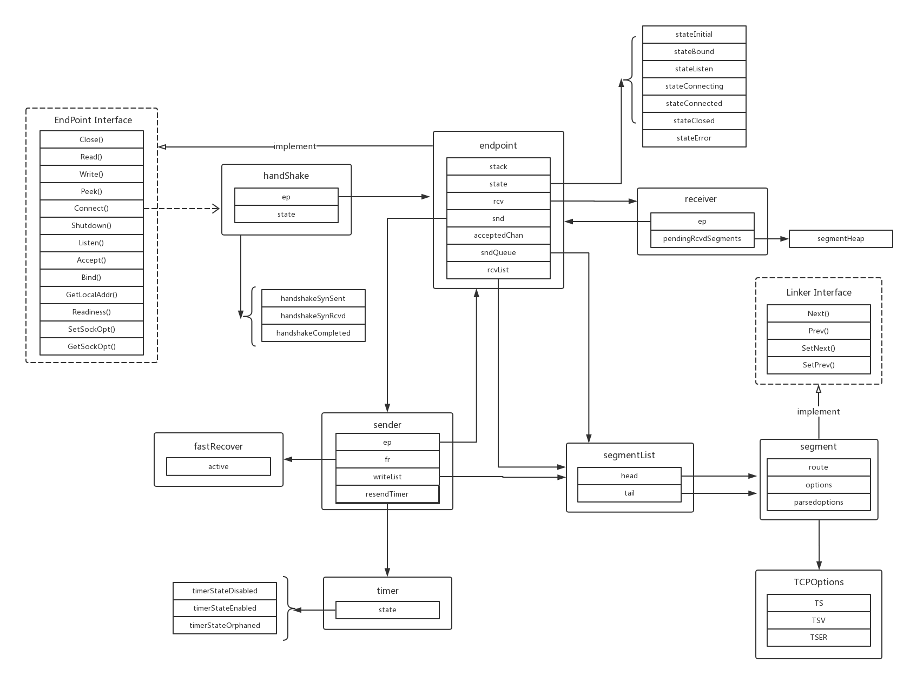
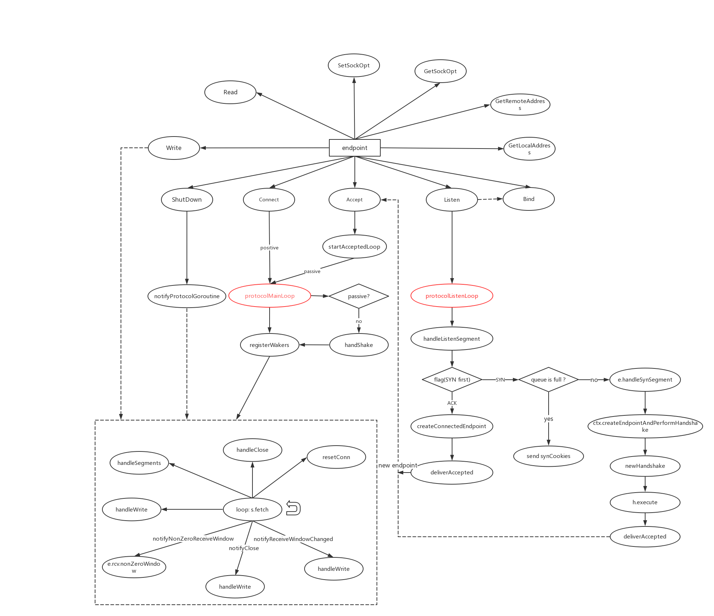

## Netsatck TCP(I) 概览

#### 主要结构及其关联



TCP 实现里暴露出来的最主要的接口是 EndPoint，它对应 Socket 的概念，提供了应用层常用的 Listen、Accept、Bind、Connect 等等方法。endpoint 结构体实现了 EndPoint 接口，它是一个 TCP 连接一端的实体，主要包含 sender、receiver、handshake 这三个结构体，这三个结构体也实现了一个 TCP 端所需的主要功能。

还有另一个非常重要的自段：stack，它是整个网络协议栈的抽象，这里负责把网络层和传输层连接起来。

#### 调用过程



整个运行的核心在图中标红的两个循环里，其余的部分代码较少，实现也简单。endpoint 的 Listen 函数在 protocolListenLoop 中监听新的连接请求，主要处理三步握手的 SYN 报文和 ACK 报文，负责连接的被动建立。可以看到，这里会有一个**处于 SYN_RCVD 状态的半连接的队列**。建立好的连接通过一个长度为 **backlog** 的channel，把新建连接对应的 endpoint 放到 backlog 队列，然后执行 Accept 的逻辑。

需要注意的是，负责 Listen 的 endpoint 管理的是所有未完成的连接，而连接建立以后会获得一个新的 endpoint，专门负责那一个连接。

Accept 和 Connect 函数处理的都是已经建立好的连接，不同之处是 Connect 是主动发起连接，而 Accept 是被动的。

##### sleep 包

进入 protocolMainLoop 之前，先注册了一些回调函数，然后进入循环，当对应事件发生时，通过 sleeper-waker 机制，调用提前注册的函数。sleep 实现了一个边缘触发的 epoll

````
It is similar to edge-triggered epoll waits, where the user registers each object of interest once, and then can repeatedly wait on all of them.
````

用法如下：

```go
func protocolMainLoop() *tcpip.Error{
    ...
    // One time set-up.
    s := sleep.Sleeper{}

    funcs := []struct {
            w *sleep.Waker
            f func() bool
        }{
            {
                w: &e.sndWaker,
                f: e.handleWrite,
            },
            {
                w: &e.sndCloseWaker,
                f: e.handleClose,
            },
            {
                w: &e.newSegmentWaker,
                f: e.handleSegments,
            },
    }

    for i := range funcs {
        s.AddWaker(funcs[i].w, i)
    }
    // Called repeatedly.
    for {
        v, _ := s.Fetch(true)
        if !funcs[v].f() {
            return nil
        }
    }   
}
```

进入循环以后，就是 endpoint 的 sender 和 receiver 的工作了，TCP 实现的总体结构就是这样了。接下来需要仔细看看连接如何建立，如何三次握手，以及连接建立后如何控制流量与拥塞控制。

