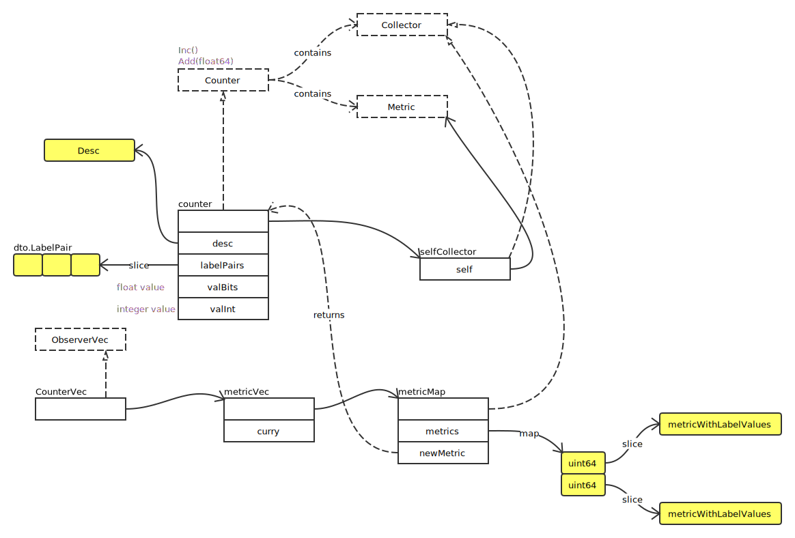

# Counter

## Counter Overview



### Add

```go
func (c *counter) Add(v float64) {
	if v < 0 {
		panic(errors.New("counter cannot decrease in value"))
	}

	// v 为整数时
	ival := uint64(v)
	if float64(ival) == v {
		atomic.AddUint64(&c.valInt, ival)
		return
	}

	// v 为 float
	for {
		oldBits := atomic.LoadUint64(&c.valBits)
		newBits := math.Float64bits(math.Float64frombits(oldBits) + v)
		if atomic.CompareAndSwapUint64(&c.valBits, oldBits, newBits) {
			return
		}
	}
}
```

### metricMap

- getMetricWithHashAndLabelValues

```go
func (m *metricMap) getMetricWithHashAndLabelValues(
	h uint64, lvs []string, curry []curriedLabelValue,
) (Metric, bool) {
	metrics, ok := m.metrics[h]	// 根据 hash，获取 slice
	if ok {
		// 遍历 slice，查找 metric
		if i := findMetricWithLabelValues(metrics, lvs, curry); i < len(metrics) {
			return metrics[i].metric, true
		}
	}
	return nil, false
}
```
