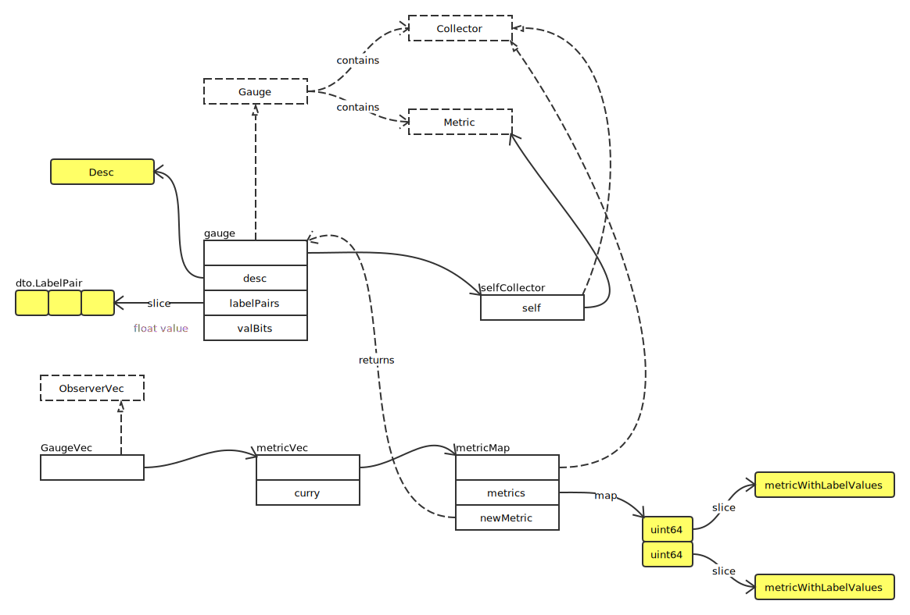

# Gauge

## Overview



Gauge 接口定义如下：

```go
type Gauge interface {
	Metric
	Collector

	// Set sets the Gauge to an arbitrary value.
	Set(float64)
	// Inc increments the Gauge by 1. Use Add to increment it by arbitrary
	// values.
	Inc()
	// Dec decrements the Gauge by 1. Use Sub to decrement it by arbitrary
	// values.
	Dec()
	// Add adds the given value to the Gauge. (The value can be negative,
	// resulting in a decrease of the Gauge.)
	Add(float64)
	// Sub subtracts the given value from the Gauge. (The value can be
	// negative, resulting in an increase of the Gauge.)
	Sub(float64)

	// SetToCurrentTime sets the Gauge to the current Unix time in seconds.
	SetToCurrentTime()
}
```
