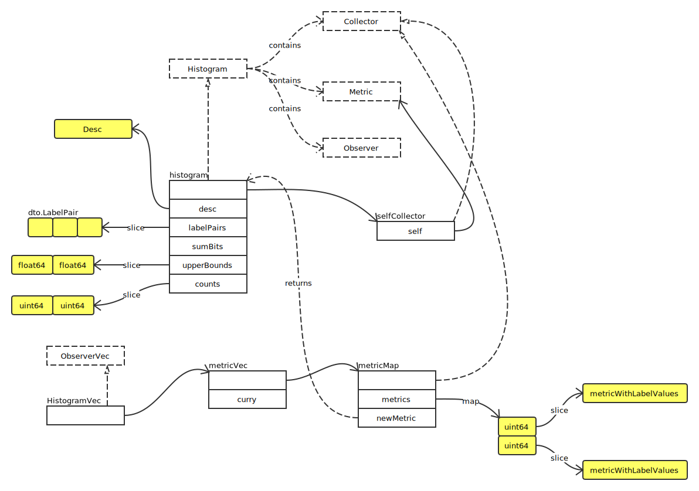

# Histogram

## Overview



### histogram

- newHistogram

```go
func newHistogram(desc *Desc, opts HistogramOpts, labelValues ...string) Histogram {
	// 参数检查
	if len(desc.variableLabels) != len(labelValues) {
		panic(errInconsistentCardinality)
	}

	for _, n := range desc.variableLabels {
		if n == bucketLabel {
			panic(errBucketLabelNotAllowed)
		}
	}
	for _, lp := range desc.constLabelPairs {
		if lp.GetName() == bucketLabel {
			panic(errBucketLabelNotAllowed)
		}
	}

	// 设置默认参数
	if len(opts.Buckets) == 0 {
		opts.Buckets = DefBuckets
	}

	h := &histogram{
		desc:        desc,
		upperBounds: opts.Buckets,
		labelPairs:  makeLabelPairs(desc, labelValues),
	}

	// upperBound 检查
	for i, upperBound := range h.upperBounds {
		if i < len(h.upperBounds)-1 {
			if upperBound >= h.upperBounds[i+1] {
				panic(fmt.Errorf(
					"histogram buckets must be in increasing order: %f >= %f",
					upperBound, h.upperBounds[i+1],
				))
			}
		} else {
			if math.IsInf(upperBound, +1) {
				h.upperBounds = h.upperBounds[:i]
			}
		}
	}

	h.counts = make([]uint64, len(h.upperBounds))

	h.init(h) // Init self-collection.
	return h
}
```
