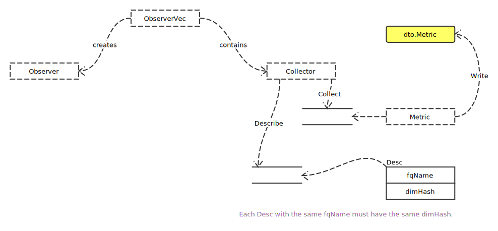

# Collector

## Overview



### 关键定义

- Collector

```go
type Collector interface {
	Describe(chan<- *Desc)

	Collect(chan<- Metric)
}
```

- Metric

```go
type Metric interface {
	Desc() *Desc

	Write(*dto.Metric) error
}
```

- BuildFQName

```go
func BuildFQName(namespace, subsystem, name string) string {
	if name == "" {
		return ""
	}
	switch {
	case namespace != "" && subsystem != "":
		return strings.Join([]string{namespace, subsystem, name}, "_")
	case namespace != "":
		return strings.Join([]string{namespace, name}, "_")
	case subsystem != "":
		return strings.Join([]string{subsystem, name}, "_")
	}
	return name
}
```
