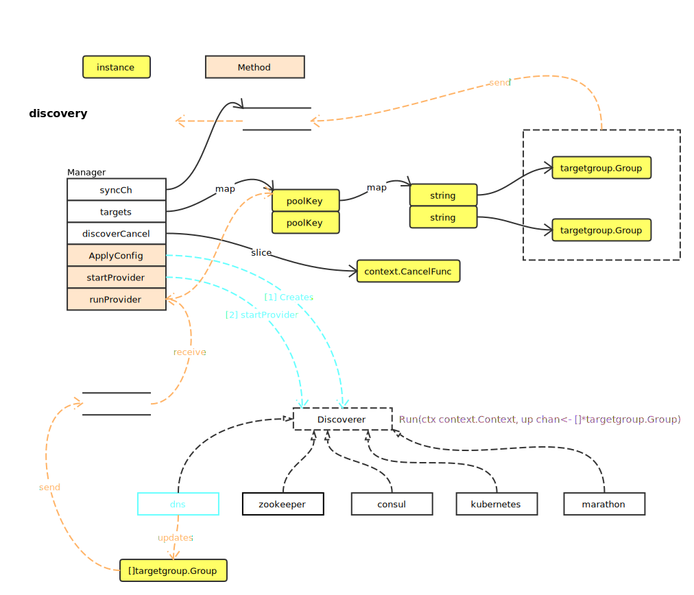

# Discovery

## Overview



### startProvider

```go
func (m *Manager) startProvider(ctx context.Context, poolKey poolKey, worker Discoverer) {
	ctx, cancel := context.WithCancel(ctx)	// 创建 cancel context
	updates := make(chan []*targetgroup.Group)	// 创建 Group channel

	m.discoverCancel = append(m.discoverCancel, cancel) // 追加 cancel 方法

	go worker.Run(ctx, updates)		// Provider 更新方法，update <- targetgroup.Group
	go m.runProvider(ctx, poolKey, updates) // Provider 更新，<-update，并更新至 target
	go m.runUpdater(ctx) // syncCh <-target
}
```

### runProvider

```go
func (m *Manager) runProvider(ctx context.Context, poolKey poolKey, updates chan []*targetgroup.Group) {
	for {
		select {
		case <-ctx.Done():	// ctx 的 cancel 方法被执行
			return
		case tgs, ok := <-updates:
			if !ok {
				return
			}
			m.updateGroup(poolKey, tgs)	// 更新 targets
			m.recentlyUpdatedMtx.Lock()	// 标记更新
			m.recentlyUpdated = true
			m.recentlyUpdatedMtx.Unlock()
		}
	}
}
```

### runUpdater

```go
func (m *Manager) runUpdater(ctx context.Context) {
	ticker := time.NewTicker(5 * time.Second)
	defer ticker.Stop()

	for {
		select {
		case <-ctx.Done():
			return
		case <-ticker.C:	// 定时器触发
			m.recentlyUpdatedMtx.Lock()
			if m.recentlyUpdated {	// 如果有更新，发送，并清除更新标记
				m.syncCh <- m.allGroups()
				m.recentlyUpdated = false
			}
			m.recentlyUpdatedMtx.Unlock()
		}
	}
}
```
