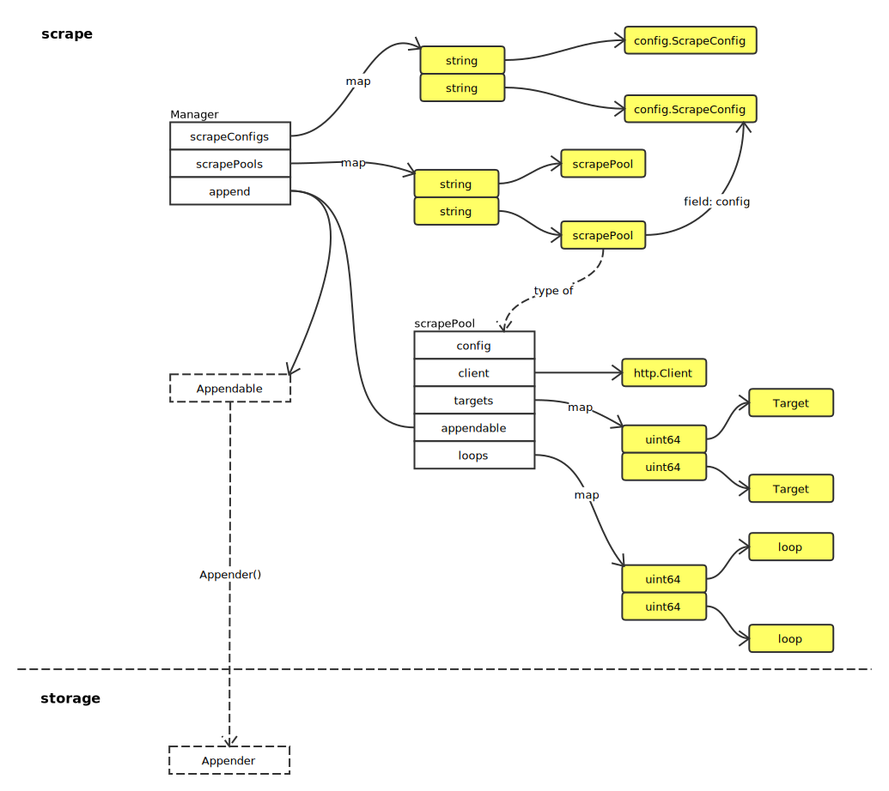
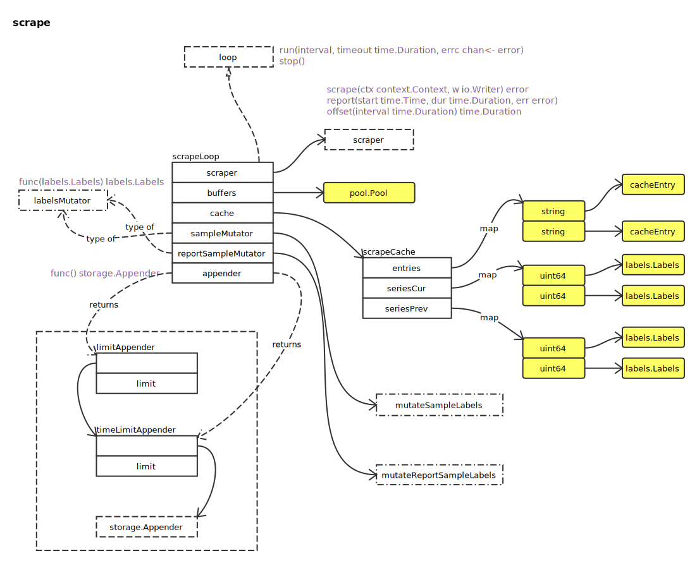
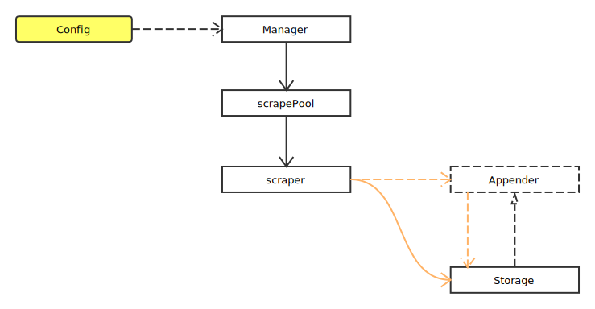

# Manager

## Overview



Appender 请参照 [Storage](storage.md).

工作流如下图：


## Scrape Pool



全局流程如下：



### sync

启动 loop：

```go
for _, t := range targets {
	t := t
	hash := t.hash()
	uniqueTargets[hash] = struct{}{}

	if _, ok := sp.targets[hash]; !ok {
		s := &targetScraper{Target: t, client: sp.client, timeout: timeout}
		l := sp.newLoop(t, s, limit, honor, mrc)

		sp.targets[hash] = t
		sp.loops[hash] = l

		go l.run(interval, timeout, nil)
	} else {
		sp.targets[hash].SetDiscoveredLabels(t.DiscoveredLabels())
	}
}
```

移除旧 loop：

```go
var wg sync.WaitGroup

for hash := range sp.targets {
	if _, ok := uniqueTargets[hash]; !ok {
		wg.Add(1)
		go func(l loop) {
			l.stop()
			wg.Done()
		}(sp.loops[hash])

		delete(sp.loops, hash)
		delete(sp.targets, hash)
	}
}

wg.Wait()
```

### reload

方法中使用的变量定义：

```
var (
	wg       sync.WaitGroup
	interval = time.Duration(sp.config.ScrapeInterval)	// 抓取间隔
	timeout  = time.Duration(sp.config.ScrapeTimeout)		// 抓取超时
	limit    = int(sp.config.SampleLimit)								// 采样限制
	honor    = sp.config.HonorLabels
	mrc      = sp.config.MetricRelabelConfigs
)
```

停止旧 loop，并开启新 loop：

```go
for fp, oldLoop := range sp.loops {
	var (
		t       = sp.targets[fp]
		s       = &targetScraper{Target: t, client: sp.client, timeout: timeout}
		newLoop = sp.newLoop(t, s, limit, honor, mrc)
	)
	wg.Add(1)

	go func(oldLoop, newLoop loop) {
		oldLoop.stop()
		wg.Done()

		go newLoop.run(interval, timeout, nil)
	}(oldLoop, newLoop)

	sp.loops[fp] = newLoop
}

wg.Wait()
```

### run

```go
func (sl *scrapeLoop) run(interval, timeout time.Duration, errc chan<- error) {
	// 等待首次等待超时
	select {
	case <-time.After(sl.scraper.offset(interval)):
	case <-sl.scrapeCtx.Done():
		close(sl.stopped)
		return
	}

	var last time.Time

	ticker := time.NewTicker(interval)
	defer ticker.Stop()

	// 创建缓存
	buf := bytes.NewBuffer(make([]byte, 0, 16000))

mainLoop:
	for {
		buf.Reset() // 重置缓存
		select {
		case <-sl.ctx.Done():
			close(sl.stopped)
			return
		case <-sl.scrapeCtx.Done():
			break mainLoop
		default:
		}

		var (
			start             = time.Now()
			scrapeCtx, cancel = context.WithTimeout(sl.ctx, timeout)
		)

		// ...

		b := sl.buffers.Get(sl.lastScrapeSize).([]byte)
		buf := bytes.NewBuffer(b)

		// 抓取数据
		scrapeErr := sl.scraper.scrape(scrapeCtx, buf)
		cancel()

		if scrapeErr == nil {
			b = buf.Bytes()
			if len(b) > 0 {
				sl.lastScrapeSize = len(b)
			}
		} else {
			level.Debug(sl.l).Log("msg", "Scrape failed", "err", scrapeErr.Error())
			if errc != nil {
				errc <- scrapeErr
			}
		}

		// 记录数据
		total, added, appErr := sl.append(b, start)
		if appErr != nil {
			level.Warn(sl.l).Log("msg", "append failed", "err", appErr)
			if _, _, err := sl.append([]byte{}, start); err != nil {
				level.Warn(sl.l).Log("msg", "append failed", "err", err)
			}
		}

		sl.buffers.Put(b)

		if scrapeErr == nil {
			scrapeErr = appErr
		}

		sl.report(start, time.Since(start), total, added, scrapeErr)
		last = start

		select {
		case <-sl.ctx.Done():
			close(sl.stopped)
			return
		case <-sl.scrapeCtx.Done():
			break mainLoop
		case <-ticker.C:
		}
	}

	close(sl.stopped)

	sl.endOfRunStaleness(last, ticker, interval)
}
```

### targetScraper.scrape

```go
func (s *targetScraper) scrape(ctx context.Context, w io.Writer) error {
	// 创建请求
	if s.req == nil {
		req, err := http.NewRequest("GET", s.URL().String(), nil)
		if err != nil {
			return err
		}
		req.Header.Add("Accept", acceptHeader)
		req.Header.Add("Accept-Encoding", "gzip")
		req.Header.Set("User-Agent", userAgentHeader)
		req.Header.Set("X-Prometheus-Scrape-Timeout-Seconds", fmt.Sprintf("%f", s.timeout.Seconds()))

		s.req = req
	}

	// 执行 HTTP 请求操作
	resp, err := ctxhttp.Do(ctx, s.client, s.req)
	if err != nil {
		return err
	}
	defer resp.Body.Close()

	if resp.StatusCode != http.StatusOK {
		return fmt.Errorf("server returned HTTP status %s", resp.Status)
	}

	if resp.Header.Get("Content-Encoding") != "gzip" {
		_, err = io.Copy(w, resp.Body)
		return err
	}

	if s.gzipr == nil {
		s.buf = bufio.NewReader(resp.Body)
		s.gzipr, err = gzip.NewReader(s.buf)
		if err != nil {
			return err
		}
	} else {
		s.buf.Reset(resp.Body)
		s.gzipr.Reset(s.buf)
	}

	_, err = io.Copy(w, s.gzipr)
	s.gzipr.Close()
	return err
}
```
