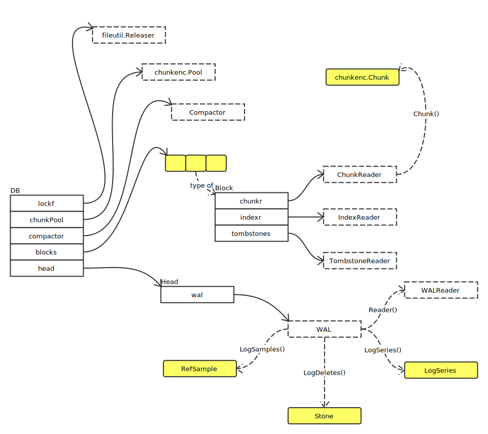

# TSDB

## Overview

## References

- [Writing a Time Series Database from Scratch](https://fabxc.org/tsdb/)
- [Write Amplification](https://en.wikipedia.org/wiki/Write_amplification)
- [Coding for SSDs](http://codecapsule.com/2014/02/12/coding-for-ssds-part-1-introduction-and-table-of-contents/)
- [Inverted Index](https://en.wikipedia.org/wiki/Inverted_index)
