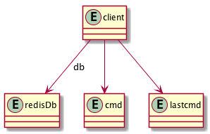

# Client

Client 代表一个到 Redis Server 的连接。结构如下图：



## Create

在 [Connection Management](connection.md) 中我们知道，每一个到 Redis Server 的连接，会被抽象为一个 client 结构，用于后续的处理，在此处，我们来看创建 client 的具体过程。

```C
client *createClient(int fd) {
    // 分配内存
    client *c = zmalloc(sizeof(client));

    // fd 为有效的 socket 时
    if (fd != -1) {
        // 设置 socket 选项
        anetNonBlock(NULL,fd);
        anetEnableTcpNoDelay(NULL,fd);
        if (server.tcpkeepalive)
            anetKeepAlive(NULL,fd,server.tcpkeepalive);
        // 创建读取 socket 的事件
        if (aeCreateFileEvent(server.el,fd,AE_READABLE,
            readQueryFromClient, c) == AE_ERR)
        {
            close(fd);
            zfree(c);
            return NULL;
        }
    }

    // 默认选择 0 号数据库
    selectDb(c,0);
    uint64_t client_id;
    // 生成 client id
    atomicGetIncr(server.next_client_id,client_id,1);
    c->id = client_id;
    c->fd = fd;
    c->name = NULL;
    c->bufpos = 0;
    c->querybuf = sdsempty();
    c->pending_querybuf = sdsempty();
    c->querybuf_peak = 0;
    c->reqtype = 0;
    c->argc = 0;
    c->argv = NULL;
    c->cmd = c->lastcmd = NULL;
    c->multibulklen = 0;
    c->bulklen = -1;
    c->sentlen = 0;
    c->flags = 0;
    c->ctime = c->lastinteraction = server.unixtime;
    c->authenticated = 0;
    c->replstate = REPL_STATE_NONE;
    c->repl_put_online_on_ack = 0;
    c->reploff = 0;
    c->read_reploff = 0;
    c->repl_ack_off = 0;
    c->repl_ack_time = 0;
    c->slave_listening_port = 0;
    c->slave_ip[0] = '\0';
    c->slave_capa = SLAVE_CAPA_NONE;
    c->reply = listCreate();
    c->reply_bytes = 0;
    c->obuf_soft_limit_reached_time = 0;
    listSetFreeMethod(c->reply,freeClientReplyValue);
    listSetDupMethod(c->reply,dupClientReplyValue);
    c->btype = BLOCKED_NONE;
    c->bpop.timeout = 0;
    c->bpop.keys = dictCreate(&objectKeyHeapPointerValueDictType,NULL);
    c->bpop.target = NULL;
    c->bpop.xread_group = NULL;
    c->bpop.xread_consumer = NULL;
    c->bpop.numreplicas = 0;
    c->bpop.reploffset = 0;
    c->woff = 0;
    c->watched_keys = listCreate();
    c->pubsub_channels = dictCreate(&objectKeyPointerValueDictType,NULL);
    c->pubsub_patterns = listCreate();
    c->peerid = NULL;
    c->client_list_node = NULL;
    listSetFreeMethod(c->pubsub_patterns,decrRefCountVoid);
    listSetMatchMethod(c->pubsub_patterns,listMatchObjects);
    if (fd != -1) linkClient(c);
    initClientMultiState(c);
    return c;
}
```

## 辅助方法

- atomicGetIncr

```C
#define atomicGetIncr(var,oldvalue_var,count) do { \
    pthread_mutex_lock(&var ## _mutex); \
    oldvalue_var = var; \
    var += (count); \
    pthread_mutex_unlock(&var ## _mutex); \
} while(0)
```

# References
