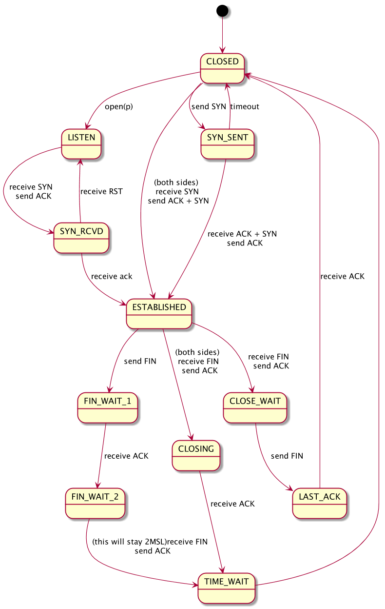

## TCP 连接管理

### TCP 连接的建立和终止

一个TCP连接由一个四元组构成：源IP、源端口、目的IP、目的端口。一个连接通常分为三个阶段：启动、数据传输（也称“连接已建立”）、关闭。以下是建立连接是三步握手和关闭时四步挥手的过程。

###### 握手：

* 客户端先发一个SYN（synchronous）报文段，并指明客户端的初始序列号（Initial Sequence Number），图中值为ISN(c)。（注意这里可能出现超时或报文丢失的情况）
* 服务端收到后返回一个ACK（acknowledgement）,并指明ACK确认号的值为ISN(c) + 1来表明已经收到Seq值为ISN(c)的SYN报文段。服务端在同一个报文段还发送了一个SYN并指明自己的初始序列号ISN(s).
* 客户端收到ACK+SYN，发送ACK向服务端确认收到来自服务端的SYN，并指明Seq=ISN(s) + 1.

> 重要的细节：对于client来说，第三步似乎是多余的，但是对服务端来说，是一个防止SYN泛洪攻击的手段：服务端在建立连接后需要为该连接分配变量和内存，如果没有第三步，恶意客户端通过不停伪造IP和端口发起SYN（客户端没有太大内存消耗），导致服务端不停分配变量，最后内存消耗完崩溃。所以第三步可以让服务端辨别恶意客户端。

######挥手：

* 关闭发起者（TCP连接是双向的，任何一方都可以主动断开连接）向另一方发送一个FIN（final）段表示要开始关闭连接。此时的ACK值是确认最近一次发来的数据。
* 被动方接收FIN，发回一个ACK。
* 被动方向发起方发送一个FIN，同时再次确认之前的FIN，ACK和上次相同。
* 发起方收到FIN，发回ACK

挥手断开这里同样有很多重要细节：

* 前两步完成后，发起方到被动方的连接已经关闭，但TCP是双向的，此时由于被动方还没有发送FIN，所以被动方到发起方的连接还打开着，TCP连接目前处于**半关闭**状态，此时被动方仍然可以向发起方发送数据，发起方也可以正常接受数据。但是如果被动方既不再发送数据，也不发送最后的FIN，就会出现问题。所以发起方收到FIN的ACK时，设置了一个定时器，在规定时间内没有数据发过来，就自动断开连接。
* 另一个问题是，如果发起方发送了最后一个ACK用于确认被动方的FIN之后立刻关闭，但是此ACK超时未达或者丢失了，就会造成问题—被动方的FIN得不到确认。这时被动方会在超时后重新发送FIN，直到收到ACK为止。所以发起方发送完最后一个ACK后不能马上离开，而要等一段时间，用于确保对方收到ACK，这段时间叫**静默时间**，并且这个时间是强制的。静默时间大小一般为2*MSL（Max Segment Lifetime,报文段在被丢弃前允许的最长存活时间）所以它还有另一个重要的作用，就是让属于这个已经关闭连接的报文段过期，以免相同的客户端和服务端再次建立连接时受到之前已经关闭连接的影响。

### TCP FSM

以下是TCP三步握手和四步挥手的有限状态机。应该掌握。

### TCP 选项

TCP有若干选项，每个选项的头一个字节表示“种类”，指明了选项的类型。

##### MSS 最大段大小选项

Max segment size。当一条TCP连接建立时，通信双方都要在SYN报文段的MSS选项说明自己允许的最大段大小。注意最大段大小不是双方协商的结果，而是表明自己不愿意接收任何大于该尺寸的报文段。

##### SACK 选择确认段

Select ACK。在滑动窗口中，TCP采用累计ACK确认，不能正确的确认已经收到的但是是失序的报文段，接收方的数据队列就会出现空洞。SACK能够使发送方了解到空洞出现并进行更有效的重传工作。通过接收SYN报文段中的“允许确认选项”，TCP通信方会知道自身拥有了发布SACK的能力。SACK选项由n个SACK块构成，每个SACK块是一对32位的序列号（a，b），表明已经接受a到b的数据。

##### WSOPT 

Window scale option。窗口本来大小只有16位，若wsopt值为s，则窗口大小为16*2^s,最大值为1G

#####TSOPT

timestamp option。发送方发出的报文段带有发出时的时间戳，接收方收到后将该值写入ACK报文段发回给发送方。发送方据此可以精确地计算RTT（round trip time）。同时该选项还可用于防回绕：假如存在一个过期了的报文段恰好和下一次要接受的报文段序列号相同，这时候可以通过时间戳来判断，如果该报文时间戳小于最近一次收到的报文段，说明改报文段是过期了的。

### TCP服务器选项

TCP服务端会为每一个客户端分配一个新的进程或线程，这样负责监听的服务器就能始终准备着处理下一个到来的连接请求。但是如果服务器正在创建一个新进程（线程）时有更多的连接到来，应该如何处理？

在被用于应用程序之前，新的连接可能会有两种状态：1、SYN_RCVD 状态 		2、	ESTABLISHED 状态 但未被应用程序所接受。

TCP为这两种状态的连接准备了两个队列，可以通过限制它们的大小来管理连接。

* 当一个SYN报文段到达，将会检查SYN_RCVD队列是否已满（Linux中默认为1000），未满则加入队列，否则拒绝连接。
* ESTABLISHED状态的队列通常被称为**未完成连接**（backlog，虽然叫未完成，但是三次握手已经完成，只是还没被应用程序处理），backlog队列最大长度默认为128
* 如果backlog队列未满，则会根据SYN_RCVD队列应答SYN并完成握手，握手完成后，加入backlog队列，由负责监听的服务器依次分配线程。注意当客户端发送ACK后，会认为服务端已经做好接收数据的准备来，所以会立即发送数据，但此时连接可能还处于backlog队列，还未被应用程序处理，所以TCP还有一个专门的数据队列。
* 如果backlog已满，则会延迟应答SYN。正常的TCP机制里，客户端会等待SYN超时，但在Linux客户端中，既不超时也不重置。

