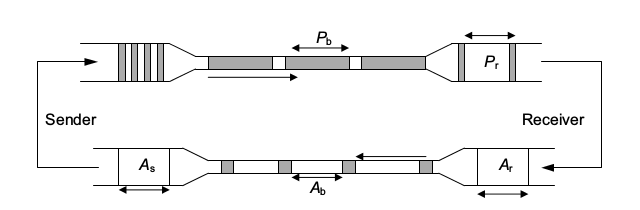
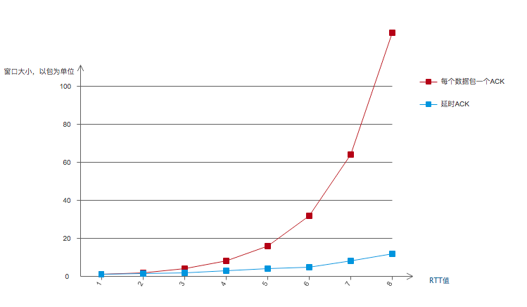
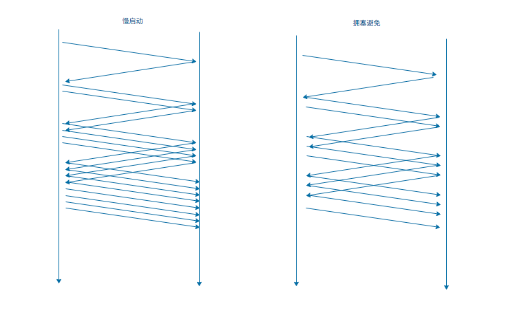
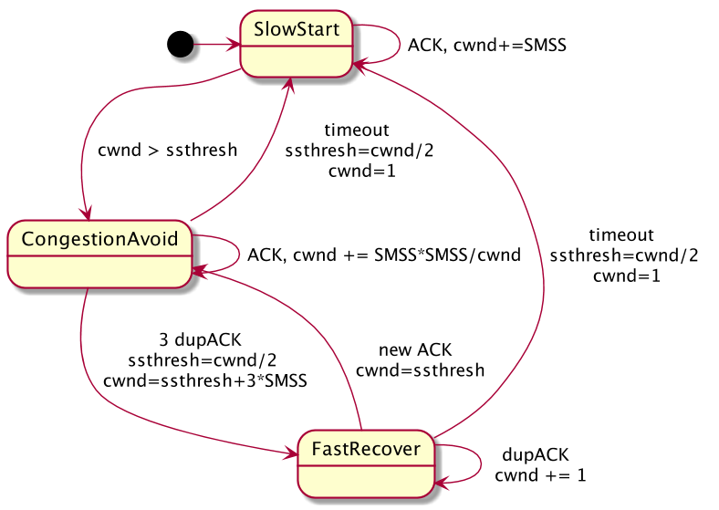

## TCP 拥塞控制

> 在上一篇文章中，讲了通过滑动窗口实现发送方和接收方之间一对一的流量控制。这次我们来看一下 TCP 协议是如何对网络进行宏观调控，也就是 TCP 拥塞控制。

### 网络拥塞
网络中的路由器因无法处理高速到达的流量而被迫丢弃数据信息的现象称为拥塞。这里可能是因为路由器缓存较小或者处理不及时，虽然和流量控制时接收方的情况相似，但是这里有本质区别。因为后者是一对一的，几乎只影响一条连接；后者则影响多个连接。

当网络中大量的发送方和接收方被要求承担超负荷的通信任务时，可以采用**降低发送方发送速率**或者**丢弃部分数据**（也可二者结合）来降低拥塞。

#### TCP 拥塞检测

通常来说，接收方没有一个精确的方法去知道中间路由器的状态。目前基本的方法有：

* 依据丢包情况，如果有丢包发生，可以认为是网络拥堵引发的丢包，但是丢包本身就是不能精确判断的。并且有时候我们不能判断丢包是因为路由器拥塞造成的还是由传输错误造成的（在无线网络中，传输和接收错误是丢包主要原因）
* 通过时延测量，当感知到 RTT 明显增大时，可以认为是网络拥堵。但是 RTT 测量本身也没有精确的方法。
* 显式收到一个丢包的消息，也称**显式拥塞通知**（Explicit Congestion Notification, ECN）。路由器在发生拥堵的时候，向数据包的 IP 首部中设置两个 ENC 标志位，发送方收到后可知拥塞发生。接收方收到则将其放到 ACK 报文中返回给发送方，直到发送方发来的报文中 CWR（接下来会说到） 字段被置为了 1。但是这个方法主要的限制是，它还没有被很好的推广，网络中很多路由器还不支持它。

#### 拥塞窗口

之前的文章提到，发送方为了适应接收方接受速度，设置了一个发送窗口来控制流量。同样的，当拥堵发生时，也需要控制发送速率，于是引入了一个窗口变量，来反映网络传输能力，称为**拥塞窗口**（Congestion window），记作 cwnd。很直观的，我们可以知道，发送端实际可用窗口 W 表示如下,其中 awnd 表示接收方窗口大小：

​									**W = min(cwnd, awnd)**

也就是说，还没有收到 ACK 的数据量（也称在外数据量）不能多于 W 。通常 W 以字节或包为单位。很明显， W 的值是在随时变化的，并且我们希望 W 接近一个最佳窗口大小——带宽延时积（Bandwidth-Delay Product, BDP）,BDP 表示某一时刻的在外数据量，但是确定一个连接的 BDP 也是一个难点。

### 拥塞控制

#### 经典算法

当连接建立之初，还无法获知可用的连接资源，也无法确定 cwnd 初始值（有例外，就是之前文章里提到的目的度量）。这时候不应该直接大量快速的向网络中发送数据，因为会造成更严重的网络拥堵。获得 cwnd 最佳值的唯一方法就是以越来越快的速度发包，直到有数据包丢失（或网络拥堵）。可以考虑**慢启动**发送。在讨论具体算法之前，需要先了解**数据包守恒**的概念。

TCP 发送端的拥塞控制行为是由 ACK 的接收来驱动或“控制”的。并且链路的传输能力是固定的，当发送方接收到一个 ACK 时，就表示链路上多了一个“空位”，于是发送方可以再发送一个数据包。数据包守恒就是指链路中最大包的数量守恒。

#### 慢启动

当一个连接刚启动时，或者检测到重传超时导致的丢包时，需要执行慢启动； TCP 长时间处于空闲状态也可能触发慢启动。其目的是探寻到 cwnd 值已经帮助 TCP 建立 ACK 时钟。

TCP 发送一定数目的报文开始慢启动，该数目称为初始窗口（IInitial Window，IW）。为了简便，我们讨论 IW 为一个 SMSS （sender's MSS）的情况。意味着初始 cwnd 大小为 1 SMSS。

假设没有丢包且每一个数据都有相应的 ACK。那么第一个 ACK 到达，说明可以再发送一个新的报文段（数据包守恒），每收到一个“好的” ACK，**cwnd = cwnd + min(N, SMSS)**，这里的 N 是指那个“好的” ACK 所确认的字节数。所谓“好的”是指 ACK 号使窗口更新了。

因为通常来说 N 的值等于 SMSS，使得 cwnd 在收到一个 ACK 后增大一倍。所以慢启动实际上是以指数增长，在 K 轮之后，cwnd = 2^K。如下图：

当接收方开启延时 ACK，则发送方 cwnd 增长曲线如图中蓝色曲线，虽然起步看起来慢，但仍是指数增长。当然这对于带宽延时积很大的网络来说，确实有所浪费，应该采用更好的办法。

当然不可能让窗口大小无限增长，否则会造成严重的网络拥堵直至网络瘫痪。在上述情况下，cwnd 将大幅减小（减至原值一半），也是慢启动和**拥塞避免**的转折点，与**慢启动阈值**（slow start threshold, ssthresh）有关。

#### 避免拥塞

当 cwnd 达到 ssthresh 时，可能还有一些传输资源未被占用。但这时候需要谨慎的试探，不能再以较快速度增大 cwnd。采用避免拥塞算法，每接收到一个新的 ACK，cwnd 会做以下更新：

​							**cwnd = cwnd + SMSS * SMSS / cwnd**

假设 cwnd = k * SMSS，则可推导如下：

​								**cwnd = cwnd + SMSS / k**

发包来看像这样：

通常认为拥塞避免阶段 cwnd 呈线性增长，称为累加增长。

#### 慢启动 和 拥塞避免 的选择

通常 TCP 连接总是会选择慢启动和拥塞避免中的一个，依据就是之前提到的慢启动阈值。当 cwnd < ssthresh，采用慢启动算法， cwnd > ssthresh 采用拥塞避免，相等时选择任意都行。所以关键就是 ssthresh 的值，该值并不是固定的，它的主要目的是，**记录上一次最好的窗口估计值**。

ssthresh 初始值可以任意设定（如 awnd 或更大），这通常会使 TCP 总是以慢启动开始。当出现重传，无论是超时重传还是快速重传，都会导致 ssthresh 值更新如下：

​							**ssthresh = max(在外数据值 / 2, 2 * SMSS)**

在外数据值其实就是当前窗口大小。这样通常会使 ssthresh 变小（但也可能使其变大），然后触发拥塞避免。

#### Tahoe、Reno、快速恢复 、 标准 TCP

> 接下来讨论的几个算法是将慢启动和拥塞避免结合使用，并且实现一些优化。

Tahoe 算法规定当重传时，都会进入慢启动，并且丢包时，将 cwnd 设为 1 SMSS。这显然性能不太好，已被弃用，不用深究。

Reno 算法是标准 TCP 的基础，它根据之前提到的“包守恒”实现了快速恢复，较好的利用了带宽。快速恢复是针对快速重传的情景实现的，来看一下它在标准 TCP 中的使用：

* TCP 连接之初采用慢启动，cwnd = 1 SMSS

* 每收到一个好的 ACK，cwnd 就会相应更新：

  * cwnd += SMSS	 (cwnd < ssthresh )

  * cwnd += SMSS * SMSS / cwnd       (cwnd > ssthresh)

* 收到三次冗余 ACK时，执行以下行为：

  * 更新 ssthresh

  * 启动快速重传算法，**将 cwnd 设为 ssthresh + 3 * SMSS**（依据包守恒，因为已经有三个包已经收到）

  * 每收到一个冗余 ACK，再将 cwnd 增加 1 SMSS

  * 当收到一个好的 ACK，说明已经恢复正常，则将 cwnd 重新置为 ssthresh

    注：以上 2、3 步构成了快速恢复,如图：

以下是 Reno 的状态转换图：

